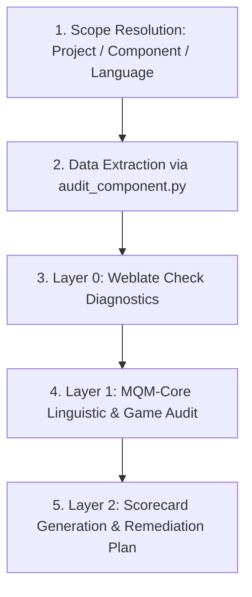

# Weblate Localization Quality Assessment (LQA) Skill

This skill performs a rigorous, multi-layered quality evaluation of translation components in Weblate or standalone game localization kits (PO, TSV, XLSX, JSON) based on the **MQM-Core Game Profile** and **Weblate Check Diagnostics**.

---

## 1. Core Evaluation Workflow

Always follow these 5 steps in order:



### Step 1: Scope Resolution
Identify the target component:
- Weblate URL or coordinates: `project_slug / component_slug / language_code` (e.g. `victory-banner/common/de`).
- Local loc-kit file path if working offline.

### Step 2: Data Extraction
Run the bundled extraction script to securely pull component metadata, unit inventory, and failing quality checks:
```bash
python .claude/skills/weblate-lqa/scripts/audit_component.py \
  --project <project_slug> \
  --component <component_slug> \
  --lang <lang_code> \
  --save-verdicts-draft /tmp/verdicts_draft.json
```
*(The script loads the API token securely from `deploy/.env.local` or environment variables without printing secrets).*

### Step 3: Layer 0 — Weblate Check Diagnostics
Group all failing checks by their exact `check_id` (`same`, `multiple_capital`, `reused`, `game-token`, `game-number`, `game-markup`, `game-length`, `cyrillic-leak`).

Consult `references/weblate-checks-guide.md` to classify every triggered check:
1. **True Positives (Real Bugs):**
   - Context hallucinations (e.g. source `Стрелок` translated as `Fahrer` due to context key `Unit_DriverVermaht`).
   - Domain term collisions (e.g. `Выгрузить` translated as `Entladen` instead of `Aussteigen`).
   - Missing or broken game markup (`<color>`, `{0}`, `$`).
2. **False Positives (Benign / Grammar Overlap):**
   - Untranslatable proper nouns or weapon models flagged by `same` (`Discord`, `Luger P08`).
   - Localized uppercase shortcuts flagged by `multiple_capital` (`[LMT]`, `[RMT]`).
   - Target grammatical convergence flagged by `reused` (e.g. German *Sanitäter* for both singular and plural).

### Step 4: Layer 1 — MQM-Core Game Profile Audit
Audit the units against the 4 core dimensions in `references/mqm-game-profile.md`:
- **Accuracy (`accuracy/`):** mistranslation, omission, addition, context hallucination.
- **Terminology & Lore (`terminology/`):** glossary violations, acronym leaks (e.g. English `AT` in German instead of `Pz.-`), inappropriate domain register.
- **Fluency & Style (`fluency/`):** grammar, noun capitalization, compound spacing, formality register (*Sie* vs *Du*).
- **Game Engine (`game_engine/`):** placeholder corruption, keybinding syntax, length overflow.

Assign severity penalty points for reviewed findings:
- **Neutral (0 pt):** Stylistic remark.
- **Minor (1 pt):** Minor typo or minor punctuation variance.
- **Major (5 pt):** Terminology/acronym leak, mechanic distortion, wrong domain register.
- **Critical (25 pt / Auto-Reject):** Corrupted placeholder, untranslated leak, major context hallucination.

### Step 5: Scorecard Generation & Remediation Plan
1. Calculate the official **MQM Quality Score**:
   $$\text{MQM Score} = \max\left(0, 100 - \left(\frac{\sum \text{Penalties}}{\text{Total Source Words}} \times 100\right)\right)$$
2. Determine the **Release Gate Grade**:
   - **Grade A ($\ge 95.0$, 0 Critical):** Approved for Release.
   - **Grade B ($85.0 - 94.9$, 0 Critical):** Conditional Approval (fix Major issues).
   - **Grade C ($70.0 - 84.9$):** Blocked (Re-translation pass required).
   - **Fail ($< 70.0$ or any Critical):** Rejected.
3. Formulate concrete remediation actions:
   - Specific string translations to update via API.
   - Exact Weblate flags to add (`ignore-same`, `ignore-multiple-capital`, `ignore-reused`).

---

## 2. Standard Output Format

Always structure the LQA report using this format:

```markdown
# Weblate LQA Audit: [Project]/[Component] ([LANG])

## 1. MQM-Core Quality Scorecard
| Metric | Value | Status |
|---|---|---|
| **MQM Quality Score** | **[Score] / 100** | **[Grade A/B/C/Fail]** |
| **Release Gate Status** | [Approved / Blocked] | [🟢 / 🔴] |
| **Critical Defects (25 pt)** | [Count] | [None / Details] |
| **Major Defects (5 pt)** | [Count] | [Details] |
| **Minor Defects (1 pt)** | [Count] | [Details] |
| **Total Penalty Points** | [Sum] pt | [Word count base] |

## 2. Reviewed Defect Log (MQM Categories)
- 🔴/🟠/🟡 **[SEVERITY]** `[context]` (Unit [ID]):
  - **Source:** `[Source text]`
  - **Target:** `[Target text]`
  - **Category:** `[category/subcategory]`
  - **Explanation:** [Reason and proposed fix]

## 3. Weblate Quality Checks Analysis (Layer 0)
- Breakdown of all failing check types (`reused`, `same`, `multiple_capital`, etc.).
- Root cause distinction (True Positives vs False Positives).

## 4. Actionable Remediation Plan
1. **String Corrections:** List of exact unit IDs and new target texts.
2. **Weblate Flags to Apply:** List of units and exact flags (`ignore-same`, `ignore-reused`, etc.).
```

---

## 3. Bundled Resources
- `references/mqm-game-profile.md` — Full MQM typology, scoring mathematics, and release gates.
- `references/weblate-checks-guide.md` — Complete catalog of Weblate checks and flag remediation matrix.
- `scripts/audit_component.py` — Secure CLI tool for unit extraction and MQM scorecard generation.
