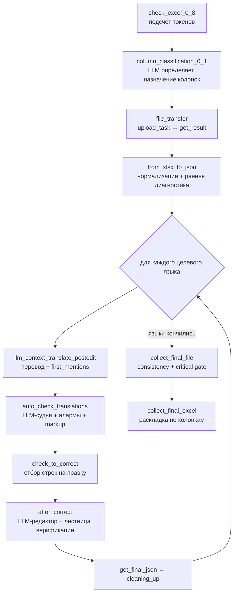

# Локализатор Cathedral: разбор системы и её функционала

**Дата разбора:** 2026-08-11
**Объект:** внутренний сервис локализации `Answer_Machine/localization`, работающий на том же VPS, что и наш Weblate
**Характер работы:** чтение кода и производственных данных, без изменения чужой системы

Документ описывает, что такое Cathedral, что он умеет с точки зрения пользователя
и как он устроен внутри. Все утверждения о коде даны со ссылками `файл:строка` на
исходники, снятые с VPS 2026-08-11 (HEAD `6e5ccc1`). Все количественные
утверждения посчитаны по реальным производственным артефактам на том же сервере.

---

## 1. Что это такое

| Параметр | Значение |
|---|---|
| Путь на VPS | `/home/dev01/localization` |
| Compose-проект | `localization`, контейнеры `cathedral_server`, `cathedral_postgres`, `cathedral_pgadmin` |
| Git remote | `https://answ-git.herocraft.com/Answer_Machine/localization.git` |
| HEAD | `6e5ccc1 Refresh README for current OpenRouter pipeline` |
| Стек | FastAPI 0.116, Jinja2, SQLAlchemy async, PostgreSQL 15, Python 3.12 |
| Объём | ~11 100 строк Python в 42 модулях, все в корне репозитория |
| Тесты | отсутствуют полностью |
| Публикация | `:8000` через nginx-vhost `fastapi` (наш Weblate — `127.0.0.1:8081`, vhost `l10n`) |

**Cathedral — это не система управления переводами.** Это одноразовый батч-конвейер
«Excel на входе — Excel на выходе». Пользователь загружает игровую таблицу
локализации, выбирает исходный и целевые языки, и через несколько минут забирает
готовый файл с заполненными языковыми колонками.

Чего в системе принципиально нет: истории строки, версионирования, ветвления,
процесса ревью, интеграции с VCS, памяти переводов между задачами, повторного
использования ранее переведённого. Каждая задача начинается с чистого листа.
Единственная память, переживающая задачу, — это глобальный глоссарий
аббревиатур единиц измерения и накопленные алиасы языковых колонок.

### Масштаб эксплуатации

Замеры по БД `cathedral_db` и каталогу артефактов на 2026-08-11:

| Метрика | Значение |
|---|---|
| Задач в БД | 80 |
| `completed` | 65 |
| `failed` | 9 |
| `error` | 6 |
| Доля неуспешных | **19 %** |
| Зарегистрированных пользователей | 11 |
| Каталогов задач на диске | 122 |
| Объём артефактов | 1.1 ГБ, ретенция отсутствует |
| Оценённых судьёй строк (все прогоны) | **388 149** |

Типовая задача — один исходный язык, один-два целевых, порядка 80 строк, полный
прогон около трёх минут (`pipeline.log` задачи `9A0E3838`: старт 13:44:22, финиш
13:47:23 для двух китайских локалей).

---

## 2. Функционал: что видит и делает пользователь

Приложение — девять экранов на самописном CSS с темой в стиле интерфейса
Counter-Strike 1.6 (`static/cs16_css/`, пиксельный шрифт Perfect DOS VGA 437).
Ни Bootstrap, ни Tailwind.

### 2.1. Карта экранов

| URL | Шаблон | Доступ | Назначение |
|---|---|---|---|
| `/login`, `/register` | `login.html`, `register.html` | гость | вход и самостоятельная регистрация |
| `/`, `/upload_task` | `upload_task.html` | пользователь | создать задачу перевода |
| `/my_tasks` | `my_tasks.html` | пользователь | список своих задач, логи, скачивание |
| `/get_result` | `get_result.html` | **без аутентификации** | забрать результат по номеру |
| `/upload_error` | `upload_error.html` | пользователь | сообщить об ошибке скриншотом |
| `/feedback` | `feedback.html` / `admin_feedback.html` | пользователь / админ | обращение в поддержку; админу — список обращений |
| `/settings` | `settings_openrouter.html` | админ | ключи, модели, активный провайдер |

Аутентификация — JWT в httponly-cookie, пароли через bcrypt
(`auth_utils.py`). Middleware (`auth_middleware.py`) редиректит на `/login`
всё, кроме `/login`, `/register`, `/static`, `/docs`, `/openapi.json`,
`/favicon.ico`. Ролей две: обычный пользователь и `is_admin`.

### 2.2. Создание задачи перевода

Главный экран (`templates/upload_task.html`, 622 строки). Форма:

- **Файлы** — Excel, drag-and-drop либо выбор. Сервер принимает список файлов и
  параллельный список `relative_paths` (`main.py:159-160`), то есть протокол
  рассчитан на загрузку целой папки, но фронтенд подставляет только `f.name`,
  так что реально загрузка дерева каталогов не работает.
- **Исходный язык** — радиокнопки плюс поле для своего варианта. Если ничего не
  выбрано, подставляется «Русский» (`main.py:196-197`).
- **Целевые языки** — 13 чекбоксов плюс поле для своего варианта. Валидация на
  фронте запрещает выбрать целевым тот же язык, что и исходный.
- **Комментарий / лор** — свободный текст в сворачиваемом блоке. Он попадает в
  промпт перевода как `Lore Context`.
- **«Переводить имена»** — чекбокс, включающий в промпт отдельный блок правил
  обращения с именами собственными.

После отправки сервер (`main.py:156-226`) генерирует `tracking_number`
(8 hex-символов из UUID), раскладывает файлы в
`processor/upload_task/<tracking_number>/In/`, пишет рядом управляющий файл
`task.txt`:

```text
[tracking_number=9A0E3838]
[translate_names=no]
[actions=Chinese,упрощённый китайский]
<текст комментария/лора>
```

создаёт запись `Task` в БД и запускает конвейер отдельным процессом:
`subprocess.Popen([python, "upload_task.py", tracking_number])` (`main.py:221`).
HTTP-ответ возвращается сразу, номер задачи показывается пользователю.

`task.txt` — не просто метаданные, а **машина состояний**: конвейер по мере
работы «откусывает» из строки `[actions=...]` очередной язык
(`list_language_cutter.py`), и пустой список означает «все языки обработаны»
(`upload_task.py:280-284`).

### 2.3. Мои задачи

`templates/my_tasks.html`, 486 строк. Таблица задач пользователя с
цветовой индикацией девяти статусов, включая `quality_alert` с раскрытием
причин и ссылками на диагностические отчёты.

Из этого экрана доступно:

- **Просмотр логов стадий** через `/api/task_logs/{tracking_number}`
  (`main.py:483-535`), содержимое отдельного лога и его полная версия — ещё два
  эндпоинта (`main.py:536`, `main.py:574`). В UI содержимое обрезается до 10 000
  символов.
- **Скачивание результата** — итоговый `result_<tracking>_done.xlsx`.
- **Скачивание всех файлов задачи** — кнопка только для админа
  (`/task_files/{tracking_number}`, `main.py:899`).

Автообновления нет: чтобы увидеть смену статуса, страницу надо перезагружать
руками.

### 2.4. Получение результата по номеру

`/get_result` — отдельный экран, которого нет в навигации. Пользователь вводит
tracking-номер, `POST /check_number` (`main.py:683`) возвращает статус, `GET
/download_out` (`main.py:441`) отдаёт файл.

**Оба эндпоинта не требуют аутентификации.** Знание восьмисимвольного номера —
единственное, что отделяет постороннего от чужого результата перевода.

### 2.5. Сообщение об ошибке скриншотом

Самая нестандартная функция системы (`templates/upload_error.html`,
`main.py:229-438`).

Переводчик или тестировщик видит в игре криво отображённый текст, делает
скриншот, прикладывает Excel и отправляет форму. Сервер требует оба файла
(`main.py:291-292`) — поле «номер задачи» из формы удалено, хотя серверная
логика его ещё умеет принимать из JSON-тела.

Дальше запускается отдельный конвейер (`upload_error.py`, `check_error.py`,
`check_no_namber_error.py`):

1. Скриншот отправляется в LLM с vision, промпт требует строгий JSON-массив
   строк — только распознанный текст, без комментариев
   (`check_error.py:167-215`).
2. Распознанные строки ищутся в приложенном Excel точным и подстрочным
   совпадением.
3. Результат — `error_matches.json`: какие ключи локализации присутствуют на
   этом экране игры.

Сценарий выбирается по `meta.txt`: если известен номер исходной задачи, берётся
`check_error.py` (работает по `get_result`), иначе `check_no_namber_error.py`
(сначала переносит Excel из `In` в `Out`, затем ищет).

Смысл функции: закрыть разрыв «вижу плохой текст в игре — не знаю, какой это
ключ». Задача проверки ошибки заводится в ту же таблицу `tasks` со служебным
целевым языком `error_check` (`main.py:352`).

### 2.6. Настройки

`templates/settings_openrouter.html`, доступ только админу. Управляет тремя
провайдерами (OpenAI, Claude, OpenRouter): API-ключ, модель, плюс выбор
активного провайдера и порог ошибок до переключения на запасной. Сохраняется в
таблицу `app_settings` и имеет приоритет над `.env` и `config.py`.

Ключи выводятся в поле `type=password`, но с предзаполненным `value`, то есть
присутствуют в DOM открытым текстом.

Файл `templates/settings.html` — мёртвый код: старая версия страницы без
OpenRouter, ни один маршрут её не рендерит.

### 2.7. Уведомления

Все значимые события дублируются в Telegram (`monitoring_service.py`): старт
обработки с именем файла и списком языков, завершение с метриками качества,
ошибки, скачивание результата. По завершении задачи в канал уходит сводка вида
«хорошее качество N (X %), требует улучшения M (Y %), плохое качество K (Z %)»
(`monitoring_service.py:76-143`), посчитанная по вердиктам судьи
(`calculate_quality_metrics`, `:145-204`).

---

## 3. Функционал: конвейер обработки



Оркестратор — `upload_task.py`: последовательные `subprocess.run` для каждой
стадии, статус пишется в PostgreSQL напрямую через `psycopg2`. Очереди нет,
ретраев стадии нет, параллелизма между задачами нет, отмены нет.

Статусы: `created → started → processing → translating → finalizing →
completed`, плюс тупиковые `failed` и `error`.

### 3.1. Приём и классификация колонок

`check_excel_0_8.py` считает объём в токенах по листам и колонкам (оценка
«1 токен ≈ 4 символа») и сохраняет отчёт — предварительная оценка стоимости
прогона.

`column_classification_0_1.py` определяет назначение колонок **через LLM**, а не
детерминированно. Модель получает шапку и образцы строк и возвращает, какая
колонка — ключ, какая — комментарий, какая — русский текст, какая — английский,
какие содержат целевые языки. Детерминированный fallback по заголовкам
существует только для базовых русского и английского и включается при ошибке
LLM.

Результат — файл вида:

```json
{"Название обрабатываемого файла": "ss_lan_test_problem_zones_1h.xlsx",
 "Название листа": "CURRENT", "Комментарий": "Nan", "Ключ": "A",
 "Русский текст": "D", "Английский текст": "C",
 "Chinese": "Nan", "упрощённый китайский": "Nan"}
```

Если хотя бы одного заявленного исходного языка в таблице нет, задача
переводится в `error` и конвейер останавливается (`upload_task.py:249-262`).
Это единственная жёсткая входная проверка, которая действительно работает.

### 3.2. Нормализация в JSON и ранняя диагностика

`from_xlsx_to_json.py` раскладывает таблицу в плоский JSON-массив — по одной
записи на строку. Параллельно строит три диагностических артефакта:

1. **`*_source_mismatch_report.json`** (`from_xlsx_to_json.py:80-171`) — подозрительные
   пары EN/RU:
   - короткий английский (≤ 4 слов) при длинном русском (≥ 8 слов) и наоборот
     — признак съехавших колонок;
   - один и тот же английский текст сопоставлен и с предложением (есть `.!?;:`
     или перевод строки), и с короткой меткой (≤ 4 слов) — признак сломанного
     выравнивания.
2. **`*_target_shape_report.json`** (`:174-241`) — длинный источник (≥ 6 слов или
   предложение) при уже присутствующем в таблице целевом значении ≤ 4 символов.
3. **`quality_alert.json`** (`:244-272`) — сводный маркер, создаётся, если любой
   из двух отчётов набрал ≥ 3 замечаний (пороги `:14-15`).

### 3.3. Перевод

`llm_context_translate_postedit.py` идёт по строкам последовательно, каждая
строка — отдельный вызов модели. Батчинга нет.

Промпт (`render_translation_prompt()`, `:347-427`):

```text
You are an expert game localization translator.
Your task is to translate the PRIMARY SOURCE TEXT into **{target_language}**.

The PRIMARY SOURCE TEXT is the source of truth.
Reference texts may be provided only for nuance, clarification, terminology, or
disambiguation. Do not treat reference texts as the primary source if they
differ from the PRIMARY SOURCE TEXT.

--- Translation Input ---
Source Language / Target Language / Primary Source Text
English Reference, Russian Reference   (только если отличаются от источника)
Context / Comment Context / Key Identifier / Unit Hint
Glossary / Previous Mentions           (см. 4.1)
Lore Context                           (из task.txt)
Name Handling Rules                    (только при translate_names=yes)

--- Critical Markup Rules ---     7 правил: плейсхолдеры, теги, code fragments
--- Translation Quality Rules --- 10 правил: смысл, тон, терминология
--- Output Rules ---
Return ONLY the final translated text in {target_language}.
```

Существенная деталь — явное разделение «первичного источника» и «референсов»
(`:392-394`). В игровых таблицах обычно есть и русская, и английская колонка,
причём одна из них сама является переводом. Конвейер выбирает первичный
источник по приоритетам из БД (`resolve_source_text_and_lang()`, `:173-203`),
остальные подаёт как справочные и запрещает модели считать их источником
истины. Выбор сохраняется в строку как `markup_source_text` /
`markup_source_lang` и переиспользуется всеми следующими стадиями — чтобы судья
и редактор оценивали перевод против того же текста, от которого он делался.

Перед вызовом модели три ветки позволяют его избежать: принудительная
аббревиатура единицы измерения из глоссария, уже одобренный перевод этого
источника, попадание в кэш точного совпадения.

### 3.4. Судья

`auto_check_translations.py` — вторая модель перечитывает вывод первой. Промпт
целиком (`:297-317`):

```text
You are an expert in translation quality assessment for game localization.

Evaluate whether the TRANSLATION (target language) accurately matches the SOURCE
text in meaning, style, and context.
Use Russian/English values only as references if provided; they are not the
primary source unless explicitly used as SOURCE.
Point out errors, unnatural phrasing, missing/extra meaning, or style mismatches.
Summarize quality as: "Good", "Needs improvement", or "Bad".
Add a short editor's comment (max 200 chars). If the translation is perfect,
comment: "No issues".

--- Input ---
SourceLanguage / SourceText / Translation / RussianRef / EnglishRef / Context

--- Output ---
Quality: ...
EditorComment: ...
```

Формат ответа свободный, разбор — построчным `startswith("quality:")`
(`:383-388`). При неудачном разборе вердикт становится `"Unknown"`. Насколько
дорого это обходится в проде — в разделе 6.

Параллельно работают **два детерминированных детектора**, и они имеют право
ужесточить вердикт модели (`:390-411`):

- **`SemanticAlarm`** — `is_suspicious_short_translation()`
  (`llm_context_translate_postedit.py:286-315`). Срабатывает, если источник из
  ≥ 3 слов (или длиннее 20 символов), а перевод — один из перечисленных
  юнит-токенов (`d.`, `h.`, `m.`, `s.`, `мин.`, `сек.`, `天`, `分`, `秒`, `Std.`,
  `Sek.`) либо просто ≤ 4 символов одним словом. Ловит характерный сбой игровой
  локализации: модель видит ключ `time_min` и отвечает «м.» вместо «Осталось %d
  минут». Гард не срабатывает, если источник действительно является одиночной
  единицей измерения.
- **`UntranslatedCopyAlarm`** — `is_probably_untranslated_copy()`
  (`auto_check_translations.py:199`). Английский источник дословно скопирован в
  неанглийский перевод.

Оба форсируют `Качество = "Bad"` и дописывают собственный текст к комментарию
модели, не затирая его.

В этой же стадии выполняется markup-контур (`:422-449`): нормализация → автофикс
→ валидация, с записью `MarkupValidationIssues`, `MarkupValidationMaxSeverity`,
`MarkupNeedsCorrection` (critical или high) и `MarkupBlocked` (только critical).

Вся стадия запускается одним `asyncio.gather` по **всем** строкам сразу
(`:462-464`), без семафора.

### 3.5. Отбор строк на правку

`check_to_correct.py:132-150`:

```python
quality_bad = quality != "good" or untranslated_copy_alarm
reasons = []
if quality_bad:
    reasons.append("quality")
if markup_needs_correction:
    reasons.append("markup")
if markup_blocked:
    reasons.append("markup_blocked")
return "+".join(reasons) or None
```

Причина записывается в строку как `Причина автокоррекции` и меняет поведение
следующей стадии. Строки без причины на правку не идут вообще — экономия
основана на том, что судить дёшево, а править дорого.

Отдельный приём (`:194-200`): при сработавшем `SemanticAlarm` первичный источник
**переключается на английский**, если английский разрешён. Логика: если перевод
схлопнулся в аббревиатуру, вероятно, исходная колонка была плохой, и второй
заход стоит делать от другого языка.

### 3.6. Правка

`after_correct.py`. Промпт редактора (`:364-390`) отличается от переводческого
явной иерархией приоритетов:

```text
You are an expert editor in game localization.
Your task is to correct and improve the translation into {lang}.

Priority order:
1. Primary source text
2. Critical markup preservation
3. Approved first-mention glossary
4. Editor comment
5. General fluency and style

If the glossary contains an approved translation for a term present in the source
text, reuse that translation unless the editor comment explicitly requires a
different rendering.
```

Три развилки перед вызовом модели (`:553-560`), и две из них вызова избегают:

1. Разрешена принудительная аббревиатура единицы — берётся значение из
   детерминированного глоссария.
2. Для пары «источник + семантический тег» уже есть одобренный перевод, **и**
   причина правки не содержит `quality`, **и** комментарий редактора не требует
   явно изменить термин — подставляется канон.
3. Иначе вызывается модель, причём «текущим переводом» ей подаётся `trg` при
   `quality`-правке и `approved_first_mention or trg` при чисто технической
   (`:560`). То есть при технической правке модель чинит канон, а не свой
   прошлый вывод.

Условие `not quality_requested` во второй ветке — самая тонкая часть конвейера.
Без него система залипала бы на первом переводе термина: если он плохой, канон
закреплял бы ошибку навсегда. С ним канон уступает дорогу, как только судья
сказал, что качество плохое.

После ответа модели идёт **лестница верификации** (`:604-690`):

1. `validate_translation()` — сверка плейсхолдеров и тегов. При ошибке —
   повторный вызов с техническим промптом, и результат принимается **только
   если он проходит валидацию** (`:632-633`). Иначе остаётся предыдущий вариант,
   регресс невозможен.
2. `normalize_markup()` + `fix_row_markup()` — детерминированная починка.
3. `validate_row()` — полная markup-валидация.
4. Если остался `critical` — ещё один вызов с перечнем конкретных
   critical-сообщений, затем повторные нормализация, автофикс и валидация
   (`:645-687`).

Обратите внимание: в четвёртом шаге принцип «принимать только прошедшее
валидацию» нарушен — ветка `if corr_text: corrected = corr_text` (`:682-684`)
берёт ответ модели без проверки. Попытка починить critical-разметку может её
доломать, и это не будет замечено.

### 3.7. Сборка и финальные гейты

`collect_final_file.py` объединяет языковые файлы и выполняет два гейта:

- **Consistency** (`:250-298`): строки группируются по
  `(source_lang, source_text, semantic_tag)`; если в группе больше одного
  различного перевода — critical, отчёт в `validation_report.json`,
  `sys.exit(5)`.
- **Critical markup** (`:300-308`): любая critical-проблема разметки —
  `sys.exit(4)`.

В обоих случаях экспорт в Excel не происходит и задача уходит в `failed`.
Система отказывается отдать результат, в котором одна и та же исходная надпись
переведена по-разному, — для игровой таблицы, где надпись встречается на десяти
экранах, это правильная строгость.

### 3.8. Экспорт в Excel

`collect_final_excel.py` раскладывает переводы обратно по языковым колонкам.
Матчинг заголовков трёхуровневый: прямое совпадение по словарю алиасов
(`lang_col_titles.json`, 20+ языков, например `"Russian": ["RU","ru","Rus","Русский",…]`),
затем по коду языка в скобках, затем создание новой колонки. Для неизвестного
языка алиасы досоздаются через LLM и кэшируются в `language_map.json`.
Отдельно выполняется санитизация символов, недопустимых в Excel, и
обезвреживание формул.

---

## 4. Сквозные механизмы

### 4.1. `first_mentions` — канон терминологии внутри задания

Механизм, который делает многостадийный цикл сходящимся, а не осциллирующим.

Ключ — кортеж `(source_lang, source_text)` либо `(source_lang, source_text,
semantic_tag)`, значение — первый принятый перевод
(`llm_context_translate_postedit.py:206-212`):

```python
def build_first_mention_key(source_lang, source_text, semantic_tag=None):
    if normalized_tag and is_short_ambiguous_unit_token(normalized_text):
        return (normalized_lang, normalized_text, normalized_tag)
    return (normalized_lang, normalized_text)
```

Семантический тег входит в ключ **только** для коротких неоднозначных
юнит-токенов: благодаря этому «m» как метр и «m» как минута не схлопываются в
одну запись, а обычные термины не дробятся на варианты по случайному тегу.

Применений два:

- **В промпте перевода.** `get_relevant_glossary()` (`:215-237`) отбирает из
  накопленного словаря термины того же исходного языка длиной ≥ 3 символов,
  входящие подстрокой в текущую строку, и вклеивает **до 15** пар
  `- [English/DAY] "term" -> "перевод"` в секцию `Glossary / Previous Mentions`.
  Это скользящий контекст: чем дальше по таблице, тем больше терминов
  зафиксировано.
- **В стадии правки.** `get_approved_first_mention()` (`:265-270`) ищет сначала
  по ключу с тегом, потом откатывается к ключу без тега.

Словарь сохраняется как `first_mentions_translations_<lang>.json` (`:240-262`),
отсортированный — инспектируемый человеком и воспроизводимый:

```json
{"source_lang": "English", "source_text": "+1 higher base damage of all battle demons",
 "translation": "所有战斗恶魔的基础伤害 +1"}
```

### 4.2. Детерминированные аббревиатуры единиц измерения

`unit_abbreviation_rules.py` + `unit_abbreviation_glossary.json`: 21 язык × 6
семантических тегов (`DAY`, `HOUR`, `MIN`, `SEC`, `METER`, `KM`).

```json
"English": {"_meta": {"source": "default", "reviewed": true},
            "DAY": "d.", "HOUR": "h.", "MIN": "m.", "SEC": "s.",
            "METER": "m.", "KM": "km"}
```

`detect_unit_semantics()` определяет тег по ключу и тексту источника,
`should_force_unit_abbreviation()` разрешает подстановку **только** для
одиночных unit-токенов, `resolve_forced_unit_abbreviation()` берёт значение из
глоссария. Для нового языка секция генерируется через LLM один раз и
кэшируется с пометкой в `_meta`.

Принцип, который стоит отметить: то, что решается таблицей, модели не
отдаётся вовсе.

### 4.3. Валидация разметки: 15 правил

`validation/markup_validator.py` — три слоя: нормализация (source-aware
лексический решейп), автофикс (поверхностное форматирование), валидация.

| Правило | Что проверяет | Severity |
|---|---|---|
| PH001 | пропавший плейсхолдер | critical |
| PH002 | лишний плейсхолдер | high |
| PH003 | нарушен порядок плейсхолдеров | critical |
| PH004 | частичная порча: `[[X]]`, `[{X}]` | high |
| PH005 | переведён идентификатор плейсхолдера | critical |
| PH006 | пробелы внутри плейсхолдера `[ X ]` | medium |
| PH007 | изменён системный тег `[IDENT]` | critical |
| HT001 | теги в переводе несбалансированы | high |
| HT002 | тег удалён | high |
| HT003 | нарушен порядок тегов | high |
| HT004 | удалён layout-тег `<br>` / `<nobr>` | medium |
| HT005 | удалён или испорчен `<sprite>` | high |
| HT006 | битый синтаксис `<color =#FFF>`, оборванный `<...` | medium/high |
| CS001 | одинаковый источник — разная структура плейсхолдеров | medium |
| CS002 | одинаковый источник — разная лексика перевода | low |

Поддерживаемые форматы плейсхолдеров (`markup_validator.py:26-35`): `{[X]}`,
`[X]`, `{{X}}`, `{X}`, `$X$`, `%X%`, `%1$s`. Самозакрывающиеся теги включают
Unity-специфичный `sprite`, layout-теги — `br` и `nobr`.

Автофиксы (`validation/markup_autofix.py:9-58`), чистые регулярные выражения:

| Правило | Преобразование |
|---|---|
| AF001 | `[ PARAM0 ]` → `[PARAM0]` |
| AF002 | `(+ [amount0])` → `(+[amount0])` |
| AF003 | `[[PARAM0]]` → `[PARAM0]` |
| AF004 | `<color =#FFC83A>`, `<size = 24>` → `<color=#FFC83A>`, `<size=24>` |

`markup_reporting.py` аккумулирует `validation_report.json` с дедупликацией по
fingerprint и сводками по severity, правилу и стадии конвейера.

### 4.4. Гарды вокруг вызова модели

Защита двухуровневая.

**Уровень провайдера** (`openrouter_api_helper.py:23-160`): `max_retries = 5`,
таймаут `60 + attempt * 30` секунд, экспоненциальный backoff, раздельная
обработка 429 (с уважением `Retry-After`), 5xx (ретрай) и 4xx (без ретрая).
Отдельно детектируются пустые ответы и «технические отказы» модели — формально
успешные ответы вида «не могу выполнить» (`:95`).

**Уровень бизнес-логики** — `call_ai_with_guard()`
(`llm_context_translate_postedit.py:441-521`): ещё 3 попытки логического запроса
поверх провайдерских, линейная задержка, и возврат структуры вместо строки:

```python
{
    "status": "ok" | "empty_response" | "error",
    "text": ...,
    "attempts_used": N,
    "stage": "...",
    "error_message": "...",
}
```

Структура оседает в строке результата (`LLMCallStatus`, `LLMCallAttempts`,
`LLMCallStage`), при исчерпании попыток уходит событие в Telegram. Наблюдаемость
вызова модели — на уровне строки, а не задачи.

Функция скопирована почти дословно в три модуля.

### 4.5. Мультипровайдерность

`AIAPIManager` (`ai_api_manager.py`) читает активного провайдера из
`app_settings`, считает ошибки по каждому и при достижении
`max_errors_before_fallback` переключается на следующий настроенный; счётчик
сбрасывается при успехе. Провайдер можно навязать точечно —
стадия правки всегда просит `preferred_provider="openrouter"`.

Текущая конфигурация в проде: активен OpenRouter с
`google/gemini-2.5-flash-lite`, запасные `gpt-4.1-mini-2025-04-14` и
`claude-sonnet-4-5-20250929`, порог 5.

Следствие: **переводчик, судья и редактор — одна и та же модель.** Классический
self-judge.

---

## 5. Модель данных и артефакты

Четыре таблицы (`models.py`): `users` (11 записей), `tasks` (80),
`feedback`, `app_settings` (одна строка глобальной конфигурации). Шесть
alembic-миграций.

Основное состояние — не в БД, а на диске:
`processor/get_result/<tracking_number>/{In,Out}/`. В `Out` для каждого языка
последовательно появляются `*_for_translation.json`, `*_fin.json`,
`*_auto_check.json`, `*_auto_check_to_correct.json`, `*_after_correct.json`,
`*_done.json`, `first_mentions_translations_<lang>.json`, плюс общие
`validation_report.json`, `quality_alert.json`, диагностические отчёты и
итоговый `result_<tracking>_done.xlsx`. Рядом — по логу на каждую стадию.

Между стадиями передаётся один JSON-массив словарей с русскими ключами; каждая
стадия дописывает свои колонки. Реальная строка после auto-check (задача
`9A0E3838`):

```json
{
  "Ключ": "building_catcher_name",
  "Русский текст": "Ловец душ",
  "Английский текст": "Soul Catcher",
  "Строка": "2",
  "Chinese": "灵魂捕手",
  "Validation": "OK",
  "markup_source_text": "Soul Catcher",
  "markup_source_lang": "English",
  "UnitSemanticTag": "",
  "ForcedUnitAbbreviationApplied": false,
  "ForcedUnitAbbreviationSource": "none",
  "FirstMentionApprovedTranslation": "",
  "FirstMentionEnforced": false,
  "SemanticShapeMismatch": false,
  "SemanticRetryTriggered": false,
  "LLMCallStatus": "ok",
  "LLMCallAttempts": 1,
  "LLMCallStage": "translation",
  "Качество": "Good",
  "Оценка редактора": "No issues",
  "SemanticAlarm": false,
  "UntranslatedCopyAlarm": false,
  "MarkupValidationIssues": [],
  "MarkupValidationMaxSeverity": "",
  "MarkupNeedsCorrection": false,
  "MarkupBlocked": false,
  "normalization_rules": [],
  "autofix_applied": false,
  "autofix_rules": []
}
```

Лучшее свойство системы с точки зрения эксплуатации: **каждое решение конвейера
оставляет машиночитаемый след прямо в строке**. Кто принял решение, сколько
попыток потребовалось, был ли перевод навязан каноном, какие автофиксы
применились. Разбор инцидента не требует чтения логов.

---

## 6. Как система ведёт себя в производстве

Замеры по всем `*_auto_check.json` на VPS: **435 файлов, 388 149 оценённых
строк**. Это не уникальные строки: один файл на язык на прогон, повторные
прогоны считаются заново.

### Распределение вердиктов судьи

| Вердикт | Строк | Доля |
|---|---:|---:|
| `Good` | 246 213 | 63.4 % |
| **`Unknown`** | **75 963** | **19.6 %** |
| `Needs improvement` | 49 953 | 12.9 % |
| `Bad` | 16 006 | 4.1 % |
| мусорный хвост (9 разных значений) | 14 | < 0.01 % |

`Unknown` — это значение по умолчанию, которое ставится, когда построчный разбор
ответа не нашёл строку `Quality:` (`auto_check_translations.py:382`). То есть
**почти каждый пятый вердикт судьи в этой системе теряется на парсинге
свободного текста.**

Мусорный хвост показывает, как именно ломается формат: помимо очевидных
`**good**` и `**bad**` (модель добавила Markdown), встречаются
`[good/needs improvement/bad]` — модель вернула сам шаблон,
`*[i will fill this in with: "good", "needs improvement", or "bad"]*` — модель
описала, что собирается сделать, `perfectly translated.`, `no issues`,
`needed improvement`, `need improvement` — модель ответила своими словами.

Практическое следствие: по правилу отбора «всё, что не `good`, идёт на правку»
(`check_to_correct.py:135`), в стадию правки уходит 141 936 строк, или 36.6 % от
всех. **Больше половины этой очереди (75 963 из 141 936) попадает туда только
потому, что не удалось разобрать ответ судьи**, а не потому, что перевод плохой.
Стадия правки — самая дорогая в конвейере, и она примерно вдвое перегружена
из-за формата ответа.

### Срабатывания детерминированных детекторов

| Детектор | Срабатываний |
|---|---:|
| `MarkupNeedsCorrection` | 848 |
| `SemanticAlarm` | 175 |
| `MarkupBlocked` | 13 |
| `UntranslatedCopyAlarm` | 0 |

### Какие правила разметки реально срабатывают

| Правило | Найдено | Что это |
|---|---:|---|
| HT001 | 480 | теги несбалансированы |
| PH002 | 477 | лишний плейсхолдер |
| HT002 | 87 | тег удалён |
| PH001 | 19 | плейсхолдер пропал |
| HT006 | 13 | битый синтаксис тега |
| PH004 | 5 | частичная порча плейсхолдера |
| HT003 | 1 | нарушен порядок тегов |

Ни разу за всю историю не сработали PH003, PH005, PH006, PH007, HT004, HT005,
CS001, CS002 — восемь правил из пятнадцати.

**Эти счётчики нельзя читать как «частота дефектов перевода».** Проверка
выборочных срабатываний показала, что значительная часть из них — не дефекты
перевода:

- HT001 («теги несбалансированы») массово срабатывает на строках, где
  **несбалансирован сам источник**, а перевод его добросовестно повторил.
  Пример из прода: источник
  `Можно починить в <color=#E3BA59>Полировке или в <color=#E3BA59>Супер слоте</color>.`
  — два открывающих `<color>` на одно закрывающее; португальский и испанский
  переводы воспроизвели ту же структуру и были помечены. Правило проверяет
  баланс только в target, не сравнивая его с source, поэтому дефект источника
  списывается на переводчика.
- PH002 («лишний плейсхолдер») в выборке срабатывает на строках, где источник и
  перевод посимвольно совпадают (`{value}` против `{value}`): валидатор
  сравнивает target с `source_text_en`, который для таких строк не равен
  фактическому источнику.

Вывод: пятнадцать правил дают полторы тысячи срабатываний, но доля настоящих
дефектов перевода среди них невелика, а два самых массовых правила системно
путают дефект источника и дефект перевода.

### Где на самом деле сосредоточена работа

Замер по всем `*_to_correct.json` и `*_after_correct.json`. Строк, дошедших до
стадии правки, — 51 797; из них с проставленной причиной — 20 637.

| Причина правки | Строк | Доля |
|---|---:|---:|
| `quality` | 19 789 | 95.9 % |
| `markup` | 501 | 2.4 % |
| `quality+markup` | 334 | 1.6 % |
| `quality+markup+markup_blocked` | 13 | 0.1 % |

**Разметка порождает 2.4 % работы стадии правки, семантическое качество —
97.6 %.** Весь пятнадцатиправильный валидатор разметки отвечает за
двадцатую часть нагрузки.

Что реально снимает нагрузку:

| Механизм | Срабатываний | Доля строк стадии правки |
|---|---:|---:|
| `FirstMentionEnforced` (канон терминологии) | 12 103 | **23.4 %** |
| `ForcedUnitAbbreviation` (глоссарий единиц) | 202 | 0.4 % |
| `SemanticShapeMismatch` | 166 | 0.3 % |

Почти четверть стадии правки закрывается подстановкой канонического перевода
**без единого обращения к модели**. Это самый весомый измеренный рычаг во всей
системе.

И контрольная цифра эффективности: из 48 099 строк, где сравнимы «текущий
перевод» и результат, правка изменила текст в 25 077 случаях —
**52 % вызовов редактора оказались холостыми**.

### Ранняя диагностика

Маркер `quality_alert.json` за всю историю создавался **8 раз** на 122 задачи.

---

## 7. Расхождения между документацией и кодом

Проверено на реальных данных, а не по README.

### 7.1. Ранний quality gate не останавливает перевод

README утверждает, что при `quality_alert` задача «НЕ идёт в перевод до ручного
подтверждения». В коде (`upload_task.py:267-273`) ветка выглядит так:

```python
quality_alert = load_quality_alert(out_dir)
if quality_alert:
    update_task_status_sync(tracking_number, "quality_alert", logger)
    logger.warning(
        f"Перед стартом перевода зафиксирован quality-alert: {quality_alert}"
    )
else:
    update_task_status_sync(tracking_number, "processing", logger)
```

Ни `return`, ни `sys.exit`, ни ожидания подтверждения. Конвейер продолжается, и
на первой же итерации языкового цикла статус перезаписывается на `translating`
(`:290`).

Проверка на данных: из восьми задач с маркером `quality_alert.json` четыре
(`279D5A0E`, `2E857481`, `97CD780E`, `FC1F581B`) дошли до `completed` и имеют
итоговый `result_*_done.xlsx`. В таблице `tasks` статуса `quality_alert` нет ни
у одной задачи — только `completed`, `failed`, `error`.

**Заявленный входной гейт фактически является меткой в логе.**

### 7.2. Прочие дефекты

| Проблема | Где | Последствие |
|---|---|---|
| Вердикт судьи парсится построчным `startswith` | `auto_check_translations.py:383-388` | 19.6 % вердиктов теряются, стадия правки перегружена вдвое |
| Ответ редактора парсится регуляркой по `CorrectedTranslation:` | `after_correct.py:598-604` | При отсутствии префикса берётся весь ответ вместе с преамбулой |
| Финальная critical-правка принимает ответ без валидации | `after_correct.py:682-684` | В отличие от `:632-633`, результат не сверяется с источником — починка critical-разметки может её доломать незаметно |
| `asyncio.gather` по всем строкам без семафора | `auto_check_translations.py:462-464` | Rate limit на больших таблицах |
| Судья, переводчик и редактор — одна модель | `app_settings`, `after_correct.py` | Self-judge: модель оценивает собственный вывод |
| Судья не видит уже найденных markup-проблем | — | Дублирует работу валидатора в свободной форме |
| Нет второго прохода судьи после правки | — | Проверяется только разметка; не сделала ли правка хуже по смыслу, не проверяет никто |
| Нет порога деградации по прогону | — | Полностью развалившийся прогон неотличим от нормального |
| `call_ai_with_guard` скопирована в три модуля | три места | Расхождение поведения |
| `/check_number` и `/download_out` без аутентификации | `main.py:441,683` | Знание номера = доступ к чужому результату |
| API-ключи предзаполнены в DOM | `settings_openrouter.html` | Утечка ключей через любой доступ к странице |
| `templates/settings.html` — мёртвый код | — | Расхождение с реальным экраном |
| Загрузка папки объявлена, но не работает | `main.py:159-160` против фронтенда | `relative_paths` всегда равен именам файлов |
| Ноль тестов | весь проект | 19 % задач падают |

---

## 8. Инфраструктура

`docker-compose.yaml`, три сервиса:

- `cathedral_postgres` (postgres:15) — порт `5432` опубликован на `0.0.0.0`,
  пароль `cathedral_password` открытым текстом в трекаемом файле (`:10,49`);
- `cathedral_pgadmin` (dpage/pgadmin4:7) — порт `8080` на `0.0.0.0`, логин
  `admin@cathedral.local` / `admin123`, `SERVER_MODE: False` (`:25-30`);
- `cathedral_server` — порт `8000`, код примонтирован из `~/localization`
  (`:47`), то есть образ не пересобирается при изменении кода.

Проверено через `ss -ltnp`: PostgreSQL и pgAdmin действительно слушают на всех
интерфейсах хоста.

Артефакты не чистятся: 1.1 ГБ в `processor/get_result`, плюс `feedback_files/` и
`_tmp_errors/` вручную.

---

## 9. Итог: что система умеет и чего не умеет

**Умеет:**

- принять произвольную игровую Excel-таблицу и самостоятельно разобраться, где в
  ней ключ, где комментарий, где какой язык;
- перевести на 13 предустановленных и любое количество произвольных языков,
  учитывая лор проекта, комментарии к строкам, ключ строки и правила обращения с
  именами;
- держать терминологическую консистентность внутри задания за счёт канона
  первых упоминаний;
- подставлять аббревиатуры единиц измерения детерминированно, без модели;
- оценивать каждый перевод второй моделью и точечно переписывать только
  забракованное;
- проверять разметку пятнадцатью правилами и чинить часть дефектов
  автоматически;
- отказаться отдать результат при неконсистентном переводе или критическом
  дефекте разметки;
- по скриншоту из игры определить, какие ключи локализации видны на экране;
- уведомлять о ходе работ в Telegram со сводкой по качеству;
- переключаться между тремя LLM-провайдерами при накоплении ошибок.

**Не умеет:**

- хранить историю строки, версионировать, показывать, кто и когда что изменил;
- переиспользовать переводы между задачами — памяти переводов нет;
- работать с VCS и файловыми форматами локализации (только Excel);
- организовать ревью человеком: правка молча перезаписывает ячейку, института
  предложений нет;
- обрабатывать задачи параллельно и переживать перезапуск процесса;
- гарантировать вход: заявленный входной гейт не блокирует;
- надёжно разбирать собственный вывод судьи — теряет каждый пятый вердикт.

**Главная инженерная идея, которую стоит запомнить:** многостадийный цикл
«перевод → суждение → отбор → правка → верификация», где на каждом переходе
детерминированные проверки имеют приоритет над мнением модели, канон
терминологии принудителен, а результат правки принимается только после
повторной валидации. Эта конструкция ценна независимо от качества её
реализации здесь.

**Главный урок из производственных данных:** свободнотекстовый ответ судьи —
не мелкая небрежность, а самый дорогой дефект системы. 19.6 % потерянных
вердиктов и вдвое перегруженная стадия правки — прямая цена отказа от
structured output. Наш собственный трек LLM-судьи
(`docs/LLM-first/plans/llm-judge-external-pipeline.md`,
`docs/LLM-first/plans/2026-08-11-phase0-schema-and-judge-calibration.md`) уже
закладывает строгую JSON-схему, судью из другого семейства моделей, чем
переводчик, и калибровку на золотом наборе — Cathedral даёт полевое
подтверждение, что все три решения обязательны, а не факультативны.

---

## 10. Что из этого стоит делать у нас: три правки по Парето

Ранжирование строго по измеренному весу, а не по тому, что интереснее делать.

### 10.1. Канон терминологии внутри прогона автоперевода

**Основание:** 23.4 % строк стадии правки закрываются подстановкой канона без
обращения к модели (12 103 из 51 797). Семантическое качество, чья главная
управляемая составляющая — терминология, даёт 97.6 % спроса на правку.

**Что у нас сейчас:** `weblate/machinery/llm.py` префетчит глоссарий на батч
(`:405`), но при `batch_size = 10` и `batch_concurrency = 2` (`:303,309`)
строки батча N не видят терминов, зафиксированных в батчах 1..N-1. Статический
глоссарий проекта в промпте есть, канона текущего прогона — нет.

**Правка:** накапливать принятые в прогоне переводы и подмешивать релевантные
(входящие подстрокой в текущую строку, до N штук) в глоссарийную секцию промпта
следующих батчей — механизм `first_mentions` из 4.1. Ложится на существующий
трек `2026-08-11-glossary-enforcement-analysis.md` и план морфологического
принуждения как недостающий рантайм-слой поверх статического глоссария.
Оценка M.

### 10.2. Structured output — блокер для фазы 2, а не оптимизация

**Основание:** 19.6 % вердиктов судьи (75 963 из 388 149) теряются на разборе
свободного текста и по правилу «всё, что не `good`, идёт на правку» попадают в
самую дорогую стадию. Больше половины очереди правки существует только из-за
формата ответа. Отдельно: 52 % вызовов редактора не меняют текст.

**Что у нас сейчас:** фаза 0, трек A (`response_format: json_schema` для
`RoutedLLMTranslation`) уже спланирован
(`2026-08-11-phase0-schema-and-judge-calibration.md`), но не выполнен.

**Правка:** считать A1/A2 предусловием фазы 2, а не параллельной задачей.
Cathedral — полевое доказательство того, что свободнотекстовый контракт с
моделью деградирует не на единицы процентов, а на два десятка, и что деградация
бьёт по стоимости, а не только по точности.

### 10.3. Гейт стадии правки: неразобранный ответ — не дефект

**Основание:** та же пара цифр — 2× раздутая очередь правки и 52 % холостых
вызовов. Плюс их собственная ветка `after_correct.py:682-684`, принимающая
результат «критической» починки без валидации, при том что аналогичная ветка на
`:632-633` валидацию делает.

**Правка (в дизайн фазы 2, до реализации):** два инварианта.

1. Отсутствие разбираемого вердикта — это сбой транспорта: ретрай, затем
   пропуск строки. Никогда не эскалация в «плохой перевод». У Cathedral именно
   это правило отсутствует, и оно стоит половины стадии правки.
2. Результат правки принимается, только если он не добавил новых проваленных
   проверок по сравнению с состоянием до правки. Иначе — откат к исходному
   варианту.

Оценка S: это две строки в плане и одна ветка в коде, но они определяют
стоимость и безопасность всей фазы.

### 10.4. Чего делать НЕ стоит

Проверка на данных сняла две гипотезы, которые выглядели правдоподобно.

**Расширять `GameMarkupCheck` проверками порядка и баланса тегов — не стоит.**
Симуляция нашего чека (мультимножество токенов `TAG_PATTERN` +
`PLACEHOLDER_PATTERN`) на 311 631 производственной строке:

| Показатель | Значение |
|---|---:|
| Строк, где источник содержит наши токены | 9 713 |
| Из них мультимножество совпало (наш чек пропускает) | 9 343 |
| ... из них отличается **порядок** токенов | 80 |
| ... из них отличается **баланс** тегов относительно источника | **0** |

Ноль расхождений по балансу. А все просмотренные случаи расхождения порядка —
законная перестановка при переводе: `The caravan's journey from the city {1} …
(turn {0})` → `W trakcie jest {0} ruch karawany z miasta {1}`. Проверка порядка
дала бы почти чистые ложные срабатывания на языках со свободным порядком слов.
Наш мультимножественный чек для этого класса данных адекватен.

**Строить ранний семантический гейт по входному файлу — не стоит.** Их маркер
`quality_alert.json` за всю историю создан 8 раз на 122 задачи, и, как показано
в 7.1, ни одну задачу он не остановил. Отдача несопоставима с ценой.

---

## Приложение: как воспроизвести замеры

Доступ к VPS — через `deploy/vps.sh` (VPN-шлюз в контейнере, SOCKS5 на
`127.0.0.1:11080`). Чтение чужого каталога требует `sudo -S` с паролем из
`deploy/.env.local`.

```sh
./deploy/vps.sh ssh 'ls /home/dev01/localization'
```

Статистика задач:

```sh
docker exec cathedral_postgres psql -U cathedral_user -d cathedral_db \
  -c "select status, count(*) from tasks group by status order by 2 desc;"
```

Распределение вердиктов судьи и срабатываний правил — обход всех
`processor/get_result/*/Out/*_auto_check.json` с подсчётом полей `Качество`,
`SemanticAlarm`, `UntranslatedCopyAlarm`, `MarkupNeedsCorrection`,
`MarkupBlocked` и `rule_id` внутри `MarkupValidationIssues`.

Исходники (без `.git`, `__pycache__`, `processor/`, `feedback_files/`) — около
300 КБ в архиве.

В ходе разбора чужая система не изменялась; единственная запись на VPS —
`git config --global --add safe.directory /home/dev01/localization` под root,
понадобившаяся для чтения истории коммитов.
