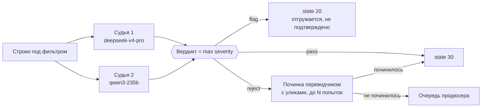
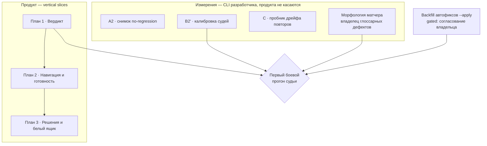

# Дизайн: LLM-судья в интерфейсе Weblate (первый тир)

Дата: 2026-08-13, пересмотрен в тот же день по итогам B2'. Статус:
**дизайн согласован, судьи выбраны замером, реализация не начата.**

Документ описывает, как судья из части 4 архитектуры встраивается в
существующий интерфейс Weblate. Он уточняет и в нескольких местах
заменяет ранее записанные решения — все расхождения перечислены в
разделе «Расхождения с существующими документами».

Основание:

- `docs/LLM-first/llm-first-product-architecture.md` (часть 4)
- `docs/LLM-first/plans/2026-08-11-phase0-schema-and-judge-calibration.md`
- `docs/LLM-first/plans/2026-08-12-phase0-implementation.md`
- `docs/LLM-first/agent_researches/2026-08-11-judge-weblate-ui-integration.md`
- `docs/LLM-first/agent_researches/2026-08-11-judge-ux-competitor-research.md`
- `docs/LLM-first/2026-08-13-phase0-measurements.md` (замеры фазы 0)

Состояние кода: **судьи в коде нет**, есть калибровочные артефакты в
`docs/misc/` (золотой набор `col4-judge-golden.json`, 919 записей;
разметка B0, 560 юнитов) и закрытая калибровка B2'
(`docs/LLM-first/2026-08-13-phase0-measurements.md`). Она заменила
двухступенчатую лестницу коллегией из двух судей — раздел «Коллегия из
двух судей» переписан, все затронутые места помечены.

## Постановка

JTBD заказчика: «когда мы выкатываем апдейт игры, переводы должны быть
провалидированы автоматически — чтобы доверять качеству без найма
переводчиков, а всё, чему доверять нельзя, было видно прозрачно».

Конечный пользователь — продюсер студии. **Он не читает целевые языки.**
Это единственное ограничение, из которого выводится весь интерфейс: он
не может исправить французскую строку, значит его действие — не правка,
а решение о доверии.

Замеренная реальность, определяющая масштаб задачи: на COL4/fr
детерминированные чеки дают ноль нарушений `game-markup` и
`game-line-break` на 3941 строке, а ручная разметка 560 юнитов нашла
18.2% дефектов в пуле, который выглядит чистым (Wilson 95% CI
[15.1%, 21.7%]). Судья нужен именно там, где формальные признаки молчат.

## Решения, принятые в этом документе

| Вопрос | Решение |
|---|---|
| Где живёт вердикт | модель `JudgeVerdict`; `Check` — только проекция |
| Кто закрывает петлю | автоматика; человек — по исчерпанию попыток починки |
| Порядок суда | два судьи параллельно на каждой строке, вердикт — строгий из двух; понижать вердикт друг друга они не вправе |
| Когда чинится перевод | при итоговом вердикте `reject` |
| Что с неразрешённой строкой | по severity: critical не отгружается, остальное отгружается |
| Точка входа | новый режим формы автоперевода |

## Коллегия из двух судей

Первая редакция этого документа описывала здесь лестницу: судья A на
всех строках, судья B только на его flag/reject, с правом снять флаг.
Замер 2026-08-13 (`docs/LLM-first/2026-08-13-phase0-measurements.md`)
эту конструкцию отверг, и ниже стоит то, что он выбрал.



Оба судьи независимо судят каждую строку, вызовы идут параллельно,
итоговый вердикт — **строгий из двух**. Ни один судья не вправе понизить
вердикт другого.

### Почему не лестница

Понижающая вторая ступень даёт сквозной recall
`recall(A) x recall(B | эскалированные)` — он **по построению не может
превысить recall первой ступени**. Лестница окупается только тогда,
когда узкое место — ложные тревоги. Замер показал, что это не так:
специфичность первой ступени 97.6-99.2%, снимать почти нечего, и
переголосования снимали настоящие дефекты — 46 ошибочных снятий из 48 в
худшей паре. Коллегия даёт обратную арифметику,
`1 - (1 - recall_1)(1 - recall_2)`, и уронить recall не может.

### Что это дало на запечатанном срезе

| | `deepseek` один | коллегия |
|---|---|---|
| recall на границе «нужен человек» | 90.6% | **97.4%** |
| **critical, ушедших в auto-pass** | **3 из 120** | **0 из 120** |
| major, ушедших в auto-pass | 22 из 146 | 7 из 146 |
| специфичность | 98.2% | 88.6% |
| пропуск среди auto-pass | 2.09% | 0.65% |

Решающая строка — вторая. `critical` по гейту severity удерживает строку
от сборки, поэтому пропущенный critical — не промах метрики, а сломанная
строка в игре. Коллегия закрывает этот гейт, одиночный судья нет.

Ошибки моделей слабо пересекаются: помечено обеими 228 строк, только
первым 16, только вторым 34. Именно несовпадение ошибок, а не сила
каждой модели, поднимает recall — на запечатанных данных сами модели
статистически неразличимы (Макнемар p = 0.20).

### Экономика

Второй судья стоит **5% бюджета первого**: $0.042 против $0.62-0.75 на
1000 строк. Полный COL4 fr — около $3 за первого и $0.17 за второго.
Отвергнутая в части 6 архитектуры экономика консенсус-QE («2-3x токенов»)
не возвращается: здесь второй голос стоит не в разы дороже, а на
двадцатую часть, потому что вторая модель на два порядка дешевле первой.

### Плата и её асимметрия

Коллегия метит 19 чистых строк из 167 против 3 у одиночного судьи —
ложный флаг 11.4% против порога плана 10%. Это принято сознательно.
Пороги защищают разное: `flag` даёт state 20 и строка **всё равно
отгружается**, значит ложный флаг стоит внимания продюсера; `critical`
даёт state 10 и строка не уходит, значит пропущенный critical стоит
поставки. Превышение на 1.4 пункта по метрике внимания принимается ради
нуля по метрике поставки.

Запасной регулятор, если объём разбора окажется велик: учитывать второго
судью только для повышения до `critical`, а его `flag` игнорировать.
Релизный гейт остаётся закрытым, специфичность возвращается к уровню
первого судьи. Вариант не измерен — срез израсходован.

### Отношение к 3x-агрегации

Коллегия **заменяет 3x-агрегацию** из архитектуры 4.2 по прежней
причине: самосогласованность одной модели сбивает дисперсию, но не
смещение, а второе семейство сбивает и то и другое.

> **Эмпирическая часть этого абзаца опровергнута 2026-08-14**
> (`docs/LLM-first/2026-08-14-st2-zh-judge-run.md`, раздел «Второе
> семейство или второй прогон»). Здесь стояло: «неразобранных ответов
> ноль на 916 записей, то есть дисперсии транспорта, ради которой
> затевалась бы агрегация, просто нет». Это дисперсия **транспорта**;
> дисперсия **вердикта** не измерялась. Измеренная: 16% у `qwen`, 11%
> у `deepseek` между побайтово идентичными прогонами.
>
> На живом компоненте `deepseek` за два прогона не нашёл ни одного
> дефекта сверх тех, что `qwen` нашёл за два своих, при цене в 12 раз
> выше. Теоретический довод «дисперсия против смещения» в силе, но
> перекос второго семейства оказался подмножеством перекоса первого,
> а не дополнением. Число мест и модели на них переводятся в
> конфигурацию; решает замер на n=5 в
> `plans/2026-08-14-judge-severity-recalibration.md`.

## 1. Модель данных

### `JudgeVerdict`

```text
unit             FK(Unit)
verdict          CharField   # pass | flag | reject (производное от max_severity)
max_severity     CharField   # none | minor | major | critical
errors           JSONField   # [{span_start?, span_end?, category, severity, description}]
                              # description — обязательно; span_start/span_end — опциональны,
                              # см. раздел «Спаны — деградируемая функция»
back_translation TextField   # улика, не сигнал
judge_model      CharField
seat             SmallInt    # 1 или 2 — место в коллегии, не старшинство
attempt          SmallInt    # 0 = первый суд, далее номер починки
target_hash      CharField(64)
context_hash     CharField(64)   # source + глоссарий + note
run_id           UUID
timestamp        DateTime

resolution        CharField  # null | accepted_as_is | sent_back | escalated
resolution_reason TextField  # обязателен при accepted_as_is
resolved_by       FK(User)
resolved_at       DateTime
```

Причина обязательна при override — симметричное трение: «принять» не
должно быть дешевле, чем «не принять». Это же даёт метрику override-rate:
если продюсер штампует 95%, судья настроен слишком строго, и об этом
надо знать до того, как контур доверия превратится в декорацию.

### Что пишется рядом

1. **`Check`-строка** (`judge-flag` / `judge-reject`) — ради виджета,
   фильтров, бейджей и статистики. Проекция, не хранилище.
2. **Состояние юнита** — по таблице severity ниже.
3. **Комментарий не пишется.** Он был обходным путём при отсутствии
   модели. Улики рендерит карточка; иначе лента комментариев забивается
   машинной прозой, а `has:comment` перестаёт означать «человек что-то
   сказал».

### Протухание

`Check` несёт ровно три поля — `unit`, `name`, `dismissed`
(`weblate/checks/models.py:82-87`), поэтому связь «вердикт ↔ версия
текста» в нём невыразима. Её несёт `target_hash`:

- `target_hash` != хэш текущего `unit.target` → вердикт протух:
  `Check`-строка снимается, карточка показывает «вердикт относится к
  предыдущей версии текста», юнит возвращается в очередь суда.
- `context_hash` изменился (глоссарий, note) → вердикт не протухает, но
  помечается вынесенным по устаревшему контексту и пересуживается
  фоновым прогоном, а не срочно.

Это тот же принцип, по которому Transifex гасит TQI при редактировании.

### Кэш и история

Пара `(target_hash, context_hash, judge_model)` — естественный ключ кэша:
неизменённая строка не пересуживается никогда. Это закрывает риск
стоимости из части 6 архитектуры без отдельного механизма.

Вердикты не перезаписываются, а накапливаются по `(unit, run_id, attempt)`.
Это даёт белый ящик коллегии, регрессию при смене промпта и обязательную
метрику доли холостых починок (у Cathedral 52% вызовов редактора были
холостыми).

### Спаны — деградируемая функция

GEMBA-MQM V2 сознательно спрашивает описание ошибки, а не символьные
офсеты, потому что «span marking is difficult for generative LLMs».
Perrella et al. (2026): ни один авто-оценщик не достигает человеческого
F-score на детекции спанов, символьная метрика systematically favourит
длинные спаны.

Дизайн принимает это как данность и не инвестирует в точность спанов:

- `description` в `errors` обязательно — текстовое описание ошибки.
  `span_start` и `span_end` опциональны. Вердикт без спанов — валидный
  вердикт, не деградированный.
- **Подсветка спанов — опциональная функция UI, список ошибок —
  обязательная.** Если спан не бьётся с текстом (офсеты вне допустимого
  диапазона, или спан захватывает некорректный фрагмент), карточка
  показывает запись без подсветки, но вердикт не выбрасывается.
- **Починка подаёт описания ошибок, а не спаны.** Промпт переводчика
  получает «ошибка X в районе Y» вместо точных офсетов. Это снижает
  долю холостых попыток починки, которые у Cathedral составили 52%.
- **Замер span-accuracy на золотом наборе до реализации.** В B0
  размечены человеческие спаны на 560 юнитах; сравнение LLM-спанов
  против них даст численную оценку шума до того, как UI начнёт на них
  опираться.

### Контракт `description`: адресат не читает целевой язык

Пометка добавлена 2026-08-14 по итогам прогона судей на живом компоненте
(`strategy-and-tactics-2/summer-update`, zh_Hans, 124 строки, отчёт —
`docs/LLM-first/2026-08-14-st2-zh-judge-run.md`). Реализации требования
ещё нет; оно относится к промпту судьи и к валидации его ответа.

Из «Постановки»: конечный пользователь — продюсер, и **он не читает
целевые языки**. Значит `description` пишется не для лингвиста, а для
него, и обязан быть самодостаточным без знания целевого языка:

- Описание содержит **обратный перевод спорного фрагмента**: «написано
  X, что значит Y, тогда как в источнике Z». Спан сам по себе адресату
  ничего не сообщает.
- Описание на языке интерфейса продюсера, не на целевом.
- Голый спан без объяснения — **невалидный `description`**, даже когда
  вердикт по существу верен.

Замер, из которого это следует: в прогоне на zh_Hans судьи давали
объяснение нестабильно. Часть записей приходила годной
(`«防御工事失败防御结果» — набор слов: «оборона провалилась оборона
результат»`), часть — голым спаном (`[critical] mistranslation: 拒绝`),
по которому продюсер не может ни принять решение, ни оценить, судил ли
судья по делу. Схема ответа это допускает: `span` в ней обязателен, а
поля `description` в измеренной версии не было вовсе
(`docs/misc/col4-judge-eval.py`, `reply_schema()`), и вся смысловая
нагрузка ложилась на спан.

Что из этого следует для реализации:

1. **Добавить `description` в схему ответа** как обязательное поле
   рядом со `span`, `category`, `severity`.
2. **Прописать адресата в системном промпте** явно: «читатель не знает
   целевого языка; каждое описание обязано содержать обратный перевод
   фрагмента».
3. **Валидировать дёшево**: описание, не содержащее ни одного символа
   языка интерфейса, либо совпадающее со спаном, помечается как
   неполная улика. Это не сбой транспорта и вердикт не отменяет —
   карточка показывает вердикт с пометкой «улика неполная».
4. **Отнести к следующему срезу.** Изменение промпта существенное,
   а нынешний `test` израсходован
   (`docs/LLM-first/2026-08-13-phase0-measurements.md`, пункт 7
   рекомендаций), поэтому цена правки — новый запечатанный срез.

Тот же контракт распространяется на модалку «Принять как есть»: причину
пишет продюсер, но пишет он **оценку цены ошибки в продукте** (какой
экран, сломает ли игрока, горит ли релиз), а не лингвистическое
суждение. Лингвистическая часть уже написана судьёй в `description`, и
продюсер её цитирует, а не воспроизводит.

## 2. Юнит: где виден вердикт

### Три поверхности

**Обратный перевод — в теле формы**, в слоте `secondary`
(`weblate/templates/translate.html:101-108`). Это существующий нативный
паттерн «та же строка в другом рендере для справки», через
`format_unit_target`. Продюсер видит смысл своего французского текста
там же, где смотрит на строку, без клика. Подпись — «приблизительная
реконструкция», чтобы её не приняли за эталон.

**Карточка «Оценка ИИ» — в сайдбаре, перед «Things to check».**
Вердикт, ошибки, мнения обоих судей, кнопки решений.

**Вкладка «Оценка ИИ»** — белый ящик: кто судил, какой моделью, когда,
что ответил, что менялось между попытками, подсветка спанов.

### Разделение факта и мнения

`weblate/templates/translate.html:619` рендерит все `unit.all_checks`,
поэтому `judge-reject` иначе попал бы в одну карточку с `game-markup`,
тем же красным `alert.svg`. Смешение вероятностного с детерминированным
подрывает доверие к обоим (паттерн Phrase: «AI checks» отдельно от
«QA checks»).

Решение: судейские `Check`-строки **исключаются из карточки «Things to
check»** и живут только как проекция для навигации. Точки касания:

- `translate.html:619` — итерировать отфильтрованный список
- `translate.html:593` — условие показа карточки, иначе она
  отрендерится пустой при единственном судейском чеке
- `weblate/trans/templatetags/translations.py:933-936` `unit_state_class`
  — отдельный класс бейджа, чтобы мнение и факт не были одной красной
  точкой

Принцип оформления: **контур = мнение, заливка = факт**.

Два запрета: `judge-*` никогда не попадает в `enforced_checks` (нарушило
бы инвариант 1 архитектуры), и механизм `Dismiss` у судейских чеков
отключается — у нас есть решение с обязательной причиной, а два
конкурирующих override дают дыру в аудите.

### Содержимое карточки

| Вердикт | Вид | Содержимое |
|---|---|---|
| pass | свёрнута | «Принято · модель · когда»; раскрытие — BT и что проверялось |
| minor | свёрнута | то же + список minor-замечаний |
| flag / major | развёрнута | ошибки со спанами, мнения обоих судей, история починок, плашка «отгружается, но не подтверждено» |
| reject / critical | развёрнута | то же + «не уйдёт в сборку» + предложение исправления как suggestion |
| протух | серая | «вердикт относится к предыдущей версии», кнопка «пересудить» |
| не разобран | серая | «ответ судьи не разобран» — сбой транспорта, **не вердикт** |

Последняя строка — инвариант 4.3 архитектуры: неразобранный ответ никогда
не показывается как flag/reject. Cathedral терял так 19.6% вердиктов.

### Что показываем принципиально

- **Не показываем число.** Ни 0-100, ни процент уверенности. Продюсер не
  может проверить число, а число создаёт ложную точность.
- **Показываем, что судья видел и что проигнорировал** — глоссарные
  термины в контексте, полученные `failing_checks`. Без этого нельзя
  оценить, судил ли судья по делу.
- **Показываем разногласие судей.** Согласие двух семейств — сильный
  сигнал, расхождение — слабый; скрывать его нельзя.

Подсветка спанов реализуема нативно: `Formatter` вставляет теги по
символьным офсетам (`translations.py:288-297`), где уже живут три
парсера — плейсблы, глоссарий, поиск. Судейские спаны — четвёртый той же
формы.

### Кнопки решений

Только на строках, дошедших до человека:

- **Принять как есть** — модалка с обязательной причиной, `state → 30`,
  `resolution = accepted_as_is`.
- **Вернуть в работу** — сброс попыток, новый круг суда.
- **Эскалировать** — `resolution = escalated`, отдельный фильтр для
  внешнего лингвиста.

## 3. Очереди, фильтры и релизная готовность

### Почему нужны свои фильтры

`Check`-строка существует только для flag/reject: чек по определению
провал, у `pass` его нет. Поэтому **покрытие судом чеками не
отвечается** — продюсер не отличит «всё прошло» от «ничего не
судилось». Это закрывается фильтрами поверх `JudgeVerdict`.

| Вопрос продюсера | Фильтр |
|---|---|
| Что уйдёт в сборку с одобрением? | `judge:pass` |
| Что уйдёт, но не подтверждено? | `judge:flag` |
| Что **не** уйдёт в сборку? | `judge:reject` |
| Что судья ещё не смотрел? | `NOT has:judge` |
| Что ждёт моего решения? | `judge:exhausted` |
| Что я принял вопреки судье? | `judge:override` |

Реализация — Exists-подзапросы той же формы, что `check_field`
(`weblate/utils/search.py:884-899`). Регистрация в `FILTERS.full_list`
(`weblate/trans/filter.py:22-83`) даёт имена, работу в API и попадание в
виджет. Плюс `calculate_judge()` в `weblate/utils/stats.py`, зеркало
`calculate_checks()` (`stats.py:911-935`) — без него у фильтров нет
счётчиков.

### Отдельная карточка на обзоре языка

Разделение факта и мнения держится на всех уровнях. Виджет
`Strings status` (`weblate/templates/snippets/translation.html:60-111`,
данные из `weblate/trans/checklists.py:61-130`) остаётся
детерминированным; рядом встаёт вторая карточка той же конструкции:

```text
┌ Состояние строк ───────────────────┐   ┌ Оценка ИИ ─────────────────────┐
│ 82  Все строки                     │   │ 64  Одобрено судьёй            │
│ 82  Переведённые строки            │   │ 12  Под вопросом               │
│  2  Строки с неудачными проверками │   │  6  Отклонено                  │
│  1  Неудачная проверка: Точки      │   │  3  Ждёт решения человека      │
└────────────────────────────────────┘   └────────────────────────────────┘
```

Технически — второй цикл по `list_judge_verdicts`, зеркало
`list_translation_checks`. Строки с нулём скрываются тем же `add_if`
(`checklists.py:136-141`), поэтому в здоровом состоянии карточка
схлопывается до одной строки. Клик даёт тот же `Browse / Translate / Zen`;
**Zen-режим и есть очередь триажа**.

### Релизная готовность

Ответ на исходный JTBD, которого сейчас нет ни в каком виде.

```text
┌ Готовность к сборке ────────────────────────────────┐
│ 76 из 82 строк уйдут в сборку                       │
│  ● 64  одобрено судьёй                              │
│  ● 12  под вопросом — уйдут, не подтверждены        │
│  ● 6   отклонено — НЕ уйдут          [разобрать →]  │
│  ● 0   не судилось                                  │
└─────────────────────────────────────────────────────┘
```

Число «уйдут в сборку» **переиспользуется**, а не пересчитывается:
`commit_policy_skipped` уже считается в
`weblate/trans/models/pending.py:349-355` и показывается на странице
git-статуса (`weblate/templates/js/git-status.html:31-34`). Два
расходящихся ответа на один вопрос недопустимы.

Строка «не судилось» — самая важная: без неё «6 отклонено» читается как
«остальное хорошо», хотя может означать «остальное не смотрели».

На уровне компонента — та же таблица по языкам, один экран «можно ли
отгружать билд».

### Гейт по severity выражается штатными настройками

`FUZZY_STATES = (10, 11, 12)` (`weblate/utils/state.py:41`), а
`WITHOUT_NEEDS_EDITING` исключает ровно их
(`weblate/trans/models/pending.py:292-293`).

| Вердикт | Состояние | Отгружается | Механизм |
|---|---|---|---|
| pass | 30 approved | да | авто-одобрение судьёй |
| minor | 30 approved | да | ошибки записаны, вес 1 |
| major (flag) | 20 translated | **да** | висит в очереди, релиз не блокирует |
| critical (reject) | 10 needs editing | **нет** | `WITHOUT_NEEDS_EDITING` отсекает |
| детерминированный провал | 11 needs rewriting | нет | `enforced_checks`, отдельно от судьи |

`commit_policy = WITHOUT_NEEDS_EDITING`
(`weblate/trans/models/project.py:83-89, 339-342`), кастомный экспорт не
нужен. Индикатор на юните уже есть (`translate.html:742-751`).

Важное следствие: `translation_review=True` **желателен, но не
обязателен** — гейт держится на `WITHOUT_NEEDS_EDITING`, а не на
`APPROVED_ONLY`. Без ревью `pass` даёт state 20 вместо 30, и «одобрено
судьёй» различается только через `JudgeVerdict`.

Семантика удержания: `APPROVED_ONLY`/`WITHOUT_NEEDS_EDITING` **не
обнуляют строку, а удерживают обновление**. Для новой строки в файле её
нет; для изменённой остаётся предыдущая версия. «Не одобрено» означает
«игра получит старый перевод или ничего», а не «игра получит плохой
перевод».

## 4. Точка входа: режим автоперевода

Судья вызывается явным выбором человека в существующей форме, а не
невидимым фоновым процессом.

### Новый режим

`weblate/trans/forms.py:1328-1335`:

```text
Добавить как предложение              suggest
Добавить как перевод                  translate
Добавить как «Требует правки»         fuzzy
Добавить как одобренный перевод       approved   (нужно unit.review)
Добавить как перевод с LLM-судьёй     judge      (новый, нужно unit.review)
```

Право `unit.review` обязательно: режим ставит state 30.

### Два правила, отличающие его от остальных режимов

У существующих режимов `target_state` — константа на прогон
(`weblate/trans/autotranslate.py:360-364`). У судейского **состояние
определяется вердиктом per-unit**.

**Правило 1 — что переводится.** По умолчанию режим переводит только
пустые и помеченные на правку строки; строку с существующим переводом он
только судит. Поведение переключается чекбоксом **«Перезаписать
существующий перевод»** (по умолчанию выключен). Включённый чекбокс
делает честным штатное предупреждение о потере переводов
(`forms.py:1202-1205`).

**Правило 2 — fail-safe.** Свежепереведённая строка пишется как
`10 needs editing` и повышается только вердиктом: несудившееся не
отгружается никогда, даже если прогон оборвался. Уже существующие
переводы при этом **не понижаются** — их состояние меняет только вердикт.

### Фильтры в форме

Выпадашка «Фильтры» берётся **не** из полного реестра, а из
захардкоженного списка 15 ключей в `SearchField.get_search_query_choices`
(`weblate/utils/forms.py:287-303`). Судейские фильтры туда надо добавить
явно, иначе продюсер не найдёт их там, где они нужнее всего.

| Пункт | Запрос | Зачем |
|---|---|---|
| Не судилось | `NOT has:judge` | **дефолт режима judge** |
| Отклонено судьёй | `judge:reject` | перезапуск суда |
| Под вопросом | `judge:flag` | то же для major |
| Вердикт протух | `judge:stale` | пересудить изменённое |
| Ждёт решения человека | `judge:exhausted` | разбор накопленного |

Дефолтный `q` меняется вместе с режимом: сейчас он жёстко
`state:<translated` (`forms.py:1201, 1325-1326`), для `judge` дефолт —
`NOT has:judge`, единственный фильтр, покрывающий и новые непереведённые
строки, и старые переведённые, но не судившиеся.

**Главная проверка после прогона:** `NOT has:judge` должен стать пустым.
Остаток — это строки, где судья не ответил, а не строки, которые прошли.

### Что нужно загородить

- **`mode=translate` + `q=judge:pass`** перезапишет одобренное судьёй.
  Вердикты протухнут корректно, но продюсер потеряет одобренную
  локализацию, не поняв этого. Нужно предупреждение в форме.
- **`mode=judge` на большом компоненте** — реальные деньги. Форма должна
  показывать число строк, попадающих под прогон, до запуска. Сейчас она
  не показывает его вообще.

### Оркестрация

Суд исполняется в существующей Celery-задаче `auto_translate`
(`weblate/trans/tasks.py:971`), расширенной судейской стадией: бесплатно
получаем прогресс через `/api/tasks/`, ретраи и отсутствие второго
механизма фоновых задач. Возобновляемость — через фильтр по состоянию и
`NOT has:judge`, как уже сделано для `store_batch`. Внешний пайплайн не
нужен: точка входа — форма, исполнение — Celery, запись — ORM.

## Расхождения с существующими документами

Реализация следует этому документу; перечисленные пункты в источниках
устарели.

1. **Хранилище вердикта.** Архитектура 4.3 предписывает комментарий с
   уликами. Заменяется моделью `JudgeVerdict`; комментарий не пишется.
2. **Состояние при flag.** Архитектура 4.3: `flag → state 10`.
   Становится `flag → state 20`: иначе major блокировал бы поставку
   вопреки решению по severity.
3. **Релизный гейт.** Архитектура 4.5 предполагает политику
   «Only include approved translations». Заменяется на
   `WITHOUT_NEEDS_EDITING`: гейтится только critical, полнота
   локализации сохраняется, инвариант 2 («судья не блокирует релиз»)
   перестаёт противоречить пункту 4.5.
4. **3x-агрегация.** Архитектура 4.2 требует троекратного прогона на
   flag/reject. Заменяется вторым семейством моделей.
5. **Протокол калибровки B2.** План фазы 0 меряет двух судей
   параллельно, чтобы выбрать одного (`плечи: {2 модели} x {один прогон |
   3x}`). Прогон 2026-08-13 показал, что выбирать одного не надо: на
   запечатанном срезе два кандидата статистически неразличимы
   (Макнемар p = 0.20), а их ошибки не совпадают, поэтому оба и остаются.
   Промежуточная редакция этого пункта требовала «сквозных TPR/TNR
   лестницы» — она отменена вместе с лестницей. Меряется вердикт
   коллегии: recall и специфичность на границах H и R по строгому из
   двух вердиктов, и отдельно **число critical, ушедших в auto-pass**,
   как метрика релизного гейта.
6. **Пер-языковые тиры.** Архитектура 4.6 требует «второго сигнала» для
   low-resource тира и откладывает его до CometKiwi в фазе 4. Коллегия
   даёт второй сигнал уже сейчас — **CometKiwi перестаёт быть блокером**.
7. **Точка входа.** В архитектуре судья — внешний пайплайн поверх REST
   API. Заменяется режимом формы автоперевода и Celery-задачей.
8. **MVP «ноль правок шаблонов»** (архитектура 4.4) снят: без правок
   шаблонов вердикт визуально неотличим от детерминированного факта.

## Роадмап

### Аудит прежнего планирования

Состояние на 2026-08-13, проверено по файловой системе, а не по статусам
внутри документов — статусы в этом проекте уже расходились с кодом
(см. преамбулу `plans/2026-08-12-phase0-implementation.md`).

| Пункт | Источник | Состояние | Актуален |
|---|---|---|---|
| A1 — тесты `json_schema` | impl-план, задача 1 | выполнено 2026-08-12 | закрыт |
| A2 — снимок no-regression | impl-план, задача 2 | **остановлен 2026-08-13**: fingerprint зеркала `00fbe7a86b65` против исторического `4db4b89dfd4b`; сравнение не проводилось | да, но требует переносимого fingerprint |
| B0 — разметка реального вывода | план калибровки | выполнено, 560 юнитов | закрыт |
| B1 — золотой набор | план калибровки | выполнено, 919 записей | закрыт, становится регрессионным |
| B2 — прогон судей | план калибровки | **закрыт 2026-08-13**, включая единственный прогон по запечатанному test | да; **каскад отвергнут, выбрана коллегия**, см. ниже |
| C — пробник дрейфа повторов | план калибровки | **выполнен 2026-08-13**: дрейф материален (57.5% групп), стоковый чек `inconsistent` его не видит | закрыт замером, порождает отдельную задачу |
| Backfill автофиксов — код | layer0-план + `plans/2026-08-13-autofix-backfill-scoped-commit.md` | **отгружено**: команда `reapply_autofixes`, scoped commit по корню репозитория, row locks, `autofix_fingerprint()` | закрыт |
| Backfill автофиксов — прод-прогон `--apply` | тот же runbook | **не выполнен**: в `autofix-terminal-punctuation.md` зафиксирован только dev smoke | да, предусловие боевого прогона |
| MVP «ноль правок шаблонов» | архитектура 4.4 | — | **снят**, см. расхождения |
| Консенсус-QE двумя моделями | архитектура, часть 6 | отвергнут как «2-3x токенов за сигнал, который дают чеки» | **пересмотрен по замеру**, см. ниже |

Последняя строка изменилась и требует пояснения. Отказ от консенсуса
стоял на цене: два голоса за 2-3x токенов ради сигнала, который дают
чеки. Замер убрал оба основания. Цена: второй судья
(`qwen/qwen3-235b-a22b-2507`) стоит $0.042 против $0.62-0.75 на 1000
строк у первого, то есть 5%, а не 200-300% — модели разошлись в цене на
два порядка, чего в момент отказа не было. Сигнал: чеки на золотом
наборе молчат почти полностью, а второй голос ловит 34 дефекта, которых
не видит первый. Пересмотр сделан ровно по условию, записанному в части
6 архитектуры: «если останутся дефекты, которых не ловят ни чеки, ни
судья».

Строка B2 задевает центральное решение этого документа. Замер
(`docs/LLM-first/2026-08-13-phase0-measurements.md`) отверг каскад:
сквозной recall 70.7-87.1% против 94.0% у одиночного судьи, потому что
ложных тревог для снятия почти нет, а переголосования снимали настоящие
дефекты — 46 из 48 в худшей паре. На запечатанном срезе выбран третий
вариант: **коллегия из двух судей**, recall 97.4% и ноль пропущенных
critical из 120 против трёх у одиночного. Раздел «Коллегия из двух
судей» переписан под это решение; лестницы с понижающей ступенью в
документе больше нет.

### Две дорожки



**Разработка плана 1 не заблокирована калибровкой.** Модель, коллегия,
режим формы и карточка строятся и тестируются на замоканных ответах
судьи. B2' и прод-backfill гейтят только первый прогон, который тратит
деньги и меняет состояния на реальных данных. Считать иначе — значит без
нужды сериализовать два независимых трека.

**Скрининг B2' закрыт.** Каскад deepseek→sonnet-5 даёт границу R
(critical) 100% [94.1, 100] при границе H 70.7% [64.5, 76.2];
терминологическая страта — 72.9% [64.2, 80.1] при пороге 80%. Порог не
взят, и это результат про судью, а не про набор: даже когда термин лежит
в промпте, судья промахивается на четверти терминологии.

**Глоссарные дефекты судье не принадлежат.** Судья собирает глоссарий
тем же `get_glossary_terms()`, что и переводчик, поэтому термин,
невидимый матчеру на падеже, отсутствует и в промпте судьи —
канонической формы у него просто нет. Класс лечится на слое 0
морфологической нормализацией
(`docs/plans/2026-08-11-glossary-morphological-enforcement.md`), после
которой его начинает видеть `GlossaryCheck`. Тот же довод закрывает
вопрос про дрейф реалий из трека C: судья судит один юнит за раз и
межстрочного обзора не имеет.

### Планы первого тира

Планы ещё не написаны. Ниже зафиксированы их границы, целевые пути и
критерий готовности; каждый пишется отдельно и утверждается перед
исполнением — по правилу инкрементов из `AGENTS.md`.

| План | Файл | Содержимое | Готово, когда |
|---|---|---|---|
| **1. Вердикт** | `plans/2026-08-13-01-judge-verdict-core.md` | `JudgeVerdict` + миграция, классы judge-чеков, клиент судьи, коллегия двух судей и починка в Celery, режим `judge` в `AutoForm` + чекбокс перезаписи, fail-safe state 10, гейт по severity, карточка на юните, обратный перевод в форме, протухание, исключение судейских чеков из «Things to check» | прогон на фильтре даёт построчный вердикт; `critical` не уходит в сборку; навигация через `check:judge-*` |
| **2. Навигация и готовность** | `plans/2026-08-13-02-judge-navigation-and-readiness.md` | `judge_field` в `search.py`, регистрация в `FILTERS`, ключи в выпадашке формы, `calculate_judge()`, карточка «Оценка ИИ» на обзоре, баннер готовности, таблица по языкам | на вопрос «можно ли отгружать билд» отвечает один экран; `NOT has:judge` показывает непокрытое |
| **3. Решения и белый ящик** | `plans/2026-08-13-03-judge-decisions-and-whitebox.md` | кнопки решений с обязательной причиной, `resolution` в работе, вкладка «Оценка ИИ» с историей суда, парсер судейских спанов в `Formatter`, отдельный класс бейджа | продюсер закрывает петлю с аудит-следом; видно, почему судья решил так |

Нарезка вертикальная: каждый план даёт работающий результат целиком, а не
слой. Это возможно потому, что `Check`-проекция из плана 1 отдаёт
навигацию бесплатно (`filter.py:75-82`, `checklists.py:110-112`) — первый
срез пригоден к работе до того, как появятся собственные фильтры второго.

### Известные временные разрывы

- **До плана 3 нет санкционированного override.** `critical` заблокирован,
  а «принять вопреки судье» с обязательной причиной ещё нет. Обходится
  штатной сменой состояния при праве `unit.review`; след остаётся в
  `Change`, но не как судейский override. Осознанная дыра, а не недосмотр.
- **До плана 2 не виден объём непокрытого.** `Check`-строки существуют
  только для flag/reject, поэтому «сколько строк судья не смотрел» в
  первом срезе не отвечается. Пока прогоны идут по узким фильтрам, это
  терпимо; на полном языке — нет, и это причина не откладывать план 2.

### Порядок гейтов боевого прогона

Первый прогон судьи, меняющий состояния на проде, требует одновременно:

1. B2' пройдена — **выполнено 2026-08-13**: судьи выбраны
   (`deepseek/deepseek-v4-pro` и `qwen/qwen3-235b-a22b-2507`, вердикт —
   строгий из двух), пороги измерены на запечатанном срезе. Два порога
   плана при этом переписываются, а не достигаются: auto-pass >= 90%
   несовместим с корпусом (потолок безошибочного судьи 81.8% при доле
   дефектов 18.2%), а false-reject <= 2% не сертифицируем на 167 чистых
   строках даже при нуле ошибок. Решение по обоим — предусловие прогона;
2. прод-backfill автофиксов `--apply` выполнен по runbook (код готов:
   `weblate/trans/management/commands/reapply_autofixes.py`, scoped commit
   через `Component.commit_pending_subset`);
3. отпечаток **слоя 0 целиком** совпадает с отпечатком прод-инстанса.
   Отпечаток составной, и одного автофиксного мало:
   - реестр автофиксов — `autofix_fingerprint()`
     (`weblate/trans/autofixes/__init__.py`);
   - режим глоссарного матчера и содержимое глоссария — на момент
     написания не фиксируется ничем, см. риски;

   Иначе судья калиброван на дефектах, которые слой 0 уже снимает;
4. золотой набор **ребейзлайнен** после правки матчера: морфология
   меняет не структуру набора, а входные условия — какие термины лежат
   в промпте судьи. Пересобирать страты не нужно, нужен повторный
   прогон с новым отпечатком;
5. отдельное согласование траты и изменения прод-данных.

## Вне первого тира

Сознательно отложено; данные модели это поддерживают, миграция не
понадобится.

- Откат прогона по `run_id`. Радиус поражения в первом тире задаётся
  фильтром `q`: прогнать на малом подмножестве, посмотреть, расширить.
- Аварийный выключатель на проекте.
- Пер-языковые тиры доверия: реально работает только fr, тиры —
  преждевременная сложность.
- Отдельная категория настроек `JUDGE` с наследованием
  глобальное → проектное. В первом тире конфигурация — сайтовая, по
  образцу `LOC_KIT_PROFILE_OPENROUTER_*`.
- Режим наблюдения в интерфейсе: калибровка и замеры живут в CLI среды
  разработчика, продюсеру там делать нечего.

## Точки касания в коде

| Файл | Что меняется |
|---|---|
| новая модель + миграция | `JudgeVerdict` |
| `weblate_customization/.../checks.py` | классы `judge-flag`, `judge-reject` (внешне populated, `check_single` → `False`) |
| `weblate/utils/search.py` | `judge_field`, по образцу `check_field:884-899` |
| `weblate/trans/filter.py:22-83` | регистрация судейских фильтров |
| `weblate/utils/forms.py:287-303` | судейские ключи в выпадашке формы |
| `weblate/utils/stats.py:911-935` | `calculate_judge()` |
| `weblate/trans/checklists.py:61-130` | `list_judge_verdicts` |
| `weblate/templates/snippets/translation.html:60-111` | карточка «Оценка ИИ», баннер готовности |
| `weblate/templates/translate.html:101-108` | обратный перевод в слоте secondary |
| `weblate/templates/translate.html:593, 619` | исключение судейских чеков |
| `weblate/templates/translate.html:279-403` | вкладка «Оценка ИИ» |
| `weblate/trans/templatetags/translations.py:288-297` | парсер судейских спанов |
| `weblate/trans/templatetags/translations.py:933-936` | отдельный класс бейджа |
| `weblate/trans/forms.py:1328-1335` | режим `judge`, чекбокс перезаписи, счётчик строк |
| `weblate/trans/autotranslate.py:360-364` | per-unit `target_state` по вердикту |
| `weblate/trans/tasks.py:971` | судейская стадия: два параллельных вызова, вердикт — строгий из двух |

## Риски

- **Объём разбора вместо пропусков.** Коллегия покупает recall
  специфичностью: 19 ложных флагов на 167 чистых строк против 3 у
  одиночного судьи, то есть 27% строк на разбор вместо 18%. Если
  продюсер захлебнётся, регулятор известен — учитывать второго судью
  только для повышения до `critical`. Он не измерен, поэтому включать
  его можно лишь со свежим test-срезом.
- **Оба судьи ошибаются одинаково.** Коллегия работает ровно потому,
  что ошибки моделей не совпадают: 34 дефекта видит только второй, 16 —
  только первый. Смена любой из моделей обнуляет это свойство, и его
  надо перемерять, а не наследовать. Согласие двух семейств — не
  гарантия, а измеренное свойство конкретной пары.
- **Severity-шкала судьи не калибрована против человеческой.** RUBRIC-MQM
  (COLING 2025) измерил у GEMBA-MQM систематический перекос: 49.8%
  сегментов без ошибок классифицированы как MAJOR. Наши пороги измерены на
  конкретной паре моделей и одном наборе — systematic bias может проявиться
  на другом корпусе или при смене модели. Severity agreement между
  аннотатором B0 и судьёй не измерялся; порог major/critical унаследован от
  аннотаторов неявно. Мера: замер severity agreement на золотом наборе до
  первого пишущего прогона; при расхождении — severity-штраф в промпте или
  сдвиг порога.
- **Спаны шумные по природе генеративных LLM.** GEMBA-MQM V2 сознательно
  отказался от символьных офсетов в пользу описаний ошибок; Perrella et al.
  (2026): ни один авто-оценщик не достигает человеческого F-score на
  детекции спанов. Починка переводчиком, завязанная на точные спаны,
  увеличит долю холостых попыток. Меры — раздел «Спаны — деградируемая
  функция»: `description` обязательно, `span_start/span_end` опциональны,
  подсветка деградирует gracefully, починка подаёт описания, а не офсеты.
- **Стоимость первого полного прогона.** Смягчается кэшем по
  `(target_hash, context_hash, judge_model)` и счётчиком строк в форме
  до запуска.
- **Продюсер штампует «принять как есть».** Меряется override-rate;
  рост доли — сигнал, что судья слишком строг, а не что строки хороши.
- **Судья деградирует молча.** Золотой набор `col4-judge-golden.json`
  становится регрессионным; первый пишущий прогон допускается только при
  совпадении `--autofix-fingerprint` набора и инстанса.
- **Отпечаток автофиксов не ловит смену поведения.** `autofix_fingerprint()`
  возвращает `tuple(AUTOFIXES.keys())` — состав реестра, но не семантику
  фиксов. Исключение `:` из `TERMINAL_MARKS` (2026-08-13) изменило
  поведение `removed-final-stop`, оставив отпечаток прежним. В тот раз
  обошлось — все семь затронутых строк турецкие, а золотой набор
  французский, — но гейт по отпечатку нельзя считать защитой от правок
  внутри фикса. Изменение поведения автофикса требует явного решения о
  пересборке набора, независимо от отпечатка.
- **Граница ответственности судьи по глоссарию.** Проверено по
  `docs/misc/col4-judge-golden.json`: все 195 записей с
  `defect_class: terminology` имеют `label_origin: construction` и
  `matcher_bucket: visible` — ровно одно и то же множество. То есть
  набор проверяет судью только там, где термин лежал в промпте.
  Продовый отказ выглядит иначе (замер
  `docs/specs/2026-08-11-glossary-enforcement-analysis.md:140-170`):
  соблюдение 100% при видимом термине против 76.9% при невидимом.
  **Это не пробел набора.** Судья собирает глоссарий тем же
  `get_glossary_terms()`, что и переводчик, поэтому на невидимом термине
  он слеп ровно так же и канонической формы не знает: страта на такие
  записи мерила бы способность, которой у судьи нет. Класс принадлежит
  слою 0. Риск здесь другой — прочитать 72.9% recall как «набор
  неправильный» и начать калибровать судью на том, чего он не видит.
  Настоящий вывод: даже с термином в промпте судья промахивается на
  четверти терминологии, и это потолок, а не дефект выборки.
- **Отпечаток не покрывает глоссарный матчер.** Метаданные набора пиннят
  только `normalization` (реестр автофиксов). Правка матчера — например
  морфологическая нормализация источника из
  `docs/plans/2026-08-11-glossary-morphological-enforcement.md` — меняет,
  какие термины попадают в промпт, но отпечаток остаётся прежним.
  Измеренный масштаб на COL4: +140% совпадений, то есть около половины
  набора меняет входные условия молча. Морфология обязана приехать
  **до** пишущего прогона, а не после.
- **Расхождение «уйдёт в сборку» с реальным экспортом.** Снимается тем,
  что число берётся из `commit_policy_skipped`, а не считается заново.
