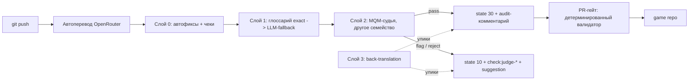

# LLM-first HCGameLoc: исследование, архитектура и роадмап

Дата: 2026-08-11. Документ развивает `llm-first-product-research.md`
(2026-08-10): исследование (части 1-3) сохранено как есть, продуктовое
предложение (бывшая часть 4) заменено архитектурой и роадмапом.

Что изменило постановку:

- Вводная заказчика: у студии **нет переводчиков**. Ключевой запрос —
  валидация локализации AI-агентами вместо людей с уверенностью в
  качестве, либо максимально прозрачный процесс. «Человек ревьюит
  low-confidence строки» из ресеча — персона, которой не существует.
- Ревизия LLM-пути по коду:
  `docs/specs/2026-08-11-llm-first-prompt-and-pipeline-review.md`.
- Замер глоссарного гейта:
  `docs/specs/2026-08-11-glossary-enforcement-analysis.md` и план
  `docs/plans/2026-08-11-glossary-morphological-enforcement.md`.
- План релизного гейта:
  `docs/plans/2026-08-10-git-localization-quality-gate.md`.
- Три исследования 2026-08-11 (полные отчёты с источниками в
  `docs/LLM-first/agent_researches/`): дизайн LLM-судьи
  (`2026-08-11-llm-judge-design-research.md`), UX конкурентов
  (`2026-08-11-judge-ux-competitor-research.md`), поверхности
  интеграции в UI Weblate
  (`2026-08-11-judge-weblate-ui-integration.md`).
- Разбор Cathedral — предыдущего локализатора заказчика на том же VPS
  (`2026-08-11-cathedral-localizer-analysis.md`): полевые подтверждения
  инвариантов на 388 149 производственных вердиктах и три правки,
  внесённые в роадмап (см. фазу 0 и инварианты исполнения в 4.3).

JTBD заказчика: «когда мы выкатываем апдейт игры, переводы должны быть
провалидированы автоматически — чтобы доверять качеству без найма
переводчиков, а всё, чему доверять нельзя, было видно прозрачно». Это
job про валидацию и прозрачность, а не про перевод: по замерам COL4
перевод почти решён (термин в промпте — соблюдение 478/478 = 100%,
`game-markup`/`game-line-break` — ноль нарушений на 3941 строке), весь
наблюдённый брак детерминирован. Недостающее звено — машинный контур
валидации и его видимость.

---

## Часть 1. Текущее состояние продукта (аудит кода)

### Карта LLM-возможностей

```text
RoutedLLMTranslation (weblate_customization/machinery.py)
  name='OpenRouter', per-language routing JSON ({ja: model, *: fallback}),
  ContextVar -> resolve_model(), наследование настроек project -> global
      | наследует
OpenAITranslation (weblate/machinery/openai.py)
  chat completions payload, parse_chat_response
      | наследует
BaseLLMTranslation (weblate/machinery/llm.py, ~2600 строк)
  PROMPT-шаблон (27 правил) + persona/style/language_instructions
  _build_string_payload(): source, context/key, explanation, note,
    secondary language, plural metadata, failing_checks[], placeholders map
  _get_glossary_entries(), batch_size=20, max_score=90
      | наследует
BatchMachineTranslation (weblate/machinery/base.py)
  кэш переводов 30 дней, rate limiting (1800s), batch_translate,
  TranslationDownloadPlan, quality в TranslationResultDict
```

### Три пути к LLM-переводу сегодня

**Путь A — вкладка Automatic suggestions (per-unit, lazy).**
Переводчик открывает страницу перевода, JS (`weblate/static/editor/full.js:275`)
лениво грузит suggestions по AJAX (`weblate/machinery/views.py:571`).
LLM не вызывается, пока человек не открыл вкладку. Кнопки
Clone / Accept / Accept+Approve, хоткеи Ctrl+M.

**Путь B — форма Automatic translation (bulk, Celery).**
Operations -> Automatic translation (`AutoForm`,
`weblate/trans/forms.py:1177`, `DEFAULT_ENGINE='openrouter'`).
Режимы: suggest / translate / fuzzy / approved; фильтр по умолчанию
`state:<translated`. Задача `auto_translate`
(`weblate/trans/tasks.py:971`) -> `AutoTranslate.process_mt()`
(`weblate/trans/autotranslate.py`) -> `fetch_machinery_matches` ->
`batch_translate`. Запускается человеком, отдельно на каждый язык.

**Путь C — addon Automatic translation (`weblate/addons/autotranslate.py`).**
Триггеры: EVENT_COMPONENT_UPDATE, EVENT_DAILY (шахматка BACKGROUND_TASKS),
EVENT_CHANGE. Дефолты: `mode=suggest`, `auto_source=others` (память
переводов, НЕ MT/LLM!), `q=state:<translated`, `threshold=80`.

### Точки трения (ручные шаги)

1. Новая строка из git НЕ переводится LLM автоматически: addon по умолчанию
   смотрит в TM, не в machinery; на компонентах он не установлен.
2. Bulk-автоперевод запускается вручную и per-language.
3. Нет auto-approve: даже принятый LLM-перевод ждёт человека.
4. Нет оценки качества (QE): все LLM-результаты равнозначны, очередь ревью
   не приоритизирована.
5. `enforced_checks` (механизм STATE_NEEDS_REWRITING при failing check) не
   подключён к игровым чекам.
6. LLM виден в UI только как вкладка suggestions — опция, не дефолтный поток.

### Архивные планы (docs/plans/old/)

- `llm-judge-external-pipeline.md` — доархитектурный черновик внешнего
  LLM-judge. Его факты о REST-курсорe, хэше target, идемпотентности и
  dry-run сохранены в 4.3; back-translation как основной критерий
  заменён текущей архитектурой. Не является планом реализации.
- `2026-08-07-project-scoped-llm-context.md` — field-by-field наследование
  проектных настроек, developer note в промпте, команда glossary coverage.
  НЕ реализован.
- `2026-08-05-routed-llm-machinery.md` (+ design) — RoutedLLMTranslation.
  РЕАЛИЗОВАН.
- `docs/specs/continuous-localization-loop.md` — полный цикл
  git -> Weblate -> git с рекомендациями по addon'ам.

---

## Часть 2. Встроенные механизмы Weblate (на что опираться)

| Механизм | Файл | Что даёт | Ограничение |
|---|---|---|---|
| BatchMachineTranslation | `weblate/machinery/base.py` | batch_translate, кэш 30 дней, rate limiting, `quality` в результате, ранжирование сервисов (max_score + rank_boost) | quality — статическая константа сервиса, не оценка конкретного перевода |
| Реестр MACHINERY | `weblate/machinery/models.py` | регистрация кастомных сервисов через WEBLATE_ADD_MACHINERY | — |
| State machine | `weblate/utils/state.py` | 0 empty, 10 fuzzy, 11 needs rewriting (enforced checks), 12 needs checking, 20 translated, 30 approved | API запрещает вручную ставить 11/12 |
| Review workflow | `weblate/trans/models/project.py` | `translation_review=True`: state 20 = "Waiting for review", 30 требует права unit.review | — |
| Suggestion + autoaccept | `weblate/trans/models/suggestion.py`, `component.py` | `suggestion_voting` + `suggestion_autoaccept` (порог голосов) | рассчитан на голоса людей, не на скоры машин |
| AutoTranslate | `weblate/trans/autotranslate.py` | режимы suggest/fuzzy/translate/approved, фильтр q | всегда per-translation (один язык), нет multi-language batch |
| Addon autotranslate | `weblate/addons/autotranslate.py` | триггеры component_update / daily / change | дефолт auto_source=others (TM) |
| enforced_checks | `weblate/trans/models/unit.py` (Unit.translate) | failing enforced check -> STATE_NEEDS_REWRITING, блокирует «переведено» | применяется после сохранения, не до |
| Checks на suggestion | `suggestion.get_checks()` | прогон checks на suggestion | не влияет на autoaccept |
| API | `weblate/api/views.py` | PATCH unit (target+state, 30 требует unit.review), POST translations/{id}/autotranslate, SuggestionViewSet.accept, ProjectViewSet.machinery_settings | нет batch-translate endpoint |
| Настройки MT per-project | `weblate/configuration/models.py` (Setting, category=2) | field-by-field merge поверх глобальных, `_project` в ключе кэша | — |
| Celery | `weblate/trans/tasks.py`, `weblate/utils/celery.py` | auto_translate с retry, периодические задачи, /api/tasks/ прогресс | — |

Архитектурные пробелы для LLM-first: нет QE-поля на unit'е, нет порога
auto-approve, quality у suggestion не хранится, нет batch API.

---

## Часть 3. Как это делают топовые TMS (2025-2026)

Единый паттерн рынка: **AI переводит всё при загрузке -> QE-скор 0-100 на
каждую строку -> auto-approve выше порога -> человек ревьюит только
low-confidence**.

### Сравнительная таблица

| Вендор | Флагманский LLM-сценарий | QE-метод | Auto-approve | Роль человека | Killer feature |
|---|---|---|---|---|---|
| Lokalise | AI translation + Workflows | Real-time MQM (0-100) | порог (default 80) | ревью < порога | Thompson Sampling мульти-модельный роутинг |
| Crowdin | AI Pipeline + Copilot | флаги неоднозначности + QA checks | ручной/Copilot | разрешает неоднозначности | модульный pipeline + ambiguity-first Copilot |
| Phrase | AI Translation Agent + MT Autoselect | QPS (MQM-based, 0-100) | порог auto-confirm + lock (default 100%) | ревью незалоченных | явный порог auto-confirm + Analytics для тюнинга |
| Smartling | AIT (managed) / AI Toolkit | LQE Agent + LQA Agent (MQM) | Tier 1 = без ревью; Tier 2 = light post-edit | тиры по языкам | zero-review для high-resource языков |
| Transifex | AI Fill-up + TQI | TQI (3 компонента, real-time) | Auto-Review по порогу TQI | ревью < порога | разбивка TQI: consistency / structural / semantic |
| XTM | AI Translate + Intelligent Workflow | консенсус 2-3 LLM (TQI) | auto-close шага, если все Good | ревью < порога | LLM-консенсус как QE (без отдельной модели) + auto-close |
| memoQ | AGT (RAG) | нет (человек обязателен) | нет | полное ревью | RAG по своим TM/TB/LiveDocs без дообучения |

### Детали по вендорам

**Lokalise.** Upload -> Workflows -> AI translation (роутинг Thompson
Sampling между 5+ LLM) -> real-time MQM per string -> auto-approve >= 80 ->
только <80 в ревью. AI Profiles с RAG по прошлым переводам/терминологии,
скриншоты и метаданные автоматически в контексте. MCP-сервер для внешних
копилотов. Маркетинг: "human-level translations at scale", 90%+ acceptance.
Источники: <https://lokalise.com/ai/>,
<https://docs.lokalise.com/en/articles/11631905-scoring-translation-quality>.

**Crowdin.** Auto-Translation при загрузке -> AI Pipeline (модульные шаги:
извлечение контекста -> терминология -> перевод -> contextual appraisal ->
QA) -> Copilot флагует неоднозначности и задаёт уточняющие вопросы вместо
угадывания. Полностью кастомизируемые промпты; контекст: глоссарий, TM,
style guide, соседние строки, файл, проект, код/репозиторий, скриншоты.
Источники: <https://support.crowdin.com/crowdin-ai/>,
<https://crowdin.com/blog/mastering-ai-localization-pipelines>,
<https://crowdin.com/blog/game-localization>.

**Phrase.** Pre-translation (TM -> MT/AI) -> MT Autoselect per job -> QPS
скорит каждый сегмент (0-100, предсказывает MQM) -> сегменты выше порога
auto-confirm и/или lock (default 100%, понижают до ~90%) -> остальное в
ревью/LQA через Orchestrator. AI Translation Agent: translate -> error
correct -> terminology -> fluency refine без конфигурации. Style Guides
per-locale, Rules как источник AI-чеков. Источники:
<https://support.phrase.com/hc/en-us/articles/5709672289180-Phrase-QPS-Overview>,
<https://support.phrase.com/hc/en-us/articles/20660272640284-AI-Translation-Agent>.

**Smartling.** Два режима: AIT (managed, Tier 1 языки = ноль человеческого
ревью, near-instant; Tier 2 = AI + Light Post-Edit) и self-serve AI Toolkit
(LQE Agent предсказывает качество, AI Post-Editing Agent правит грамматику/
тон/brand voice, LQA Agent — MQM-based QA). Visual Context: скриншоты, OCR,
JS/API. Маркетинг: "MTPE-quality at half the cost". Источники:
<https://help.smartling.com/hc/en-us/articles/4417496876827-Smartling-Language-Services-Workflows>,
<https://help.smartling.com/hc/en-us/articles/25058582212507-Language-Quality-Estimation-Agent-for-Machine-Translation>.

**Transifex.** TM Fill-up -> AI & MT Fill-up (AI/MT/hybrid per language) ->
TQI в реальном времени (Consistency = согласие LLM-выводов, Structural
Integrity = форматирование/глоссарий/теги, Semantic = MQM-точность) ->
Auto-Review по пользовательскому порогу TQI -> ниже порога — в ревью.
Thumbs up/down улучшает AI и TQI. Smart Tag protection для notranslate.
Источники: <https://help.transifex.com/en/articles/9465000-translation-quality-index-tqi>,
<https://community.transifex.com/t/now-live-supercharge-your-localization-with-auto-review-based-on-tqi/4762>.

**XTM.** AI Translate шлёт каждый сегмент 2-3 LLM (с source + контекст +
до 3 TM-совпадений + терминология) -> TQI = сходство ответов моделей
(высокое согласие = высокий скор) -> Intelligent Workflow auto-close шага,
если все сегменты Good (порог Acceptable default 70%, Good 95-100%,
конфигурируется global/customer/project) -> ниже порога — лингвисту.
IPE (Intelligent Post-Editing) — автоматический LLM-шаг доводки перед
человеком. Источники:
<https://help.xtm.ai/en/xtm-cloud/26.2/en/global-ai-translate---tqi-settings.html>,
<https://help.xtm.ai/en/xtm-cloud/26.2/en/global-intelligent-workflow-settings.html>.

**memoQ.** AGT: pre-translate LLM'ом с RAG по своим TM/TB/LiveDocs, без
дообучения. Человеческое ревью обязательно. Источники:
<https://docs.memoq.com/current/en/Workspace/pre-translate-with-agt.html>,
<https://www.memoq.com/product/memoq-agt/>.

### Quality estimation: что реально гейтит в проде

1. **TMS-нативные скоры** (Phrase QPS, Lokalise MQM, Transifex TQI, XTM
   TQI, Smartling LQE) — проприетарные смеси COMET-производных +
   LLM-as-judge. Именно они, а не сырой COMET, выполняют auto-approve.
2. **COMET / CometKiwi** (Unbabel) — открытые модели; CometKiwi —
   reference-free QE, практичный вариант для гейтинга.
   <https://github.com/Unbabel/COMET>,
   <https://aclanthology.org/2022.wmt-1.60/>.
3. **GEMBA-MQM** — GPT-4 как MQM-судья, SOTA для system-level ranking
   (WMT). <https://aclanthology.org/2023.wmt-1.64/>. Академическая база
   того, что вендоры продают как real-time скоринг.
4. **Мульти-LLM консенсус** (XTM, компонент Consistency у Transifex) —
   качество = согласие моделей; не нужна отдельная QE-модель.
5. **MQM** — общий каркас всех скоров: accuracy, fluency, terminology,
   style + severity (minor/major/critical).

### Контекст-инъекция для игровой локализации (зрелые практики)

- Глоссарий/termbase в промпте — универсально; рекомендация 500-1000
  терминов до включения AI (<https://loxily.com/en/blog/complete-guide-game-localization-ai>).
- Профили персонажей / тон / style guide в промпте (Gridly character
  prompt library, Crowdin style guides).
- Скриншоты / visual context против переполнения UI (Smartling, Crowdin).
- Лимиты длины строк per-language (Gridly length limit).
- Сохранение плейсхолдеров/маркапа как детерминированные проверки — по
  Loxily большинство провалов игровой локализации это
  engineering/formatting, не качество перевода
  (<https://loxily.com/en/blog/game-localization-qa-checklist>).
- Код/репозиторий как контекст (Crowdin MCP, сканирование репо).

### Агентные / pipeline-подходы

- **Translate -> Estimate -> Refine** (TEaR, NAACL 2025;
  <https://aclanthology.org/2025.findings-naacl.218/>) — self-review цикл;
  экспериментально, но сильные результаты.
- **Каскадный cost-quality роутинг** ("Translate Smart, not Hard",
  EMNLP 2025; <https://aclanthology.org/2025.emnlp-main.1358.pdf>) —
  дешёвая модель первой, эскалация низкоскорных X% на дорогую в рамках
  бюджета. Прямо ложится на OpenRouter-роутинг.
- **Sample-N + re-rank по QE** (Unbabel QUARTZ, MBR;
  <https://unbabel.com/quality-aware-machine-translation/>) — ~40%
  снижение серьёзных ошибок.
- **Multi-agent translate -> postedit -> proofread** (WMT25;
  <https://aclanthology.org/2025.wmt-1.32/>) — коммерческий аналог:
  Crowdin AI Pipeline.

### Роль человека (консенсус рынка)

- Review-only: человек не переводит первый драфт нигде.
- Порог QE решает, что человек вообще увидит.
- Тиры доверия по языкам (Smartling): high-resource — без ревью.
- Человек остаётся для транскреации / лора / эмоционально нагруженного
  контента; AI стартует с low-risk (UI, patch notes).
- Петля обратной связи: правки человека -> TM/RAG -> будущие переводы.

---

## Часть 4. Архитектура: судья вместо ревьюера

### 4.0 Смена постановки

Части 1-3 писались под рыночный паттерн «AI переводит всё -> человек
ревьюит low-confidence». Без переводчиков паттерн вырождается: очередь
«Waiting for review» без ревьюера — это вечный state 20 и ноль
прозрачности. Следствия:

- **LLM-judge — не сэмплированный аудит (бывший P4), а штатный
  ревьюер.** Единственный семантический валидатор в системе;
  поднимается в начало роадмапа.
- **Консенсус-QE (бывший P2) не строится.** Все замеренные дефекты
  детерминированы и ловятся чеками (ревизия, п. 3.3); численный скор —
  инструмент тюнинга порога человеческого ревью, которого нет. Вердикт
  судьи + чеки заменяют скор.
- **Auto-approve — не экономия труда, а критерий релиза**, и замыкает
  его не state-машина, а фильтрованный экспорт (4.5).
- Зависимость, которую ресеч не связал: митигация отравления few-shot
  (ревизия, п. 3.1 — брать примеры из `STATE_APPROVED`) без людей
  работает только когда approved-юниты создаёт судья. Без судьи петля
  деградации немитигируема в принципе.

### 4.1 Инварианты

1. Всё детерминированно проверяемое проверяется кодом — автофиксами и
   чеками, не промптом и не судьёй.
2. Вероятностный вердикт никогда не блокирует релиз. Блокируют только
   детерминированные проверки; судья — advisory required-check'ом не
   становится (зафиксировано планом гейта; сегментные LLM-оценки шумят
   и на WMT уступают метрикам).
3. Судья — другое семейство моделей, чем переводчик. Self-preference
   bias управляется перплексией, а не авторством, и при
   judge=translator усиливается (arXiv 2410.21819, NeurIPS 2024);
   переводит `google/gemini-*` — судит не-Google.
4. Вердикт выводится из списка ошибок, а не наоборот: судья сначала
   перечисляет MQM-ошибки со span, категорией и severity (веса
   critical=25 / major=5 / minor=1), затем вердикт из инвентаря
   (EAPrompt; GEMBA-MQM V2 — #1 на WMT25). Прямые численные оценки
   0-100 не используются: они кластеризуются и не калибруются.
5. Back-translation — display-only артефакт доверия, не скоринговый
   сигнал. Литература единодушна: RTT как оценщик ненадёжен — ошибки
   гасятся в round-trip, парафраз даёт ложные тревоги (WMT22 QE, ACL
   2023). Это заменяет основной критерий архивного черновика
   `plans/old/llm-judge-external-pipeline.md`: BT остаётся, но переезжает
   из механизма оценки в слой улик.
6. Терминология: детерминированный матч первым, LLM — только на
   промахах (паттерн IFMTBench), и только advisory для склоняемых
   терминов; hard остаётся за forbidden/exact (план морфологии,
   задачи 3-4).
7. Пер-язык политика доверия (4.6): для th/vi/id/hi/fa судья ненадёжен
   (LoResLM 2025: Spearman 0.14-0.36 против 0.34-0.64 у fine-tuned
   энкодеров) — там pass не авто-одобряется без второго сигнала,
   авто-reject запрещён.
8. Каждый вердикт оставляет след: Check-строка для фильтров и
   статистики плюс комментарий с уликами. Молчаливых переходов
   состояния нет.

### 4.2 Целевой конвейер



**Слой 0 — детерминированный пол (в Weblate, уже работает).** Автофиксы
на записи (`RemoveAddedFinalStop`, `AddFrenchPunctuationSpacing`,
`LineSeparatorSpacing`), чеки (`game-markup`, `game-line-break`,
`cyrillic-leak`, стоковые), `enforced_checks` -> state 11. По отраслевым
замерам детерминированный слой снимает 40-60% дефектов бесплатно;
критичный детерминированный провал до судьи не доходит вообще.
Добивка слоя (quick wins из разбора Cathedral, план
`plans/2026-08-11-layer0-autofix-quick-wins.md`): расширение автофикса
терминала на `!`, `?`, `:` (+83 юнита той же болезни) и backfill-команда
`reapply_autofixes` — автофиксы работают только на записи
(`unit.py:2406`), исторические ~1380 дефектных юнитов иначе не
вылечатся никогда. Обратный класс (модель потеряла пунктуацию
источника) остаётся чеку и судье: дописывание недетерминированно.

**Слой 1 — терминология.** Сначала точный матч с подсчётом вхождений
(план морфологии, задачи 2-3); LLM-подтверждение только для промаха на
склоняемом термине: бинарный ответ «присутствует ли грамматическая
форма термина» (IFMTBench). Advisory, кроме forbidden/exact.

**Слой 2 — MQM-судья, главный вердикт.** Батч юнитов -> structured
output (JSON schema) со списком ошибок {span, категория, severity} ->
вердикт: critical -> reject, major -> flag, иначе pass. Глоссарий,
developer note и результаты детерминированных проверок
(`failing_checks`) подаются судье как контекст: судья не пере-доказывает
разметку и не противоречит коду (у Cathedral судья дублировал валидатор
свободным текстом). Для flag/reject — повторный прогон 3x с агрегацией
перед записью (паттерн GEMBA V2), чтобы сбить false rejects; pass не
переспрашивается.

**Слой 3 — back-translation.** Для каждого юнита, дешёвой моделью,
подпись «approximate reconstruction». Продюсер, не читающий
французский, сравнивает `ГЕРМОДВЕРЬМИ` с обратным
`PORTES BLINDÉES -> Бронированные двери` — это и есть интерфейс
доверия для нечитающего стейкхолдера. Скор из BT не выводится.

**Слой 4 — позже, по данным: CometKiwi** как второй сигнал для
low-resource языков и эскалация при разногласии с судьёй (фаза 4).

### 4.3 Запись вердикта в Weblate

Судья остаётся внешним пайплайном поверх REST API. Из архивного черновика
сохранены курсор, хэш target, идемпотентность и dry-run; контракт записи
определяется ниже:

| Вердикт | Действия |
| --- | --- |
| pass | `PATCH state=30` (judge-бот с правом `unit.review`) + audit-комментарий: модель, счёт ошибок, BT |
| flag | `PATCH state=10` + Check-строка `judge-flag` + комментарий с MQM-списком и BT |
| reject | `PATCH state=10` + Check-строка `judge-reject` + suggestion с исправлением (не автопринимается) + комментарий |

Два инварианта исполнения — полевое основание: Cathedral теряет 19.6%
вердиктов на разборе свободного текста, и все они по умолчанию уходят в
самую дорогую стадию (анализ, пп. 6 и 10.3):

1. **Неразобранный или пустой ответ судьи — сбой транспорта, не
   вердикт.** Ретрай, затем пропуск строки со счётчиком в метриках
   прогона. Никогда не эскалация в flag/reject.
2. **No-regress при правке.** Результат второго прохода принимается,
   только если множество failing checks не выросло относительно
   состояния до правки; иначе откат к предыдущему target. (Аналогичная
   ветка Cathedral без ревалидации — `after_correct.py:682-684` — их
   единственное исключение из этого правила, и оно ломает
   critical-разметку молча.)

Механика подтверждена сканом кода
(`agent_researches/2026-08-11-judge-weblate-ui-integration.md`):

- Check-строки, созданные внешним процессом, полноценно живут в UI:
  красный бейдж в списках, карточка «Things to check», фильтры
  `q=check:judge-flag` / `has:check`, статистика `stats.allchecks` —
  всё бесплатно. Классы `judge-flag`/`judge-reject` регистрируются
  через `WEBLATE_ADD_CHECK` и возвращают `False` из `check_single`.
- Комментарии несут Markdown -> карточка улик: вердикт, список ошибок,
  BT (`POST /api/units/{id}/comments/`).
- Labels отвергнуты: висят на source_unit и общие для всех языков —
  вердикт по fr пометил бы и ja.
- `translation_review=True` включается в фазе 2: это предусловие
  `state=30` через API. Ревьюером становится judge-бот.

### 4.4 Прозрачность: UI по фазам

Консенсус конкурентов и cross-domain паттерны — в
`agent_researches/2026-08-11-judge-ux-competitor-research.md`. Два главных: Phrase
отделяет вкладку «AI checks» от детерминированных «QA checks» — судья
не должен визуально смешиваться с фактами; SPF.io и Crowdin показывают
back-translation именно для ревьюера, не читающего целевой язык.

- **MVP (ноль правок шаблонов).** Очереди продюсера — это фильтры:
  `q=check:judge-reject` (разобрать сегодня), `q=check:judge-flag`
  (просмотреть), `q=state:approved` (принято судьёй — виден объём
  доверия). Улики — в комментарии юнита.
- **V2 (правки шаблонов).** Отдельная карточка «Judge» в сайдбаре
  (`translate.html:596`, зона «Things to check») с бейджем вердикта,
  BT-блоком и списком ошибок; счётчики judge coverage / pass-rate в
  `info.html` по образцу `stats.allchecks`; бейдж вердикта в строке
  списка юнитов, визуально отличный от детерминированных чеков.
- **V3.** Варианты исправления как suggestions (паттерн Transifex
  Variants); white-box лог рассуждений судьи в развороте (паттерн
  Crowdin AI Pipeline Logs).

### 4.5 Auto-approve и релизный гейт

`enforced_checks` понижает состояние **после** `save_backend()`
(ревизия, п. 8.5): плохая строка уже лежит в PO-файле, и если игра
собирает локализацию из файлов VCS, state-машина — декорация. Настоящий
гейт замыкается по плану `2026-08-10-git-localization-quality-gate.md`:

- Weblate пушит только в `translations/weblate` и открывает PR;
- offline-валидатор блокирует детерминированные дефекты; судья —
  advisory, никогда required status check;
- коммит-политика «Only include approved translations»: в файл попадает
  только то, что одобрил судья (или человек поверх него). Состояние 30
  становится физическим фильтром поставки, а auto-approve — критерием
  релиза.

Auto-approve включается только после калибровки судьи (фаза 0, трек B)
и канарейки на COL4.

### 4.6 Пер-язык политика доверия

| Тир | Языки | Политика |
| --- | --- | --- |
| high | fr, de, es, pt_BR, ru, en | вердикт действует полностью: pass -> 30, reject -> 10 |
| mid | tr, ja, ko, zh | как high + периодический сэмплированный переаудит 3x-прогоном |
| low | th, vi, id, hi, fa | pass не одобряется без второго сигнала (CometKiwi, фаза 4); авто-reject запрещён — максимум flag |

Основание — LoResLM 2025 и WMT24 QE: на low-resource языках
reference-less LLM-оценка около шума, fine-tuned энкодеры надёжнее.

---

## Часть 5. Роадмап

### Статус: что уже стоит в коде (2026-08-11)

Из порядка работ ревизии сделано: логирование `finish_reason`
(`openai.py:148-150`), `max_tokens`, спасение валидного префикса вместо
деления пополам (`PartialLLMReplyError`, `llm.py:2863-2874`), весь
глоссарий в батч при <=300 записей (`llm.py:213` — закрывает и COL4, и
Space Arena), автофиксы финальной точки и французской типографики, чек
`cyrillic-leak`, параллельный fetch с `batch_concurrency=2`,
eval-харнесс (`docs/misc/col4-eval-harness.py`) с базлайном и замером
batch_size (`col4-batch-size-eval.json`: кандидат batch 10 /
concurrency 2; правило 27 оставлено — его удаление замерено как
end_stop 58-71 против 18-28).

Не сделано: `response_format: json_schema`, инкрементальная запись
`process_mt`, few-shot из `STATE_APPROVED`, короткий промпт, задачи
плана морфологии, судья, гейт.

### Фаза 0 — измеримость и транспорт (сейчас)

- **Трек A:** эксперимент `response_format: json_schema` на пути
  OpenRouter (прецедент `loc_kit.py:425-443`) по протоколу харнесса.
  **Предусловие фазы 2, а не параллельная задача**: Cathedral — полевое
  доказательство, что свободнотекстовый контракт с моделью деградирует
  на два десятка процентов и бьёт по стоимости (19.6% потерянных
  вердиктов = вдвое раздутая стадия правки). Дизайн эксперимента —
  `plans/2026-08-11-phase0-schema-and-judge-calibration.md`.
- **Трек B:** B0 и B1 выполнены: зафиксирован золотой набор COL4 из
  919 записей — clean 419, terminology 195, mutation 305. До фазы 2
  остаётся B2: калибровка двух судей, выбор промпта и go/no-go порогов.
  Промпт судьи schema-enforced с первого прогона — тот же контракт, что
  пойдёт в прод. Результаты разделяются по Fable-разметке,
  OpenAI-разметке и конструктивным стратам, чтобы не принять family bias
  за качество.
- **Трек C — пробник дрейфа не-глоссарных повторов** на прод-выводе
  COL4: правка 10.1 анализа Cathedral (рантайм-канон first_mentions,
  23.4% их стадии правки) переносится только через замер — их цифра
  получена в системе без TM, кэша и глоссария в промпте, у нас точные
  повторы закрывает кэш machinery, термины — полный глоссарий <=300, а
  детекцию — стоковый чек `inconsistent`. Если дрейф повторяющихся
  не-глоссарных фраз материален — канон встаёт в фазу 2/4 как
  рантайм-слой (с дизайном под батчи и concurrency); если нет —
  закрыто замером.
- Инкрементальная запись в `process_mt` + возобновляемость прогона.
- Few-shot из `STATE_APPROVED` — правка кода сейчас, эффект измерим
  после появления approved-юнитов (фаза 2): до тех пор список примеров
  пуст, что и является митигацией петли деградации.

**P1 ресеча (addon автоперевода) сознательно отложен**: запуск перевода
руками не является узким местом, а addon без судьи наливает очередь,
которую некому разгребать. Возвращается в фазе 3.

### Фаза 1 — терминология и hard/advisory (план морфологии, усечённый)

Порядок внутри `plans/2026-08-11-glossary-morphological-enforcement.md`
меняется под судью:

- Задачи 3 и 4 (hard/advisory + пер-термин/пер-язык режим) — первыми:
  без них глоссарный сигнал нельзя отдавать ни в промпт, ни судье —
  advisory-промах превращается в обязательную команду переписать
  корректный текст.
- Задача 2 (морфологический фильтр цели) — детерминированная половина
  слоя 1 судьи.
- Задача 1 (стемминг источника) — **отложена**: глоссарий <=300 уже
  уходит в промпт целиком; стемминг нужен только термбейсам >300.

Плюс добивка слоя 0 — `plans/2026-08-11-layer0-autofix-quick-wins.md`:

- автофикс добавленных `!`, `?`, `:` (XS; снимается вместе с французской
  парой NBSP/NNBSP+знак, до backfill — чтобы тот прошёл одним проходом);
- management-команда `reapply_autofixes` (S; dry-run по умолчанию,
  покомпонентно). Прод-прогон — **предусловие первого пишущего прогона
  судьи в фазе 2**: иначе судья сожжёт бюджет и очередь flag на ~1400
  юнитах, которые код чистит бесплатно. Трек B прод-прогона не ждёт:
  golden set нормализуется автофиксами in-flight при сборке.

### Фаза 2 — судья v1 (после успешной калибровки B2)

- MQM-судья по 4.2-4.3: structured output, другое семейство моделей,
  BT как улика. Запись: комментарии + Check-строки; сначала
  `--dry-run`, затем flag/reject, без auto-approve.
- `translation_review=True` на проекте, judge-бот с `unit.review`.
- Второй проход `q=has:check` (TEaR на существующем коде — ревизия,
  п. 3.3): судья флагует -> `failing_checks` уходит в промпт -> модель
  чинит -> судья пересуживает. Приёмка правки — по инварианту
  no-regress из 4.3; доля холостых правок (у Cathedral — 52% вызовов
  редактора) — обязательная метрика eval-харнесса второго прохода.

### Фаза 3 — auto-approve и релизный гейт

- pass + ноль failing checks -> state 30 (канарейка COL4, потом
  пер-язык по тирам 4.6).
- Релизный гейт по плану `2026-08-10-git-localization-quality-gate.md`
  с политикой «Only include approved translations».
- Дашборд V2 из 4.4 (coverage / pass-rate).
- Возврат addon автоперевода (бывший P1): налитое теперь разгребает
  судья.

### Фаза 4 — масштабирование, по данным

- CometKiwi для low-resource тира и эскалация разногласий судья/QE.
- Задача 1 плана морфологии при термбейсах >300.
- Каскад дешёвая -> дорогая модель перевода (бывший P3), если дефекты
  сконцентрируются в конкретных языках.
- Дистилляция судьи (паттерн TQLite) при росте объёмов.

### Порядок зависимостей

Фаза 0 не зависит ни от чего и измеряет всё остальное. Фаза 2 зависит
от треков A (structured output — блокер, не оптимизация) и B
(калибровка) фазы 0 и задач 3-4 фазы 1 (иначе судья получает ложные
hard-команды); первый пишущий прогон судьи дополнительно требует
backfill автофиксов на проде (добивка слоя 0). Фаза 3 зависит от фазы 2
(канарейка) и внешних входов плана гейта (доступ к game repo). Фаза 4 —
только по данным фаз 2-3.

---

## Часть 6. Что сознательно не делаем

- **Консенсус-QE двумя моделями (бывший P2).** Платит 2-3x токенов за
  сигнал, который на замеренных данных целиком дают чеки; численный
  скор без человека-ревьюера не имеет потребителя. Пересмотр — если
  после фаз 1-3 останутся дефекты, которых не ловят ни чеки, ни судья.
- Свою COMET/ML-QE модель — CometKiwi берётся готовой и только для
  low-resource тира.
- Скриншоты/visual context — контекст уже идёт из loc-kit
  (note/explanation/глоссарий).
- `suggestion_voting`/`suggestion_autoaccept` как gate — механизм для
  голосов людей; правильный рычаг — `state` + гейт экспорта.
- Численный 0-100 скор в UI — вердикт + улики вместо числа: LLM-скоры
  кластеризуются и не калибруются, а продюсер не может проверить число.
- Проверку порядка и баланса тегов в `GameMarkupCheck` — симуляция на
  311 631 производственной строке Cathedral: ноль расхождений по
  балансу, все расхождения порядка — законные перестановки при
  переводе; проверка порядка дала бы почти чистые ложные срабатывания
  (анализ, п. 10.4).
- Ранний семантический гейт по входному файлу — у Cathedral маркер
  сработал 8 раз на 122 задачи и не остановил ни одной (анализ,
  пп. 7.1, 10.4).

### Риски

- **False-pass судьи на low-resource языках.** Митигация: тиры 4.6,
  запрет авто-reject, второй сигнал, сэмплированный переаудит.
- **Стоимость.** Полный суд ~5000 юнитов: $15-45 на язык (frontier),
  $3-8 при сэмплировании; кэш вердиктов по хэшу source+target+глоссария
  убирает пересуд неизменённых строк.
- **Отравление few-shot до фазы 2** — примеров из approved нет, список
  пуст, петли нет; после фазы 2 петля становится положительной: в
  промпт попадает только подтверждённое судьёй.
- **Судья деградирует молча.** Митигация: золотой набор из фазы 0
  становится регрессионным — каждое изменение промпта судьи гоняется по
  нему, как изменения промпта переводчика по eval-харнессу.
