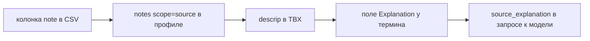

# Колонка примечаний в выводе глоссарного профиля

Дата: 2026-08-10. Статус: дизайн реализован и проверен 2026-08-15.

Продолжение `docs/plans/2026-08-10-loc-kit-glossary-deterministic-infer-design.md`,
где в границах v0 записано: «секции и notes не выводятся», а таблицы с
колонкой note уходят в OpenRouter или в рукописный профиль.

## Проблема

Типовая глоссарная таблица игры — языковые колонки плюс одна колонка прозы
о термине:

```text
ru,en,tr,fr,note
Russian,English,Turkish,French,Note
Партия,Party,Parti,Parti,"Правящая политическая партия. Во французском
                          le Parti, мужской род, не la partie"
```

Детерминированный вывод профиля на ней отказывает. `infer.py:560-569` требует,
чтобы каждая заполненная колонка была опознанным языком, и пятая колонка даёт
`InferenceError`: «column 5 ('note') holds data but is not a recognised
language column; this layout needs an explicit profile».

Цена отказа не в лишнем шаге, а в потерянном качестве автоперевода. Пояснение
к термину — единственный способ снять омонимию адресно, на конкретной строке:



Без звена B модель получает только пару «Партия = Parti» и на французском
может выдать `la partie` — партию товара вместо правящей партии. С пояснением
в запрос уходит:

```json
{"source": "Партия", "target": "Parti",
 "source_explanation": "Правящая политическая партия. Во французском le Parti, мужской род, не la partie"}
```

Правило 4 промпта (`weblate/machinery/llm.py:56`) использует
`source_explanation` именно для снятия омонимии.

Обходной путь — рукописный профиль — гарантирует, что пояснения заводить не
будут.

## Что уже работает

Проверено прогоном, а не чтением: ручной профиль с полем

```json
"notes": [{"scope": "source", "column": 5, "header": "note", "row_offset": 0}]
```

на приведённом CSV даёт `python -m loc_kit_ingest` код возврата 0 и
`out/Terms/tbx/fr.tbx` с `<descrip>Правящая политическая партия…</descrip>`.

Следовательно, менять не нужно:

| Слой | Состояние |
|---|---|
| Схема профиля v2 | `notes[]` допускает `row_offset: 0` на неязыковой колонке |
| Парсер | `_join_notes` (`parser.py:368`) склеивает несколько source-заметок, пустые ячейки выбрасывает |
| Коллизии полей | `_check_record_map_field_locations` (`profile.py:702`) считает по `(row_offset, column)`; `(0, note_col)` не пересекается ни с терминами `(0, язык)`, ни с парной заметкой `(1, source_col)` |
| Writer | пишет source explanation в `<descrip>` (`writer.py:181`) |
| Гейт публикации | `validate_glossary_profile` — та же схема, точные заголовки, парс, рендер, парс-бэк |
| UI превью | уже рендерит колонку «Source note» и счётчик `note_count` (`loc_kit_glossary_preview.html:39,65,76`) |
| Weblate | `TBXUnit.source_explanation` читает `<descrip>` (`ttkit.py:3388`) |

Не хватает ровно одного звена: вывод профиля не предлагает то, что всё
остальное умеет принять.

## Решение

### 1. Правило опознания — по тексту заголовка

Новая константа рядом с `_KEY_HEADER_DENYLIST` (`infer.py:45`):

```python
# A column of prose about the term, not a translation of it. Recognised by
# header text only: a shape rule would silently route "Character limit" into
# every LLM prompt.
_NOTE_HEADERS = frozenset({
    # English
    "note", "notes", "comment", "comments", "description", "descriptions",
    "explanation", "explanations", "context", "usage", "definition", "meaning",
    # Russian
    "примечание", "примечания", "комментарий", "комментарии",
    "описание", "описания", "пояснение", "пояснения",
    "контекст", "определение", "значение",
})
```

Сравнение — `header.strip().casefold()`, точное совпадение.

Отвергнутая альтернатива — распознавание по форме данных, порогами
`_DESCRIPTION_MIN_CHARS = 80` и `_DESCRIPTION_RATIO = 4.0`, которые уже
работают в детекции пар (`infer.py:50-51`). Отвергнута сознательно: колонка
«Лимит символов» или «Персонаж» прошла бы порог и молча уехала бы в каждый
промпт к модели. Ошибка первого рода здесь дороже отказа.

Отвергнута и разметка колонок оператором в превью: она даёт ноль ложных
срабатываний, но стоит нового экрана ради случая, который закрытый список
покрывает без единого клика.

Префиксное совпадение не используется: оно приняло бы `Context ID` и
`Note count`. Заголовок `Комментарий переводчику` остаётся случаем отказа.

### 2. Куда встраивается

`infer_glossary_profile`, после одноразового сбора `populated` (`infer.py:555-559`)
и до проверки неотображённых колонок:

```text
_find_header_row → languages{} → populated{} → [НОВОЕ: note_col]
                 → unmapped check → regions → grammar
```

- среди заголовков из закрытого списка выбирается не более одна **заполненная**
  колонка-примечание; две или более заполненные → `InferenceError` с
  перечислением номеров, потому что выбирать за оператора нечего;
- пустые распознанные колонки исключаются по отдельности с предупреждением и
  не конкурируют с единственной заполненной;
- решение берётся из готового множества `populated`, без повторного обхода
  строк для каждой колонки. Это сохраняет линейную защиту от широкого
  пользовательского файла;
- колонка не проходит проверки, применяемые к языкам: ни `min_fill`, ни отказ
  на числовых значениях. Примечание, заполненное в 3 строках из 40, — норма,
  а не разреженный язык;
- проверка `populated - languages.keys()` получает вычитание `note_col`.

Колонка не участвует ни в определении блоков (они идут по `source_col`), ни в
классификации `flat`/`pairs`, ни в подсчёте пропущенных терминов целевых
языков. Она допускается только на строках терминов во всех раскладках. Текст в
ней на строке описания, caption-строке или строке без исходного термина
отклоняется до публикационного гейта. Последняя иначе стала бы `skip_rows` и
тихо потеряла бы текст: parser намеренно не читает ячейки явного skip.

### 3. Что попадает в профиль

`grammar["notes"]` для flat получает одну запись:

```json
"notes": [
  {"scope": "source", "column": 5, "header": "note", "row_offset": 0}
]
```

Для раскладки pairs с колонкой примечаний порядок — сначала записи
строки-описания (`row_offset: 1`), затем колонка (`row_offset: 0`):
`_join_notes` склеивает в порядке объявления, и основное описание должно идти
первым.

Диагностическая заметка в отчёт и превью:
`column 5 ('note') -> explanation of the source term`. Пустая распознанная
колонка получает заметку `is empty; excluded`. Оба решения видны до создания
компонента.

Область — только `scope: source`, только одна заполненная колонка на лист.

### 4. Сообщение об отказе

Единственное изменение за пределами правила. Было:

```text
column 5 ('Контекст') holds data but is not a recognised language column;
this layout needs an explicit profile
```

Станет:

```text
column 5 ('Контекст') holds data but is not a recognised language column;
rename the header to a recognised term-note header, for example note,
description, comment, or explanation, or supply an explicit profile
```

Без кнопок и новых экранов.

## Границы

Сознательно не делается:

- заметки к конкретному целевому языку (колонка `fr note` →
  `<note from="translator">`), хотя схема их поддерживает;
- эвристика по длине текста;
- распознавание фраз вроде `Комментарий переводчику`;
- разметка колонок оператором в UI;
- глоссарные флаги (`terminology`, `read-only`, `forbidden`) из таблицы —
  отдельная тема, writer их пока не пишет вообще.

## Риск и чем ограничен

Заголовок из списка становится доверенным. Если в колонке `context` лежит не
проза, а идентификатор сцены `menu.settings`, он уедет в Explanation и в
каждый промпт.

Ограничено тремя вещами: список закрытый и короткий (`Character limit`,
`Персонаж`, `Status` в него не входят и по-прежнему дают отказ); решение
попадает в отчёт заметкой; содержимое видно в превью в колонке «Source note»
до создания компонента, и оператор отменяет импорт до записи в базу.

## Проверка

- `loc_kit_ingest/tests/test_infer_glossary.py`: плоская таблица с `note` даёт
  профиль с одним source-полем; `Notes` и `ОПИСАНИЕ` тоже; две таких колонки —
  отказ; пустая — исключается с заметкой; `Контекст` — отказ с новым текстом;
  заметка на строке без исходного термина — отказ; pairs плюс `note` даёт два
  note-поля в правильном порядке и проходит как с `layout="pairs"`, так и на
  обычном `layout="auto"` пути визарда.
- `weblate/trans/tests/test_loc_kit_ingest_contract.py`: тот же CSV через
  настоящий визард даёт превью с непустым `note_count` и текстом примечания в
  колонке «Source note», проходит TBX parse-back и создаёт glossary-компонент.
- Живой smoke кликами: загрузка файла → превью → создать компонент → у термина
  «Партия» заполнено Explanation. Не вызывать автоперевод: сквозной
  контракт `source_explanation` проверяет детерминированный тест визарда через
  `BaseLLMTranslation._get_glossary_entry`.
- `docs/specs/loc-kit-ingest.md`, раздел вывода профиля; запись в
  `docs/changes.rst`.
