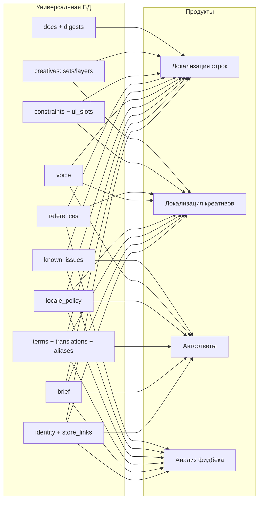

# Универсальная БД игрового контекста

Дата: 2026-08-28. Статус: дизайн, не согласован. Требует решения владельца БДХК.

Что должна содержать база знаний по играм, чтобы одна и та же запись обслуживала
четыре продукта: локализацию строк, локализацию скриншотов и стор-креативов,
автоответы на отзывы и анализ фидбека. Документ описывает схему и контракт
чтения, а не реализацию.

Источники: замер живой БДХК от 2026-08-28 (75 игр, все карточки), код
`game_pulse_saas` (файл:строка), код фока (файл:строка) и исследование
семи коммерческих TMS плюс отраслевых loc-kit гайдов (ссылки по месту).

## Проблема

Сейчас каждый продукт добывает игровой контекст сам, и все четыре добывают
разное:

| Продукт | Откуда берёт контекст сегодня | Чем это плохо |
|---|---|---|
| Локализация строк | `persona`/`style`/`language_instructions` в конфиге движка + `explanation`/`note` на юнитах | заполняется вручную на каждый проект, про игру не знает ничего |
| Локализация скриншотов | нигде | лимиты и термины креатива не связаны с игрой |
| Автоответы | `autoanswer_settings.about_game`/`brand_voice`/`support_contact` (`autoanswer/tables.py:21-53`), при пустом `about_game` — склейка `user_prompt_context` + `knowledge_base` (`autoanswer/workers.py:355-367`) | три разных пути получения одного факта |
| Анализ фидбека | `project_settings.settings->'project_context'` (`context_service.py:136-140`), генерируется LLM из `store_url` + `wiki_urls` (`context_onboarding_service.py:143-205`) | скрейп стора и вики на каждый проект заново |

Общего слоя нет. БДХК на эту роль сегодня не годится по данным, а не по
доступу: `game_texts` — это «Localized store and marketing texts» (схема
сервиса), 876 записей из пяти типов (`full_description` 291,
`short_description` 287, `title` 240, `whats_new` 55, `marketing` 3), платформа
только Android (873 из 876). Внутриигровых строк, терминов и лимитов нет.
Ни одна из 75 игр не одобрена (`requires_review` 56, `needs_review` 17,
`draft` 1, null 1), а 11 из 83 фактов опросника — буквально
`"Проверка опросника"` и при этом помечены `is_ai_context: true`.

## Три принципа, из которых следует вся схема

**1. Слои, а не один блок.** Обзор Crowdin / Lokalise / Phrase / memoQ /
Transifex / Smartling / Localazy и гайдов IGDA / Allcorrect / Keywords даёт один
и тот же ответ: контекст расслаивается на бриф, стиль и персонажей,
терминологию, посегментную семантику, визуал с жёсткими ограничениями и
версионирование. Единая «загрузка GDD» не заменяет ни один из этих слоёв
([IGDA loc-kit](https://igda.org/news-archive/high-quality-localization-help-loc-help-you/),
[Phrase Unity](https://support.phrase.com/hc/en-us/articles/15979838858140-Unity-Strings/)).

**2. База хранит факты об игре, продукт хранит свою настройку.** Как только в
БДХК попадёт `category_overrides` (привязан к десяти L1-категориям
классификатора GamePulse, `context_onboarding_service.py:20-24`) или
`domain_corrections` (учатся оператором через Telegram,
`telegram_webhook.py:221-233`), база перестанет быть универсальной. Туда же не
едут лимиты ответа в сторе — это константы платформы, а не факт об игре
(`AUTOANSWER_STORE_LIMITS`: google_play 350, app_store 5970, rustore 500,
`autoanswer/contracts.py:47-62`).

**3. Типизировать, а не просить прозу.** Заполняемость определяется формой:
enum, теги, автодополнение, `не применимо` и автоподстановка структурных полей;
свободный текст — только там, где enum не выражает смысл. Прямое следствие
замера: свободное поле `display_name` в `game_project_fields` дало 16 записей
«поле N» из 47 и 5 названий с тестовым мусором.

## Карта: кто что читает



Универсальное ядро — то, что читают минимум два продукта: идентичность, бриф,
термины, языковая политика, голос, известные проблемы, ссылки. Терминология и
языковая политика нужны всем четырём и отсутствуют сегодня везде.

## Слой 0. Идентичность и связывание

Без этого слоя база бесполезна: продукты не смогут сопоставить свою сущность с
её записью. Сейчас GamePulse опознаёт игру по настройкам коннектора
(`app_id` / `package_name` в JSONB `source_connections.settings`,
`adapters/app_store.py:91-100`, `google_play_scraper.py:317-328`), Weblate — по
слагу проекта, а БДХК использует Android-пакет как `game_id`
(`com.dekovir2.abreakerfree`). Для мультиплатформенной игры это ломается: у iOS
другой bundle id.

`title`

| Поле | Тип | Комментарий |
|---|---|---|
| `title_id` | stable slug | внутренний, не пакет стора |
| `series_id` | fk, nullable | для сиквелов и переиспользования |
| `display_name` | str | |
| `source_locale` | BCP-47 | язык оригинала |
| `engine` | enum | Unity / Unreal / custom — определяет разметку |
| `lifecycle` | enum | softlaunch / global / sunset |
| `age_rating`, `content_flags[]` | enum | violence / gambling / alcohol |
| `owner_producer`, `source_owner`, `context_steward` | fk user | три роли, см. «Владение» |

`title_store_link`: (`title_id`, `platform` enum, `store_app_id`,
`package_name`, `store_url`, `store_locales[]`). Это и есть точка связывания:
отзыв из Google Play → `package_name` → `title_id` → проект Weblate.
Дополнительно `title_binding`: (`title_id`, `system` enum
weblate/gamepulse, `external_id`) — явная таблица связей вместо угадывания.

## Слой 1. Бриф — факты об игре

Одна запись на (`title`, `revision`), типизированная и с жёстким бюджетом.

| Поле | Тип | Лимит |
|---|---|---|
| `genre[]` | enum | |
| `premise` | text | 300 |
| `core_loop` | text | 800 |
| `setting_and_era` | text | 600 |
| `world_tone[]` | enum + free | serious/comedic/dark/cozy/heroic/ironic, free 200 |
| `target_audience` | text | 400 |
| `monetization_model` | enum | f2p_iap / f2p_ads / premium / subscription |
| `monetization_notes` | text | 400 |
| `live_ops` | bool + text | 400 |

**Бюджет всей записи — 4000 символов, это не пожелание.** GamePulse режет
`user_prompt_context` на 4000 (`ai_pipeline/config.py:14`), а Lokalise прямо
предупреждает, что длинный или противоречивый гайд ухудшает и замедляет вывод
модели, и рекомендует держаться под 2000 слов
([Lokalise Style Guide](https://docs.lokalise.com/en/articles/8217808-style-guide)).
Слой обязан быть коротким по конструкции.

Материал под это в БДХК уже есть, но в виде свободных `fact_type`: у 13 из 75
игр `core_gameplay` / `player_goal` / `target_audience` / `genre_perception`
заполнены содержательно. Нужно закрыть словарь `fact_type`, добавить
`setting_and_tone` и `monetization_model` и провести ревью.

## Слой 2. Термины — несущий элемент

Единственный слой, которого в БДХК нет вообще, и единственный, который нужен
всем четырём продуктам. Он же самый дорогой в наполнении, поэтому владение им
решается ниже.

`term`

| Поле | Тип | Комментарий |
|---|---|---|
| `kind` | enum | character / unit / item / currency / location / faction / mechanic / mode / event / rank / ui_label / brand / stat |
| `canonical` | str | термин на языке оригинала |
| `definition` | text 300 | что это такое |
| `translatability` | enum | translate / do_not_translate / transliterate |
| `pos`, `gender`, `number` | enum | нужны для ru/de/fr согласования |
| `usage_note` | text 300 | регистр, склонение, длина |
| `status` | enum | draft / approved / deprecated |
| `superseded_by` | fk | переименования |

`term_translation`: (`term_id`, `locale`, `term`, `note`, `status`) — **та
форма, что реально отгружена в игре**, а не предложение.
`term_alias`: (`term_id`, `locale`, `alias`, `kind` enum player_slang /
misspelling / legacy / abbreviation).

Набор полей — пересечение того, что поддерживают term base у memoQ (определение,
пример, изображение, POS, род, число, запрещённые термины,
[док](https://docs.memoq.com/current/en/Concepts/concepts-term-bases-inside-an-entry.html)),
глоссарий Crowdin (definition, subject, notes, POS, gender, status,
[док](https://support.crowdin.com/glossary/)) и Smartling (определение,
референсное изображение, языковые термины и заметки, DNT,
[док](https://help.smartling.com/hc/en-us/articles/12026027210139-Elements-of-a-Glossary-Entry)).

Куда идёт:

- **Локализация строк**: TBX-глоссарий, который фок уже умеет принимать —
  `append_glossary_terms` с идентичностью (`context`, `source`), где `context` =
  `kind`; `definition` + `usage_note` → explanation; `do_not_translate` → флаги.
- **Локализация креативов**: текст на скриншоте обязан использовать
  `term_translation`, иначе стор-скриншот расходится с игрой.
- **Автоответы**: правильные имена сущностей в ответе.
- **Анализ фидбека**: рендер `kind` + `canonical` + `definition` даёт
  `knowledge_base`; `term_alias` → `custom_slang_map`; `canonical` ∪
  `term_translation` заменяют захардкоженный список стабильных терминов в
  `prompts/translate_batch.txt:7` (сегодня это двенадцать родовых слов: raid,
  guild, gacha, skin, nerf, buff, lag, ping, server, ban, loot, drop, и никакого
  пер-игрового глоссария путь перевода не потребляет,
  `ai_pipeline/translator.py:173-194`).

Что это лечит предметно: в примерах промпта классификатора те же сущности
встречаются в двух языках вперемешку — «Аксиома»/«Axioma»,
«Единорог»/«Unicorn», «Рейдер»/«Raider», «Диггер»/«Digger», «Galleon»,
«Heavy Brig», «Murk» (`prompts/extraction_system.txt:219-229`). Это готовые
двуязычные пары, которые сейчас существуют только внутри текста промпта.

**Владение: термины текут из Weblate, а не в него.** Локализаторы уже ведут
глоссарии, `loc_kit_ingest` уже собирает TBX, `append_glossary_terms` уже
применяет их append-only. Просить продюсера набить 80 терминов на игру —
гарантированный незаполненный слой; исследование заполняемости говорит то же.
Скрейп вики (то, что GamePulse делает сегодня) и стор-тексты дают только
кандидатов, одобрение остаётся за стюардом терминологии. БДХК здесь — хаб
раздачи, Weblate — источник истины.

## Слой 3. Голос и стиль

Запись на `title` плюс переопределение на `locale` — так устроен style guide
Localazy (formality, tone, sentiment, preferred gender и пер-языковые
переопределения, [док](https://localazy.com/docs/general/style-guide)).

| Поле | Тип |
|---|---|
| `register` | enum formal / informal / mixed |
| `player_address` | enum + note (ты/вы, du/Sie) |
| `profanity_policy` | enum none / mild / uncensored |
| `emoji_policy` | enum never / sparing / free |
| `tone` | text 600 |
| `forbidden_claims[]` | ≤20 × 200 |
| `dnt_brand_terms[]` | list |

`forbidden_claims` стоит вынести в данные: сейчас запрет обещать возвраты,
компенсации и сроки фиксов вписан в промпт автоответов
(`prompts/autoanswer_reply.md:27`), то есть одинаков для всех игр и не
редактируется студией. Читают: локализация (`style`/`persona`), креативы,
автоответы (`brand_voice`).

## Слой 4. Языковая политика

Нужна всем четырём и отсутствует везде: в GamePulse пер-проектного списка языков
нет, язык определяется по сообщению (`messages.language String16 default 'en'`,
`feedback_core/tables.py:46-76`).

| Поле | Тип | Комментарий |
|---|---|---|
| `locale` | BCP-47 канонический | |
| `raw_locale` | str | провенанс, как пришло |
| `scope` | enum | interface / store / creatives / voice / subtitles / support |
| `status` | enum | shipped / planned / dropped |
| `is_source` | bool | ровно один на (title, scope) |
| `weblate_language_code` | str | явное сопоставление |
| `expansion_allowance_pct` | int, default 30 | Keywords даёт 20-35% |
| `locale_note` | text 500 | формальность, письменность, ограничения |

Канонизация обязательна: в замере одновременно живут `ru` (67) и `ru-RU` (18),
`en` (218) и `en-US` (18), `de`/`de-DE`, `fr`/`fr-FR`, `es`/`es-ES`/`es-US`,
`it`/`it-IT`, `pt`/`pt-BR`/`pt-PT`, `pl`/`pl-PL` — две конвенции, голый ISO из
excel-импорта и BCP-47 из google_play. Поле `weblate_language_code` отдельное, а
не вычисляемое, потому что ISO 639-1 и ISO 3166-1 расходятся на трёх кодах, о
чём уже предупреждает `docs/guides/game-repo-integration-contract.md:136-162`.

## Слой 5. Ограничения

`title_constraint`: синтаксис плейсхолдеров (enum + regex), диалект разметки
(Unity rich text), правила плюралей, разделитель строк (для движка Hero Craft
это `$`, под него в фоке уже живёт `GameLineBreakCheck`), поддержка RTL, набор
фолбэк-шрифтов.

`ui_slot`: (`slot_key`, `screen`, `component_type` enum button/header/tooltip/
error/tutorial/quest/item_name/item_desc/dialogue/subtitle/system/marketing/legal,
`max_chars`, `max_lines`, `max_px`, `font`, `font_size`). Строка тегируется
слотом, а не переписывает лимиты руками — это и есть механика массового
заполнения. Пиксельные лимиты со шрифтом и кеглем поддерживает memoQ,
посимвольные на исходной строке с распространением на все языки — Smartling
([док](https://help.smartling.com/hc/en-us/articles/115004155413-Set-Translation-Length-Limits)).

## Слой 6. Креативы — локализация скриншотов

Новый потребитель, которого нет ни в одной из существующих схем. В БДХК сегодня
`game_media` — 1116 плоских URL, для локализации этого недостаточно.

- `creative_set`: (`title_id`, `platform`, `purpose` enum screenshot /
  feature_graphic / icon / video_thumb / banner, `order`, `status`)
- `creative_source`: мастер-ассет — ссылка на слоёный файл (PSD/Figma/SVG),
  фоновое изображение, `safe_area`, размеры, dpi
- `creative_text_layer`: (`layer_key`, `role` enum headline/subhead/callout/
  legal/cta, `bbox`, `font`, `size`, `max_chars`, `max_px`, `term_refs[]`,
  `source_text`)
- `creative_binding`: (`layer_key`, `unit_key`) — связь слоя с переводимой
  единицей

**Разделение ответственности.** Текст креатива — такая же переводимая единица,
как строка интерфейса, поэтому он живёт в Weblate (компонент с флагами
`max-length`, прикреплённые скриншоты как визуальный контекст). БДХК хранит
структуру ассета, лимиты и привязки, но не переводы. Иначе появляется вторая
система перевода со своим статусом и своей историей. Фок уже поддерживает
скриншоты, привязанные к юнитам (право `screenshot.add`), а OCR- и ручное
сопоставление скриншота со строками — стандарт у Crowdin, Lokalise, Phrase,
Transifex и Smartling.

Побочная выгода для локализации строк: `creative_text_layer` с `term_refs` даёт
переводчику картинку и жёсткий лимит одновременно.

## Слой 7. Известные проблемы

(`title_id`, `issue_key`, `issue_summary`, `answer`, `locale`, `scope` enum
store_reply / support / patch_note, `valid_from`, `valid_until`, `status`,
`owner`).

Ложится напрямую в `knowledge_pairs` автоответов
(`autoanswer_knowledge_pairs`: issue Text, answer Text, enabled Boolean,
`autoanswer/tables.py:56-75`). Ключевое добавление к текущей схеме —
`valid_until`: ответ про плановые работы 12 августа обязан истечь сам, сегодня
там только флаг `enabled`. Анализ фидбека использует тот же слой для
опознания уже известного, локализация — чтобы понимать, что значит строка
`error_5`.

## Слой 8. Ссылки и референсы

(`title_id`, `kind` enum build / walkthrough_video / wiki / gdd / store_page /
press_kit / discord / telegram / support_form, `url_or_ref`, `locale`,
`access_note`, `updated_at`).

Заменяет пер-проектные `store_url` и `wiki_urls`, которые GamePulse хранит в
своём JSON и скрейпит сам (`context_onboarding_service.py:143-205`). Практики
loc-kit единогласно требуют минимум один референс-ассет: билд, запись
прохождения или стабильное видео, плюс скриншоты ключевых экранов.

## Слой 9. Документы — и почему не RAG по GDD

`doc`: (`title_id`, `kind`, `original_file_ref`, `mime`, `size`, `uploaded_by`,
`uploaded_at`).
`doc_digest`: (`doc_id`, `revision`, `ai_ready_summary`, `edited_by`,
`approved_by`, `approved_at`, `content_hash`).

**В промпт уходит только одобренный человеком `ai_ready_summary`, никогда не
исходный документ.** Это доминирующий вендорский паттерн: Phrase принимает
Markdown до 150 КБ и автогенерирует AI-оптимизированную версию, Lokalise —
PDF/DOCX до 5 МБ с редактируемой краткой версией, Crowdin — MD/PDF/DOCX/XLSX с
редактируемой AI-Ready Version. Чанковый RAG по сырому GDD отложить: он
добавляет индекс, ACL, латентность, стоимость эмбеддингов и уязвимость к
внедрению инструкций, и ни один из семи вендоров не документирует его для
lore. Если включать — только за флагом, только по одобренным чанкам, и с
явным приоритетом: жёсткие структурные ограничения > глоссарий и QA-правила >
извлечённый lore > априор модели.

## Сквозной слой. Управление и свежесть

Здесь сегодняшняя БДХК ломается, и это важнее любого нового поля.

Каждая запись любого слоя несёт:

| Поле | Зачем |
|---|---|
| `revision` | монотонный, старые ревизии не удаляются |
| `review_status` | draft / in_review / approved / rejected / deprecated |
| `authored_by`, `approved_by`, `approved_at` | правило: автор ≠ одобряющий |
| `source` | producer_form / wiki_import / store_import / weblate_glossary / llm_proposal / ops |
| `updated_at` | |
| `content_hash` | для инвалидации у потребителя |

**`approved_for_ai` вычисляется, а не выставляется руками:**
`review_status == approved` И запись прошла защиту от заглушек. Сегодня
`is_ai_context` ставится вручную и отдаёт 13% мусора — это ровно та причина, по
которой базу нельзя подключать к промпту. Защита от заглушек отклоняет на
записи: строку из повторяющегося токена, тестовые маркеры
(`проверка`, `тест`, `test`, `asdf`, `поле N`), содержимое, равное названию поля,
и длину ниже порога для этого поля.

Свежесть, по итогам исследования:

- `updated_at` карточки = максимум по дочерним записям, чтобы потребитель
  опрашивал одно поле.
- `bundle_hash` на (title, потребитель, locale) — потребитель кеширует и
  инвалидирует. У фока для этого уже есть механика: `JudgeVerdict` хранит
  `context_hash`, `project_context_hash`, `request_identity`,
  `profile_fingerprint`; в идентичность добавляется `bundle_revision`.
- `stale_after` задаётся слоем, а не глобально: визуальный контекст живёт
  недолго (Smartling рекомендует 14-30 дней), бриф — долго, термины
  инвалидируются событием, а не возрастом.
- Событие изменения: (`title_id`, слой, `revision`, затронутые локали,
  число затронутых единиц). Потребитель ставит перепроверку в очередь. Старые
  результаты ИИ сохраняются и помечаются устаревшими; человеческие переводы
  не перезаписываются автоматически никогда.

Роли — по итогам исследования организации: продюсер авторствует, владелец
игры одобряет фактическую и творческую часть, стюард контекста владеет
шаблонами, общим слоем серии и высокорисковыми исключениями, лингвист
переводит и запрашивает уточнения, но не является универсальным одобряющим
контекста.

## Контракт чтения

Продукты **не читают таблицы**. Они запрашивают готовый срез:

```
GET /bundle?title=<id>&consumer=<C>&locale=<BCP-47>
C ∈ { loc_strings, loc_creatives, autoanswer, feedback }
```

Ответ содержит только поля этого потребителя, только `approved_for_ai`, уже
отрендеренные, плюс `bundle_revision` и `etag`. Причина жёсткая: без такого
среза каждый продукт соберёт «описание игры» по-своему — у GamePulse уже
сегодня три разных пути получения `about_game`
(`autoanswer/workers.py:355-367`).

Минимум, который обязателен на стороне БДХК и которого сейчас нет:

- серверная фильтрация `review_status=approved`;
- канонизация локали и цепочка фолбэков (`ru-RU` → `ru`);
- `If-None-Match` / `etag` на срез;
- пагинация терминов (их тысячи, а не десятки).

## Безопасность

Срез — недоверенный внешний ввод для промпта, и это выводит его на
`docs/security/threat-model.rst` как outbound integration. Требования:

- всё содержимое подаётся модели как данные, не как инструкции; служебные
  заголовки нейтрализуются на входе (в GamePulse это уже делает
  `_neutralize_reserved_headers`, `ai_pipeline/subcategorizer.py:128`);
- токен только на чтение, область — арендатор; потребитель не может подсунуть
  свой endpoint, ключ или модель;
- бюджеты на размер среза и на число терминов, иначе один тайтл выдавит промпт.

## Этапы

Порядок выбран так, чтобы каждый этап уже давал всем четырём продуктам, а
самый дорогой слой шёл вторым, когда владение уже определено.

| Этап | Содержание | Объём на тайтл |
|---|---|---|
| 1 | идентичность + store_links + binding, бриф, языковая политика, голос, ссылки, сквозные поля управления, срез `/bundle` | ~60 строк |
| 2 | термины + переводы + алиасы, наполнение из глоссариев Weblate | ~500 строк |
| 3 | ограничения + ui_slots + креативы (локализация скриншотов) | ~90 строк, переводы слоёв не здесь |
| 4 | документы + дайджесты; чанковый RAG только за флагом | 1-3 документа |

Этап 1 закрывает то, что все четыре продукта сейчас дублируют, и не требует ни
одной новой сущности с большим объёмом. Этап 2 — несущий, но он бессмысленен до
решения о владении терминологией.

## Границы

Сознательно не делается:

- перевод внутриигровых строк в этой базе: строки живут в Weblate, база хранит
  знание об игре, а не текст игры;
- настройка потребителей: `category_overrides`, `domain_corrections`, шаблоны
  промптов, флаги проверок, лимиты стора остаются в продуктах;
- автоматическое одобрение чего-либо, что предложила модель;
- перезапись человеческих переводов по событию изменения контекста.

## Риск

Главный риск не технический. Слой терминов — единственный, который даёт
качественный скачок всем четырём продуктам, и единственный, который невозможно
наполнить силами продюсеров. Если владение им не закрепить за локализацией,
схема останется правильной и пустой — ровно как `game_project_fields` сегодня:
15 игр из 75, 16 записей с названием «поле N» и 16 с пустым содержимым.

Второй риск: этап 1 выглядит дешёвым и потому может уехать в продакшн без
сквозного слоя управления. Тогда повторится текущее состояние БДХК — данные
есть, доверять им нельзя, потому что `approved_for_ai` ничего не значит.

## Проверка

Дизайн считается проверенным, когда:

- срез `/bundle?consumer=feedback` полностью заменяет
  `project_context.user_prompt_context` + `knowledge_base` на одном тайтле, и
  классификатор на золотом наборе не деградирует;
- срез `/bundle?consumer=autoanswer` заполняет `about_game`, `brand_voice`,
  `support_contact` и `knowledge_pairs` без ручного ввода, а лимит ответа
  по-прежнему берётся из константы платформы;
- глоссарий одного тайтла проходит круг Weblate → БДХК → `custom_slang_map` и
  `translate_batch`, и имена сущностей в переводе фидбека перестают плыть;
- один стор-скриншот собран из `creative_text_layer` + `term_translation` для
  двух локалей с соблюдением `max_px`;
- изменение одной ревизии брифа помечает устаревшими ровно те вердикты судьи,
  чья `bundle_revision` меньше, и ни один человеческий перевод не изменён.
