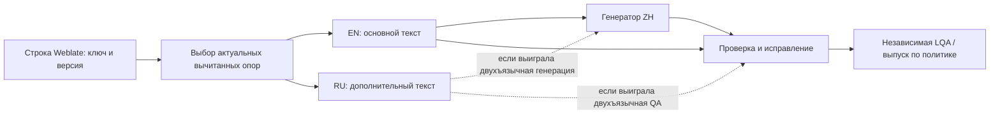

# Два опорных языка в локализации: практики и возможности HCGameLoc

Дата: 2026-09-16. Предмет: RU и вычитанный EN при локализации игр на zh-Hans.
Статус: исследование, без экспериментального подтверждения на HCGameLoc.

Сбор внешних источников выполнен тремя субагентами Luna: Weblate/community,
TMS/frameworks, научные работы и LQA. Основной агент проверил локальный код,
ключевые первичные источники и собрал протокол. Отдельный Terra исследовал
актуальные проекты прода для согласования датасета; его отчёт завершён.

**Дополнение после составления архивного снимка:** владелец выбрал Gemini
3.7 через OpenRouter для перевода и действующих судей через LiteLLM.
Актуальный исполняемый протокол — версия 1.1
`docs/product/plans/2026-09-16-dual-reference-zh-study.md`: два review seat
в E/F, editor Gemini, 1200 сегментных операций на пилот N=120 до повторов
и дополнительной оценки. Точные model IDs/профили снимаются перед запуском.
Приложения ниже сохраняют историческую редакцию: фразы о ещё не выбранных
моделях и бюджет 960 операций в ней заменены этим решением. Датасет и запуск
по-прежнему не согласованы.

**Полный комплект исследования в одном файле.** Основной текст содержит
вывод и внешние основания. Приложение A включает полный протокол эксперимента,
приложение B — полный отчёт Terra с данными прода, приложение C — дополнительные
материалы Luna и решения по независимому ревью. Это зафиксированный комплект
на 2026-09-16, собранный из документов коммита `b83011de` и сообщений
субагентов. Исходные отдельные документы сохранены; их последующие правки не
обновляют этот снимок автоматически.

**Вывод:** EN как основной вход и второй вычитанный язык как опора —
обоснованные кандидаты на проверку, но превосходство для RU/EN → zh-Hans
в HeroCraft ещё не измерено. Рекомендованный пилот: 90 строк Need For Greed
(UI, Tutorial, Loot по 30) и 30 диалоговых строк Heart Abyss. Это предложение,
а не согласованный датасет. Подтверждён только zh-Hans; вычитка опор, состав
оценщиков, бюджет и запуск остаются открытыми. Экспериментальные переводы
не запускались, production использовался только для чтения.

Связанные документы:

- `docs/product/plans/2026-09-16-dual-reference-zh-study.md` — отдельный план
  исполнения для следующей сессии; датасет и запуск ещё не согласованы.
- `docs/product/designs/2026-09-16-dual-reference-zh-experiment.md` — условия,
  контроль смещений, LQA, статистика и критерии решения.
- `docs/operations/reports/2026-09-16-dual-reference-dataset-candidates.md` —
  кандидаты из продакшена; выбор остаётся за владельцем.

## Рекомендация

Проверять политику «актуальный вычитанный EN — предпочтительный основной вход
для zh-Hans; актуальный вычитанный RU — дополнительная опора» разумно.
Объявлять её доказанной мировой практикой пока нельзя. Есть действующие
продуктовые механизмы и научные положительные результаты, но не найдено
публичного контролируемого исследования именно RU+EN→ZH в игровой локализации.

Качество EN и его актуальность важнее самого кода языка. Дополнительный текст
может снять многозначность или вернуть потерянный смысл, а может принести
ошибку, устаревшее условие или несовместимую адаптацию. Совпадение RU и EN
также не гарантирует истину: EN часто получен из RU и повторяет его ошибки.

Архитектурно не нужно сначала менять исходный язык всех компонентов Weblate.
Один source на компонент не запрещает выбирать другой основной вход для MT
и передавать дополнительный перевод в LLM. В HCGameLoc часть этого уже есть;
не хватает полного контракта вычитки, свежести и двухъязычной QA.

## Какие практики нельзя смешивать

| Практика | Что происходит | Какой эффект проверяется |
| --- | --- | --- |
| Pivot/relay | RU переводится в EN, затем EN в ZH | Полезность и потери промежуточного текста |
| Выбор готового EN | Для ZH используется уже вычитанный EN | EN против RU как вход в конкретную модель |
| Multilingual context | Модель одновременно видит основной текст и его версию на другом языке | Добавочная информация при генерации |
| Reference language в редакторе | Человек видит другой язык рядом | Помощь переводчику; передачи в модель может не быть |
| Cross-language QA | Готовый ZH сверяется с RU и EN | Обнаружение и исправление дефектов |
| RAG/TM examples | Извлекаются похожие ранее переведённые сегменты | Терминология/стиль, а не обязательно вторая версия той же строки |
| Multi-reference evaluation | Несколько допустимых ZH-эталонов или корпус эталонных сегментов | Оценивание результата, а не источник для генерации |
| Runtime fallback | Игра показывает другой язык, если целевой отсутствует | Доступность текста во время исполнения |

Для HeroCraft исходный EN уже предполагается подготовленным человеком.
Это другой вопрос, чем «пусть модель сначала сама переведёт RU в EN».
Смешивать эти сценарии в одном экспериментальном условии нельзя.

## Что подтверждают TMS и localization frameworks

Таблица отражает найденные официальные документы, а не аудит всех функций
каждого продукта. «Не подтверждено» означает границу этих источников.

| Система | Подтверждённый механизм | Что переносится в HCGameLoc | Ограничение |
| --- | --- | --- | --- |
| [Crowdin AI](https://support.crowdin.com/crowdin-ai/) | `Other languages translations` позволяет выбрать конкретные языки или передать переводы на всех языках в AI context | Прямой аналог RU/EN как дополнительного контекста той же строки | Документ не даёт измеренного RU+EN→ZH uplift и не доказывает вычитку выбранных переводов |
| [Gridly + memoQ](https://blog.memoq.com/gridly-and-memoq-integration-enhanced-localization-processes-in-app-and-game-development) | Pivot через English и отслеживание зависимостей/устаревания строк; интеграция описана для приложений и игр | Английский как редакторский промежуточный язык; необходимость revision tracking | Последовательный workflow, а не доказательство качества двухъязычного LLM prompt |
| [Phrase Next GenMT](https://support.phrase.com/hc/en-us/articles/14299433827996-Phrase-Next-GenMT) | Multi-segment context и RAG с fuzzy TM examples | Проверенные linguistic assets и контекст | Рекомендованные English–Russian и English–Chinese пары не доказывают превосходство EN→ZH над RU→ZH |
| [Smartling Prompt Tooling with RAG](https://help.smartling.com/hc/en-us/articles/42142862499227-Prompt-Tooling-with-RAG-for-LLM-Translation) | TM examples, glossary и locale-specific style rules передаются LLM | Управляемый контекст и качество его происхождения | TM examples не равны параллельному RU+EN source; такой режим этим документом не подтверждён |
| [Lokalise AI profiles](https://docs.lokalise.com/en/articles/11894216-ai-profiles) | Existing translations/TM как RAG для определённых языковых направлений | Выбор качественных примеров и профилей по языку | Не найдено обещания использования другого source language как второй опоры той же строки |
| [Trados / RWS community](https://community.rws.com/product-groups/trados-portfolio/trados-studio/f/machine-translation/20071/deepl-plugin-i-want-to-put-english-mt-into-projects-with-a-target-language-different-than-english) | Исторический ответ сотрудника: подготовить EN отдельным target, затем добавить как reference file для других языков | Практика справочного английского существует и вне LLM | Это ответ поддержки о конкретном workflow, не актуальная полная спецификация Trados и не эксперимент качества |
| [Tolgee AI Translator](https://docs.tolgee.io/platform/translation_process/ai_translator) | Screenshots, key/project context, language notes, TM | Второй язык должен дополнять игровой контекст | В просмотренной странице не подтверждён отдельный parallel-reference режим |

Полезный образец eval-процесса даёт
[Lokalise evaluation](https://docs.lokalise.com/en/articles/14018423-ai-profile-evaluation-and-proof-of-value):
контекст для генерации отделяется от approved reference set для оценки,
сравниваются несколько методов на одном наборе. Сама документация уточняет,
что BLEU/TER/chrF и совпадение с reference измеряют сходство, а не абсолютное
качество. Это поддерживает раздельные train/context/test данные; рекомендуемые
вендором объёмы не являются power analysis для нашего эксперимента.

У runtime frameworks другая ответственность.
[i18next fallback](https://www.i18next.com/principles/fallback) выбирает
доступный язык для отсутствующего ключа, а не сверяет RU/EN при создании ZH.
[Mozilla Fluent](https://projectfluent.org/) допускает различную грамматическую
сложность локализаций независимо от структуры source. Для нас это аргумент
оценивать китайскую выразительность по требованиям китайского языка, но не
эмпирическое доказательство пользы английской опоры.

## Есть ли опубликованные success practices

Есть три разных уровня свидетельств.

**Поддержанный промышленный workflow:** Crowdin передаёт переводы других
языков как AI context; Gridly/memoQ поддерживает English pivot с зависимостями.
Это показывает применимость архитектуры, но не величину эффекта.

**Измеренный научный результат:** исследователи LILT в
[Shahnazaryan et al., RANLP 2025](https://aclanthology.org/2025.ranlp-1.127/)
сравнили GPT-4o с дополнительными человеческими переводами и без них.
На proprietary EN→PT добавление трёх языков контекста дало в среднем
+2.31 BLEU и +1.01 COMET по шкалам статьи. На FLORES+/TICO-19 для EN→PT
прямой перевод часто оказался лучше. Это три контекстных языка, PT target
и технические тексты, не наш RU+EN→ZH. Самогенерируемый контекст не воспроизвёл
выигрыш. Все исходные корпуса были English-origin; эффект языкового
происхождения нельзя игнорировать. См. разделы 3.1, 4.1–4.2 и limitations
в [полной статье](https://aclanthology.org/2025.ranlp-1.127.pdf).

Более ранняя работа
[Zoph & Knight, 2016](https://aclanthology.org/N16-1004/) получила до
+4.8 BLEU для multi-source NMT относительно сильного baseline. Это
подтверждает возможность добавочного сигнала, но не переносится численно
на современные LLM и игровую локализацию.

**Кейс успешной AI-локализации без изоляции второго языка:**
[Crowdin / Polhus](https://crowdin.com/blog/ai-translation-polhus-using-crowdin)
сообщает о больших объёмах и доле AI-переводов без правок, однако объединяет
AI, глоссарий и человеческую проверку. Такой кейс не отвечает на наш
причинный вопрос. В найденных vendor case studies нет контролируемого
сравнения «тот же source и модель, единственное изменение — второй
вычитанный язык» для RU/EN/ZH игр.

Следовательно, ответ на вопрос worldwide: **подобные практики существуют,
положительные результаты в других условиях опубликованы; наша конкретная
политика требует собственной проверки**. Отсутствие найденной публикации
не означает отсутствия закрытых внедрений.

## Что говорит Weblate и его сообщество

В Weblate один source language у **компонента**, а не один обязательный язык
на всю инстанцию. Есть несколько независимых механизмов:

| Механизм | Локальное основание | Значение |
| --- | --- | --- |
| Secondary language проекта/компонента | `docs/admin/projects.rst:471`, `:1297` | Постоянный дополнительный язык для редактора; настройка может наследоваться |
| Пользовательские secondary languages | `docs/user/profile.rst:94` | Языки-подсказки конкретного переводчика; не произвольный набор опор LLM |
| Выбор MT source | `docs/admin/machine.rst:47`, `weblate/machinery/base.py:833` | Component source или configured secondary можно выбрать отдельно |
| Secondary в LLM payload | `docs/admin/machine.rst:70`, `weblate/machinery/llm.py:955` | Дополнительный перевод передаётся как контекст |
| Intermediate language / source quality gateway | `docs/admin/projects.rst:779`, `docs/workflows.rst:291` | Monolingual workflow от текста разработчика к подготовленному source, затем к остальным языкам |

Подтверждения community:

- [#13398: LLM context](https://github.com/WeblateOrg/weblate/issues/13398)
  описывает практически тот же мотив: French source и качественно
  подготовленный English для перевода на третий язык. Закрыт как выполненный
  с milestone 2026.5. При этом maintainer
  [в декабре 2024](https://github.com/WeblateOrg/weblate/issues/13398#issuecomment-2563921920)
  сообщал, что в собственных опытах заметного улучшения от existing translations
  не увидел. Это полезное отрицательное наблюдение без опубликованного
  протокола; закрытие issue не опровергает и не подтверждает quality uplift.
- [#7388: admin alternative source](https://github.com/WeblateOrg/weblate/issues/7388)
  закрыт, milestone 5.11: дополнительный язык задаётся администратором для
  проекта/компонента, а не только личными настройками переводчика.
- [#2136: MT from other languages](https://github.com/WeblateOrg/weblate/issues/2136)
  остаётся открытым. Maintainer
  [27 мая 2026](https://github.com/WeblateOrg/weblate/issues/2136#issuecomment-4552847986)
  уточнил, что явный alternative source уже доступен; отсутствует automatic
  fallback при неподдерживаемой языковой паре. Следующее уточнение ограничивает
  этот выбор внешними сервисами. Это не автоматический выбор наиболее
  качественного языка для каждой строки.
- [Discussion #15410](https://github.com/orgs/WeblateOrg/discussions/15410)
  касается developer English → polished English → другие языки. Обсуждение
  без accepted answer; ответ maintainer ссылается на уточнение документации
  в [#15473](https://github.com/WeblateOrg/weblate/pull/15473). Его проверяли
  через discussions репозитория `WeblateOrg/weblate`.

Upstream index [llms.txt](https://docs.weblate.org/en/latest/llms.txt) при
проверке обозначал 2026.10; локальный fork — `2026.8.1.dev0`. Это разные
ветки версий. Поведение HCGameLoc ниже установлено по локальному HEAD
`f103a26232b9abcd6ccce1a45543f5a28ae80d0f`, а не выведено из latest upstream.
Онлайн-документация не подтверждает ревизию работающего production image.

## Что реально умеет текущий HCGameLoc

Проверка кода дала следующие факты.

1. `BaseLLMTranslation._get_secondary_unit`
   (`weblate/machinery/llm.py:936`) принимает непустой перевод при
   `STATE_TRANSLATED <= state < STATE_READONLY`. Это включает state 20;
   обязательной human approval и проверки версии вычитки здесь нет.
2. `_get_secondary_context` (`weblate/machinery/llm.py:955`) берёт одну
   configured secondary translation, связанную с source unit. Исключает язык
   target и **исходник компонента**, но не сравнивает secondary с фактическим
   языком MT-запроса.
3. `get_source_language` (`weblate/machinery/base.py:833`) умеет выбрать
   secondary как основной вход. В базовом AUTO используется source компонента;
   это не LQA-оптимизатор. `PluralMapper.get_other_units`
   (`weblate/lang/models.py:1592`) также использует порог translated.
   Отсутствующий альтернативный перевод даёт пустую `plural_map`, а не
   доказанный автоматический fallback к RU для этой строки.
4. При stored source=RU, secondary=EN и MT source=secondary код способен
   отправить **EN как source и EN как secondary**, не добавив RU как отдельную
   опору. Это вывод по веткам кода, не результат live payload capture.
   Простое включение настройки не проверяет требуемое условие EN+RU.
5. `JudgeRequest` (`weblate/trans/judge.py:192`), `build_request`
   (`weblate/trans/judge_loop.py:111`) и `_segment`
   (`weblate/trans/judge.py:901`) сейчас передают один `unit.source` и target.
   Второй опорный перевод в запрос judge не включён. Выбор MT source не
   переключает автоматически основание оценки judge.
6. MT cache включает сериализованный контекст
   (`weblate/machinery/llm.py:1133`); judge context hash
   (`weblate/trans/models/judge.py:219`) включает source, note, explanation,
   glossary. При добавлении второй опоры её текст, ревизия и статус должны
   учитываться во всех связанных snapshot/cache identities, не только в prompt.
7. Смена `Component.source_language` у существующего компонента запрещена
   в `Component.clean` (`weblate/trans/models/component.py:5618`).
   Глоссарии также выбираются по source language
   (`weblate/glossary/models.py:311`). Поэтому миграция source — отдельная
   продуктовая работа с файлами, состояниями и связями, не шаг пилота.

Существующие measurements тоже предостерегают от предположения «больше
контекста обязательно лучше»:
`docs/product/measurements/2026-09-04-judge-dialog-context-paired.md`
и `docs/product/reviews/2026-09-04-judge-dialog-context-review.md`.
Это другой эксперимент, с соседними репликами, а не с двумя языками;
его результат нельзя переносить напрямую, но его контрольные меры полезны.

## Архитектурные варианты после эксперимента

**Вариант 1: компонент уже имеет EN source.** RU можно использовать как
secondary для перевода; дополнительно нужны проверка вычитки/свежести и
явная политика конфликтов. Двухъязычный judge потребует отдельной доработки.
Это минимальный путь, если такое устройство уже соответствует ресурсам игры.

**Вариант 2: сохранить RU source, отделить выбор опор для LLM.** Рекомендуемый
путь исследования и вероятный путь внедрения: resolver собирает версионированные
RU/EN; translator получает EN primary и RU reference; QA получает те же
основания. Структурные проверки и связь с игровым ресурсом продолжают
опираться на канонический технический контракт. Перед использованием пары
проверяется совместимость плейсхолдеров, ICU/plural и engine DSL.
Это предложение архитектуры, ещё не существующая готовая настройка.

**Вариант 3: formal source quality gateway.** Для подходящих monolingual
форматов intermediate file может отражать авторский RU, а подготовленный
EN стать source для других переводов. Это управляет порядком редакторской
подготовки, но не создаёт автоматически второй язык в judge. Intermediate
имеет особые правила отображения и блокировки переводов. Сам gateway не
является доказательством human approval: готовность source и его вычитка —
разные требования. Его следует сначала
проверять на отдельном примере формата. Для bilingual форматов такую схему
нельзя обещать без проверки поддержки.

Во всех вариантах должны существовать одно правило актуальности, понятный
владелец игрового смысла и различение `source_conflict` от `translation_error`.
Модель не должна молча решать, какая из противоречащих версий «победила».
Сначала проверяется гипотеза на snapshot; затем составляется и согласуется
план внедрения работающего варианта.

## Основания для LQA и eval-дизайна

Для качества важнее независимое профессиональное оценивание, чем рост
score того же LLM, который исправлял текст. Эти работы определяют прибор
измерения, но не доказывают пользу двух опор:

| Источник | Что поддерживает | Граница |
| --- | --- | --- |
| [Freitag et al., Experts, Errors, and Context, 2021](https://aclanthology.org/2021.tacl-1.87/) | Профессиональная MQM-разметка с контекстом меняет выводы относительно непрофессиональной оценки | Не готовая рубрика для игровой zh-Hans LQA |
| [WMT21 Metrics](https://aclanthology.org/2021.wmt-1.73/) | Зависимость ранжирования от качества references, домена и способа human evaluation | Китайское направление в обсуждаемой части — ZH→EN |
| [COMET, Rei et al., 2020](https://aclanthology.org/2020.emnlp-main.213/) | Обучаемая оценка с source/target/reference | Нужны конкретная версия и локальная калибровка; изменение source меняет прибор |
| [Chinese MWE metric benchmark, 2024](https://aclanthology.org/2024.lrec-main.198/) | Идиомы и многословные выражения создают слепые зоны метрик | Также ZH→EN; предупреждение, а не оценка нашего target |
| [Zheng et al., LLM-as-a-Judge, 2023](https://arxiv.org/abs/2306.05685) | Position, verbosity и self-enhancement bias | Исследование chat evaluation, поэтому переносим меры контроля, не его accuracy |
| [Fu & Liu, Multilingual LLM-as-a-Judge, 2025](https://aclanthology.org/2025.findings-emnlp.587/) | Непостоянство оценок многоязычных LLM | Другой benchmark; не замена китайским редакторам |
| [Ni et al., Translationese, 2022](https://aclanthology.org/2022.naacl-main.389/) | Происхождение текста и направление перевода влияют на измерение | EN, переведённый с RU, не эквивалентен независимо написанному EN |
| [Ki & Carpuat, Post-editing with Error Annotations, 2024](https://aclanthology.org/2024.findings-naacl.265/) | QA/post-editing нужно проверять как самостоятельное вмешательство | Не каждое более подробное замечание даёт полезное исправление |

Отсюда протокол отдельно сравнивает EN/RU, второй язык при генерации и второй
язык при QA с равноценной одноязычной QA. Основание качества — человеческие
major/critical дефекты; операционные отказы учитываются в общем риске
непригодного результата. Автоматические оценки остаются вспомогательными.
Датасет, локальная величина выигрыша, бюджет и допустимые регрессии этим
исследованием ещё не определены.

## Приложение A. Полный протокол эксперимента

Источник: `docs/product/designs/2026-09-16-dual-reference-zh-experiment.md`.

Дата: 2026-09-16. Статус: предложение исследования; датасет и запуск не
согласованы. Целевой язык подтверждён владельцем: упрощённый китайский,
`zh-Hans` (в API Weblate может называться `zh_Hans`).

Внешние основания и проверка архитектуры:
`docs/product/research/2026-09-16-dual-reference-localization.md`.
Кандидаты из актуального прода:
`docs/operations/reports/2026-09-16-dual-reference-dataset-candidates.md`.
Этот документ не является планом внедрения или разрешением запускать переводы.

### Решение, которое должно поддержать исследование

Проверяем политику: «Для перевода на zh-Hans предпочитать актуальный,
вычитанный EN как основной вход; при наличии актуального, вычитанного RU
использовать его как дополнительный источник смысла или проверку».

Это проверяемая гипотеза для конкретных игр, моделей и процесса вычитки.
Нельзя заранее считать EN лучшим для всех языков и всех моделей. Также нельзя
приравнивать наличие английского текста к его редакторской готовности.

Нужно различать четыре роли:

| Роль | Что она определяет |
| --- | --- |
| Исходник компонента Weblate | Идентичность строк, связи с файлами, история, проверки |
| Основной язык запроса LLM | Текст, из которого модель строит перевод |
| Дополнительный опорный язык | Уточнение смысла или материал для проверки |
| Истина для оценки | Заранее согласованный игровой смысл и требования к китайскому |

Язык оригинального авторства записывается отдельно. RU и EN обычно зависимы:
один мог быть переводом другого. Они не являются двумя независимыми голосами,
а согласие двух текстов само по себе не доказывает их правильность.

### Гипотезы и сравнения

**H1 — выбор основного языка.** На одних и тех же игровых строках с
согласованными, вычитанными RU и EN перевод с EN имеет меньшую долю
существенных LQA-дефектов, чем перевод с RU, при фиксированных модели,
глоссарии и контексте.

**H2 — второй язык при генерации.** EN с RU как справкой даёт меньше
существенных дефектов, чем EN без RU. Обратное направление, RU со справкой EN,
показывает, определяется ли выигрыш наличием двух текстов или выбором ведущего.

**H3 — второй язык при проверке.** Добавление RU в проверку и исправление
одного и того же EN→ZH черновика уменьшает остаточные дефекты относительно
проверки и исправления только по EN с тем же числом проходов и лимитами.

**H4 — применимость в производстве.** Полученный выигрыш сохраняется с учётом
стоимости, задержки, доступности проверенных опор и ошибок в самих опорах.
Это отдельный вывод: эксперимент на идеальных парах не оценивает весь прод.

Основные нулевые гипотезы: разность частот непригодных результатов в соответствующих
сравнениях не меньше нуля. Минимально полезный эффект фиксируется до
подтверждающего прогона; статистическая значимость не заменяет полезность.

### Шесть условий

Каждая включённая строка проходит все условия. Это парный дизайн; разные игры
не распределяются по разным условиям.

| Код | Генерация | Последующий проход | Что сравниваем |
| --- | --- | --- | --- |
| A | RU → ZH | Нет | Базовый вариант RU |
| B | EN → ZH | Нет | B против A: H1 |
| C | EN → ZH, RU как справка | Нет | C против B: H2 |
| D | RU → ZH, EN как справка | Нет | D против A; C против D — вторичные сравнения |
| E | Точная копия черновика B | Проверка и исправление по EN | Контроль дополнительного прохода |
| F | Та же точная копия B | Проверка и исправление по EN + RU | F против E: H3 |

Для E и F фиксируются одинаковые reviewer и editor, по одному вызову каждого
этапа, одинаковые параметры и максимальные токены. Editor может вернуть текст
без изменений. Нельзя давать F дополнительные попытки до успеха. В F второй
язык доступен на этапе QA/repair; поэтому вывод относится к этому процессу в
целом, а не только к точности детектора. Реальные токены и время учитываются:
равное число проходов не означает равной цены.

Черновик B не генерируется заново для E/F. C не становится исходником F:
иначе смешаются выгода двухъязычной генерации и выгода двухъязычной проверки.
Комбинация C + двухъязычная QA возможна как следующий эксперимент после выбора
работающего механизма.

Дополнительно на фиксированных черновиках B сравниваем сырые замечания
reviewer E/F с человеческими ошибками до исправления: precision/recall для
major/critical, ложные тревоги и обнаружение конфликтов опор. Это позволяет
понять механизм, не подменяя качеством детектора качество итогового текста.

### Датасет: сначала согласование

До выбора владельцем используются только метаданные и чтение кандидатов.
Не запускаются переводы, judge, repair и оценочные LLM на игровых строках.
После согласования фиксируются точные проекты, компоненты, квоты, exclusions,
объём пилота и версия снимка. Расширение на другие игры не происходит молча.

Критерии включения в основной корпус:

- RU и EN сопоставлены по стабильному ключу внутри компонента и версии
  ресурса; совпадение текста или номера строки не является ключом.
- Обе версии непустые, актуальны для одного игрового состояния и имеют
  подтверждение вычитки. `state=20`, `read-only`, «нет failing checks» и
  `100% translated` по отдельности этого не доказывают.
- До генерации редактор RU↔EN проверяет существенную согласованность смысла:
  числа, условия, отрицания, роли персонажей, предметы и терминологию.
- Известны контекст использования, ограничения и обязательные термины.
  Для диалогов сохраняются сцена, говорящий и связанные реплики.
- Оригинальное авторство, редакторская адаптация EN и дата проверки записаны.
  Включение EN-origin и RU-origin игр требует отдельного отчёта по этим слоям.

Основная популяция для вопроса команды — RU-origin. EN-origin используется
как заранее выделенная репликация, unknown origin — только в exploratory
анализе. Эффекты по происхождению не объединяются без фиксированных весов;
проверка взаимодействия arm × authoring language вторична. Сам парный дизайн
сохраняет одинаковое происхождение во всех условиях одной строки.

«Вычитанный» означает подтверждённый человеком конкретный текст конкретной
ревизии. Если команда вычитывала вне Weblate, допустим реестр подтверждения
владельцем и выборочная ревизия; импортный статус approved сам по себе не
заменяет происхождение. При отсутствии доказательств сначала проводится
вычитка выбранных пар, и её стоимость включается в экономику решения.

Слои основного корпуса: короткий UI; игровые инструкции и условия;
предметы/способности/термины; диалог и характер персонажа. Дополнительно
помечаются многозначность, пропущенные субъекты, числа, плейсхолдеры, ограничения
длины и engine DSL. Квоты берутся из согласованного распределения выпуска;
если редкие типы пересэмплируются, итог взвешивается обратно.

Связанные реплики, шаблонные варианты и почти одинаковые строки объединяются
в кластеры. Кластеры целиком относятся к calibration, pilot или holdout.
Повторы не увеличивают число независимых наблюдений.

Отдельный стресс-набор содержит реальные расхождения RU/EN, устаревшие версии
и недостающие опоры. Сконструированные ошибки можно добавить с явной меткой.
Он проверяет безопасность поведения, но не смешивается с репрезентативным
корпусом при оценке частоты дефектов в проде. На нём важны обнаружение
конфликта, ложные конфликты, принятие неверной опоры и доля отложенных строк.

Существующий китайский перевод не обязателен для генеративного эксперимента.
При наличии он может служить отдельным baseline или материалом калибровки,
но не становится эталоном автоматически и не попадает в подсказки генератору.

### Контроль условий и утечек

Фиксируем model ID и доступную ревизию, провайдера, параметры reasoning,
temperature, лимиты, batching, retry policy, промпты и их хеши. Запросы разных
условий перемешиваются по времени внутри блоков, чтобы смена провайдера или
нагрузки не совпала с одним условием. Смена модели требует отдельного блока.

Все условия получают одинаковые факты о сцене, персонаже, интерфейсе и
целевом стиле. Перевод этих пояснений не должен невольно раскрывать скрытый
опорный текст одноязычному условию. Язык инструкций фиксируется для всех;
его влияние отдельно этим экспериментом не исследуется.

Порядок RU/EN в двухъязычном payload фиксируется симметрично относительно
ролей primary/reference. Эффект включает такое выбранное представление;
перестановка полей может быть отдельной проверкой устойчивости. Seed, если
поддерживается, записывается, но не считается гарантией детерминизма API.

Глоссарий заранее выравнивается как набор одинаковых понятий с RU/EN/ZH
формами. В одноязычном условии показывается соответствующий source label и
тот же ZH term/смысл; второй полный исходник не подмешивается через glossary.
Нельзя сравнивать RU с полным глоссарием против EN с пустым из-за source-based
поиска терминов в Weblate.

Существующие project examples, TM hits, fuzzy matches, repair translation
fields и кэши могут подмешать старый ZH или результат другого условия. Для
первого эксперимента отключаем retrieval готовых переводов и используем один
набор нейтральных примеров формата; точное совпадение с test исключается.
Каждое условие имеет отдельную cache identity. Продуктовые effects TM можно
исследовать позже отдельным слоем.

Детерминированные проверки и autofix одинаковы. Сохраняются raw response,
текст до и после autofix, ошибки протокола и причины отказов. Неудачные
запросы не удаляются из отчёта; показываются качество полученных результатов
и покрытие всех запланированных строк. Предписанные повторы одинаковы, без
ручного выбора лучшего ответа. Для случайной части пилота полезны 3 повтора,
однако они вложены в строку, а не считаются новыми строками.

### Человеческая LQA и независимая истина

Предпочтительны как минимум два специалиста по игровой локализации,
носителя китайского, плюс независимый арбитр для расхождений. Нужна реальная
компетенция RU↔ZH и EN↔ZH: это могут быть разные специалисты. Нельзя
компенсировать отсутствие RU-компетенции у всех оценщиков обратным переводом
LLM и затем назвать результат независимой проверкой смысла.

Редактор RU↔EN и владелец игры до раскрытия результатов готовят карту смысла:
что происходит, кто действует, обязательные условия, термины, допустимые
варианты и известные расхождения. Это не один «идеальный китайский перевод».

Карта фиксируется до настройки экспериментальных промптов; записываются её
авторы и основания решений. Арбитры финальной LQA не пишут treatment prompts
и не участвуют в repair. Человеческие оценки test outputs не попадают обратно
в генерацию. Один оценщик видит не более одного варианта строки за сессию,
кроме специально выделенной и сбалансированной pairwise-задачи.

Если краткие пояснения нужны оценщикам EN↔ZH, их одинаково получают все
условия, а спорные смысловые случаи направляются RU↔ZH специалисту.

Два прохода оценки:

1. Китайский текст в игровом/интерфейсном контексте: естественность, регистр,
   терминология, пригодность для места использования. Источник скрыт, если
   он не нужен для этой задачи.
2. Проверка точности по одной и той же карте смысла и одинаковому комплекту
   RU/EN для всех результатов; независимая арбитражная проверка конфликтов.

Оценщик не видит условие, модель, цену, самокритику модели и оценки judge.
Порядок рандомизирован, названия методов нейтральны. В пилоте все outputs
размечаются двумя оценщиками; в основном прогоне заранее определяется
сбалансированное двойное покрытие (предлагается минимум 25–30%) и проверка
всех серьёзных разногласий. Один оценщик не должен получать все B, другой —
все C. Повторные версии одной строки разводятся по сессиям; ключевые пары
можно сравнить вслепую с балансировкой левой/правой позиции как вторичный тест.

Перед пилотом размечаются 20–30 калибровочных строк, не входящих в holdout.
Сохраняются исходные оценки до арбитража. Отчёт содержит agreement по наличию
major/critical, матрицу severity, положительное согласие, а также коэффициент
согласия с интервалом; одной высокой общей accuracy на почти чистых строках
недостаточно. Низкое согласие требует уточнения рубрики до основного прогона.

### Метрики и правила severity

Используется компактный профиль MQM, настроенный на игровые задачи; это не
заявление, что существует один обязательный «MQM score» с едиными весами.

| Категория | Примеры |
| --- | --- |
| Accuracy | Искажение условия, пропуск, добавление, неправильный субъект/число |
| Terminology | Другой игровой объект, непоследовательный или запрещённый термин |
| Fluency | Грамматика, неестественное сочетание, трудность понимания |
| Style/character | Неверный регистр, голос персонажа, неуместная культурная адаптация |
| Locale | Неправильная письменность, формат чисел, типографика zh-Hans |
| Functional | Повреждённый токен, тег, `$`, DSL, проверенное переполнение UI |

`minor` — локальная проблема без существенного изменения действия или смысла;
`major` — смысл, условие или пользовательское действие заметно искажены либо
текст требует существенной правки; `critical` — нарушение блокирует действие,
ломает подстановку/интерфейс или создаёт иной заранее определённый тяжёлый
продуктовый риск. Краткость китайского и предпочтение синонима сами по себе
ошибками не являются. Дублирующие описания одной ошибки не суммируются.
Functional severity назначается по последствию, а не только по названию check.

**Первичная метрика:** риск непригодного результата на всех назначенных
строках (intention-to-treat, ITT). Результат непригоден, если арбитражная LQA
нашла хотя бы один major/critical дефект, либо после предусмотренных попыток
не получен валидный перевод, включая abstain. Отказ не называется
лингвистической critical-ошибкой: это отдельная причина общего исхода.
Знаменатель каждого условия — одинаковое `N_assigned`, а не `N_valid`.
Риск измеряется в процентах и разнице процентных пунктов (п.п.).

Обязательный LQA-разрез показывает major/critical среди полученных текстов,
их отдельные категории, `N_assigned`, `N_valid`, missing и abstain. Для
лингвистического риска на полном наборе публикуются best/worst-case границы
для missing outputs; complete-pair анализ — только sensitivity. Снижение
технических отказов без свидетельства улучшения LQA не подтверждает гипотезу
о повышении языкового качества. Дизайн не зависит от числа слов в RU или EN.

Для E/F отдельно считаются полный процесс B→E/B→F (failure B остаётся в обоих
ITT-знаменателях) и эффект QA на общем заранее определённом поднаборе успешно
полученных черновиков B. Все повторы связаны по item, исходному B и repeat ID;
два QA-результата не считаются независимыми наблюдениями.

**Вторичные метрики:**

- Отдельные частоты accuracy/terminology, critical и функциональных нарушений.
- Взвешенные error points на 100 фиксированных единиц: minor=1, major=5,
  critical=25 как выбранная шкала исследования; severity breakdown публикуется
  отдельно. Эти веса не выдаются за универсальный стандарт.
- Естественность и слепые pairwise wins/ties/losses, доля принятия без правок.
- Время человека до publishable состояния на сопоставимых поднаборах;
  оценка и post-editing разделяются, чтобы не измерять время знакомства со строкой.
- Стоимость и p50/p95 времени на 100 пригодных результатов, coverage,
  количество запросов, отказов, конфликтов опор и новых ошибок после repair.

Для нормирования по длине допустим один замороженный знаменатель на все
условия — например, исходные EN tokens корпуса или заранее выбранные
семантические единицы. Нельзя делить RU-условия на русские слова, а EN-условия
на английские и затем сравнивать такие scores. Для ZH дополнительно
фиксируются tokenizer/version, если используются метрики с сегментацией.

COMET/XCOMET, chrF и LLM-MQM — вспомогательная диагностика с конкретной
версией, проверкой поддерживаемых языков и калибровкой на этом корпусе.
Любой source-aware scorer для всех outputs получает один и тот же source
в отдельном анализе; оценки с RU и EN анализируются раздельно. Оценка B по EN,
а A по RU создаёт ещё одно изменение прибора. Старый ZH не используется как
единственный gold. Back-translation удобен русскоязычному продюсеру, но не
является доказательством качества или естественности китайского.

LLM reviewer, изменяющий переводы в E/F, не выставляет окончательную оценку
своей работе. Даже другой model family не заменяет человеческую калибровку.
Если специалистов пока нет, возможен только технический скрининг с явно
ограниченным выводом; гипотезу улучшения профессиональной LQA он не подтверждает.

### Размер, статистика и критерий решения

Предложение для оценки ресурсов: 120 уникальных единиц в пилоте, например
по 30 на четыре жанровых слоя, если согласованный корпус позволяет. Это 720
итоговых вариантов в шести условиях; исходные B для QA общие. Пилот оценивает
дисперсию, долю дефектов, согласие и стоимость, а не объявляет победителя.
Число 120 не является результатом power analysis и не фиксирует датасет.

Предложенный владельцу состав: Need For Greed — UI 30, Tutorial 30, Loot 30;
Heart Abyss / hub-1 — 30 диалоговых строк. Альтернативы и ограничения
зафиксированы в отчёте кандидатов. Квоты предварительные: при выборе целых
сцен итоговый объём уточняется в manifest, без разрыва кластеров между splits.

Бюджет считается до запуска: A–D требуют 4N генераций, E/F используют общий
B и добавляют 2N review + 2N edit операций. При N=120 это 960 сегментных
операций до повторов; batching может уменьшить число API-запросов. Двойная
оценка 720 вариантов даёт 1440 карточек LQA. Если одна карточка в калибровке
занимает `t` минут, базовая трудоёмкость равна `24 × t` часов, плюс вычитка
опор, арбитраж и post-editing. Это формула бюджета, не оценка скорости
китайского редактора. При нехватке ресурса пилот уменьшается до генерации,
а не путём удаления неудобных результатов после просмотра.

После пилота рассчитывается подтверждающий объём для обнаружения заранее
выбранного минимального эффекта с мощностью 80–90% и family-wise alpha 0.05.
Нужны парные расхождения исходов и зависимость внутри сцены/семейства строк;
обычный расчёт независимых долей завысит или занизит нужный объём. Используем
симуляцию из пилота с консервативными параметрами, а не обещаем достаточность
условных 300 строк. Если бюджет не даёт нужного объёма, вывод остаётся
неопределённым; отсутствие значимости не доказывает равенство.

Предлагаемый минимально полезный выигрыш для обсуждения: снижение major/critical
на 2 п.п. При baseline 10% это 20% относительного снижения; при другом baseline
интерпретация меняется. Это продуктовый порог, а не цифра из мировой практики.
Владелец фиксирует его и допустимые затраты до holdout.

Для локального решения фиксируем выбранные игры как страты; целевой эффект —
взвешенная парная разность риска по их запланированному объёму выпуска. До
прогона фиксируются веса игр и жанров. Иерархия зависимости:
игра → сцена/семейство шаблонов → строка → повтор. Внутри фиксированной игры
resampling переносит целый кластер со всеми условиями, включая общий B и E/F.
Если кластеров мало, эффект описательный: сотни похожих строк не заменяют
независимые сцены. Публикуются и эффекты отдельно по играм/жанрам.

Такой интервал относится только к выбранным играм. Для вывода о новой игре
единицей репликации становится игра, нужны независимые игры, их заранее
выбранные веса и анализ на этом уровне. Две игры пилота такого вывода не дают.
Три основных сравнения B−A, C−B, F−E образуют одну семью с поправкой Holm;
остальные заранее обозначаются как вторичные. Для величины эффекта показываются
и обычные 95% интервалы, и интервалы/тесты с учётом множественности.

Для превосходства верхняя граница скорректированного интервала разности
риска treatment−control должна быть ниже нуля; точечный выигрыш должен
достигать выбранного полезного порога. Более сильное утверждение «эффект
не меньше порога» требует, чтобы и верхняя граница была ниже минус этого
порога. Рост только технического coverage не объявляется улучшением LQA.

До holdout заполняется таблица допустимых регрессий: critical-only,
functional/token failures и failure/abstain — для каждого фиксируются
знаменатель ITT, допустимая прибавка `Δ` в п.п. и контрасты. Числа выбирает
владелец продукта, они сейчас не согласованы. Для non-inferiority верхняя
односторонняя граница риска treatment−control должна быть ниже `Δ`;
семейство заявленных тестов и коррекция фиксируются до анализа. Если хоть
один обязательный критерий не измерен с нужной точностью, общего утверждения
«без регрессий» нет. Любая новая critical-ошибка проходит разбор до рекомендации.
Ноль critical в малой выборке не доказывает нулевой риск: публикуется верхняя
граница с учётом принятой модели зависимости, а не iid-формула для связанных
строк. Стресс-набор имеет отдельный отчёт. Дополнительно нужны приемлемые
цена и задержка; они не выводятся из статистической значимости.

Holdout не используется для настройки промптов, выбора лучшего из множества
прогонов или изменения порогов. Один основной генератор проверяет локальное
решение; повтор победившего сравнения на другом model family и другой игре
проверяет переносимость. Масштаб такой репликации согласуется отдельно.

### Как результат изменит решение

| Наблюдение | Допустимое решение |
| --- | --- |
| B лучше A, C/F не дают полезного выигрыша | EN как основной вход для исследованного scope; второй язык остаётся справкой человеку |
| C лучше B | Двухъязычная генерация для проверенного scope |
| F лучше E, C не лучше B | EN-генерация и RU в последующей QA/repair |
| D лучше A, но B не лучше A | Второй язык полезен; преимущество EN как ведущего не подтверждено |
| Выигрыш только в одном жанре | Маршрутизация по этому жанру, без глобального default |
| Сырые/устаревшие опоры вредят | Обязательная проверка актуальности и конфликтов до их использования |
| Интервалы широки | Недостаточно данных; сохраняется текущая политика |

### Архитектурная граница эксперимента

Первый прогон делается на замороженных снимках вне рабочего потока Weblate.
Он не требует пересоздания компонентов или переключения source на проде.
Прототип отдельно собирает `primary` и `reference`, поэтому существующее
ограничение одного component source не препятствует проверке гипотезы.

Предлагаемый будущий контракт опоры: язык, текст, стабильный ключ, ревизия,
ссылка на source revision при вычитке, основание human approval и роль.
Неизвестная или устаревшая опора считается недоступной. При материальном
конфликте модель сообщает `source_conflict`, а владелец смысла разрешает его;
политика не превращает «EN по умолчанию» в «EN всегда прав».

Для первого чистого корпуса такие конфликты разрешаются до генерации. В
производственном stress-тесте отложенная строка уменьшает coverage и отражается
в стоимости; её нельзя убрать из знаменателя и объявить рост качества.

Доработка продукта после результата потребует отдельного согласованного
плана: resolver опор и статусов, payload translator/judge, связь глоссария,
инвалидация кэшей по обеим ревизиям, audit provenance и обработка конфликтов.
Одна строка настройки secondary не реализует весь этот контракт.

### Что фиксируется перед запуском

1. Выбранные владельцем игры, компоненты, квоты и точный список ключей.
2. Подтверждение вычитки и актуальности RU/EN; раздельные clean/stress слои.
3. Состав оценщиков, единая LQA-рубрика и арбитраж смысловых расхождений.
4. Модель, условия A–F, промпты, бюджеты, стоимость и правила повторов.
5. Минимальный полезный эффект, guardrails, план анализа и holdout split.
6. Manifest с timestamp, hashes, IDs, происхождением и masked arm mapping.

На момент составления согласован только целевой вариант китайского. Датасет
остаётся на выборе владельца; экспериментальные результаты пока отсутствуют.

## Приложение B. Полный отчёт Terra по production

Источник: `docs/operations/reports/2026-09-16-dual-reference-dataset-candidates.md`.

Снимок production: **2026-09-16 07:34 UTC** (10:34 MSK). Это read-only
инвентаризация для согласования корпуса; ни переводы, ни LLM-задачи, ни
изменения в production не запускались. Китайские строки в этом отчёте не
считаются gold/reference.

### Что есть в production

В API сейчас 12 проектов. Состав: CoL4 (`LocalizeCommon`, `data`,
`all-glossary`); Pirate Ships (`Localization`, `Glossary`); Heart Abyss
(`temple`, `hub-1`, `all-glossary`); Strategy and Tactics 2 (`summer-update-en`,
`glosssary`); Need For Greed (Buyers, CharacterDialogue, Loot, Orders, Survey,
Tutorial, UI, glossary, Google Play); Space Arena (`lockit`, glossary); Victory
Banner (general, glossary); Anvil Saga (`lockit`, glossary); Dead Shell
(`localization`, glossary); test project pi (`Localization_tst`, glossary).
Curse of Pirates и Chronocracy пока не имеют компонентов.

У всех перечисленных рабочих проектов включён `translation_review`; у всех
`source_review=false`. Исключение -- тестовый `test-project-pi`, где review
выключен. Поэтому состояние source RU не является доказательством вычитки, а
`state=20` у EN означает только «переведено, ожидает review», не вычитку.

Ниже `T/A` означает число translated / approved по метаданным translation.
Approved входит в translated; складывать эти числа не нужно.
`--` означает, что языка в компоненте нет.

| Проект / компонент | Исходный | RU | EN | zh-Hans | Жанр / замечание |
| --- | --- | ---: | ---: | ---: | --- |
| [Pirate Ships / Localization](https://l10n.herocraft.com/projects/pirate-ships/localization-json/) | RU | 3893/0 | 3892/0 | -- | общий JSON |
| [Heart Abyss / temple](https://l10n.herocraft.com/projects/heart-abyss/temple/) | RU | 688/0 | 641/0 | -- | общий |
| [Heart Abyss / hub-1](https://l10n.herocraft.com/projects/heart-abyss/hub-1/) | RU | 396/0 | 394/0 | 395/0 | общий, контекст у всех строк |
| [Need For Greed / CharacterDialogue](https://l10n.herocraft.com/projects/need-for-greed/characterdialogue/) | RU | 25/0 | 25/0 | -- | диалоги |
| [Need For Greed / Loot](https://l10n.herocraft.com/projects/need-for-greed/loot/) | RU | 154/0 | 154/0 | -- | предметы |
| [Need For Greed / Tutorial](https://l10n.herocraft.com/projects/need-for-greed/tutorial/) | RU | 102/0 | 102/0 | -- | туториал |
| [Need For Greed / UI](https://l10n.herocraft.com/projects/need-for-greed/ui/) | RU | 463/0 | 463/11 | -- | UI |
| [Space Arena / lockit](https://l10n.herocraft.com/projects/space-arena/lockit/) | EN | 4871/0 | source | -- | не RU-source корпус |
| [Victory Banner / general](https://l10n.herocraft.com/projects/victory-banner/general/) | RU | 537/0 | 537/11 | 535/0 | общий |
| [Anvil Saga / lockit](https://l10n.herocraft.com/projects/anvil-saga/locale_v1-02-import-explained-3/) | RU | 9482/0 | 9482/0 | 9481/0 | большой общий корпус |
| [Dead Shell / localization](https://l10n.herocraft.com/projects/dead-shell/localization/) | RU | 963/0 | 963/0 | -- | общий |

Остальные неглоссарные RU/EN-компоненты: CoL4 `LocalizeCommon` и `data` --
только RU; Victory Banner, Anvil Saga, Need For Greed, Heart Abyss, Pirate Ships
и Dead Shell имеют свои TBX-глоссарии. В трёх языках присутствуют TBX у Need For
Greed (300), Space Arena (339), Victory Banner (156) и Anvil Saga (184). Это
терминологические таблицы, а не корпус UI/диалогов, поэтому они не входят в
основные кандидаты. Наличие связанного glossary -- полезный контекст для
будущей QA, но не свидетельство вычитки строк.

### Проверенное выравнивание и происхождение

Стабильный ключ -- пара `(id_hash, context)`: `id_hash` уникален внутри
translation, а context оставлен в ключе как явная защита от ошибок импорта.
Для двух малых кандидатов последовательно прочитаны все unit pages трёх
языков; в отчёт не записывались тексты.

| Компонент | Уникальных ключей RU / EN / zh | Пересечение всех трёх | Дубликаты | Пропуски RU/EN/zh в пересечении | EN: state 20 / state 30 | zh-Hans: state 20 / 11 / 30 |
| --- | ---: | ---: | ---: | ---: | ---: | ---: |
| Heart Abyss / hub-1 | 396 / 396 / 396 | 396 | 0 / 0 / 0 | 0 / 0 / 0 | 394 / 0 | 395 / 1 / 0 |
| Victory Banner / general | 537 / 537 / 537 | 537 | 0 / 0 / 0 | 0 / 0 / 0 | 526 / 11 | 535 / 2 / 0 |

Heart Abyss даёт 394 выровненные пары с заполненным RU и EN;
Victory Banner -- 537 пар. В Heart Abyss у всех 396 unit есть `note` и context; comments, labels,
suggestions и explanations отсутствуют. В Victory Banner context есть у всех
537, а notes/comments/labels/suggestions/explanations отсутствуют. Это важно:
context существует, но сам по себе не даёт редакторского provenance.

Для Anvil Saga метаданные дают 9 482 RU, 9 482 EN и 9 481 zh-Hans; запросы
`state:approved` дали 0 во всех трёх языках, `state:translated` -- 9 482 / 9
482 / 9 481, `has:comment` -- 0, `has:note` -- 330. Полную выгрузку ключей
умышленно остановили после 2 250 последовательных RU-строк: production
ограничивает страницу 50 строками, и полное трёхъязычное пересечение потребует
около 570 GET. Следовательно, число **9 481 не объявляется подтверждённым
пересечением**: перед включением Anvil в эксперимент нужен отдельный
read-only preflight выравнивания.

Текущие китайские результаты не имеют approved-строк: Heart Abyss -- 0,
Victory Banner -- 0, Anvil Saga -- 0. В Heart Abyss 374 zh-Hans unit помечены
как automatically translated; в Victory Banner -- 537. Они пригодны только как
существующее production-состояние/материал для последующей диагностики, но не
как эталон для оценки качества нового вывода.

### Кандидаты для согласования

1. **Рекомендуемая на согласование жанровая смесь: 120 строк.** Need For Greed:
   UI 30 + Tutorial 30 + Loot 30; Heart Abyss / hub-1: dialogue 30. Отсутствие
   исторического zh-Hans в Need For Greed не ограничивает генеративный
   эксперимент: эти прошлые zh-Hans результаты всё равно не являются gold.
   У Need For Greed есть RU и полностью заполненный EN по metadata, но
   выравнивание всех ключей `(id_hash, context)` ещё не проверялось; до
   фиксации списка нужен read-only preflight. Для Heart Abyss выравнивание
   подтверждено. Ни один из этих 120 unit пока не имеет подтверждённого
   human-review provenance.
2. **Проверенная альтернативная смесь: Victory Banner 90 + Heart Abyss 30.**
   Все 537 ключей Victory Banner и все 396 ключей Heart Abyss трёхъязычно
   выровнены. Это даёт более широкий общий срез, но EN approved-signal в
   Victory Banner есть только у 11 строк, а у Heart Abyss отсутствует.
3. **Минимальный проверенный seed: Victory Banner / general, 11 строк.** Все
   537 ключей трёхъязычно выровнены; из них ровно 11 EN имеют Weblate
   `state=30` (approved). Seed удобен для проверки процесса, но размер слишком
   мал для сильного вывода о gain.
4. **Крупный будущий корпус: Anvil Saga / lockit, до 9 481 потенциальных
   трилингвальных ключей.** Он даёт масштаб и 330 строк с note, но сейчас не
   имеет EN approved и exact alignment ещё не подтверждён. Разумная будущая
   выборка -- предварительно согласованный стратифицированный срез после
   read-only preflight, а не весь компонент.

Need For Greed полезен как отдельный жанровый контроль (UI 463, tutorial 102,
loot/items 154, dialogue 25; всего 744 RU+EN строк по metadata), но zh-Hans в
этих компонентах отсутствует. EN approved: UI 11, остальные три -- 0; notes и
comments в EN -- 0. Это не препятствие для нового zh-Hans вывода; ограничение
состоит только в отсутствии заранее проверенного historical zh-Hans reference.

### Как измерять gain второго опорного языка после выбора

Этот снимок **не измеряет gain**: пользователь запретил запуск тестов, а
существующий zh-Hans не gold. Полный дизайн эксперимента A--F зафиксирован в
`docs/product/designs/2026-09-16-dual-reference-zh-experiment.md`; после
согласования корпуса следует выполнять именно его. EN `state=20` нельзя
называть human-reviewed.

Даже EN `state=30` подтверждает лишь Weblate approved-state. Чтобы назвать
его «вычитанным человеком», владелец корпуса должен подтвердить происхождение
11 Victory Banner строк и допустимость их использования. До такого
подтверждения кандидаты описаны как структурно пригодные, а external/human
review provenance для них не подтверждён.

### Воспроизведение

Токен был прочитан программно из `PROD_WEBLATE_API_TOKEN` в `.env.local` или
`deploy/.env.local` и никогда не выводился. Последовательные GET к
`/api/projects/`, `/api/projects/{project}/components/`,
`/api/components/{project}/{component}/translations/` дали inventory и
coverage. Для Heart Abyss и Victory Banner последовательно читались
`/api/translations/{project}/{component}/{language}/units/?limit=500`, после
чего агрегировались только ключи и поля состояния/контекста. Для Anvil Saga
использовались metadata и bounded GET с `q=state:approved`,
`q=state:translated`, `q=has:comment`, `q=has:note`; raw unit texts не
сохранялись.

## Приложение C. Материалы субагентов и независимое ревью

### Состав исследовательской работы

| Исполнитель | Модель | Область | Где сохранён результат |
| --- | --- | --- | --- |
| `weblate_evidence` | Luna | Upstream docs, community issues/discussions, проверка архитектурных выводов | Основной текст: Weblate/community и HCGameLoc; уточнения ревью ниже |
| `tms_practices` | Luna | Crowdin, Phrase, Lokalise, Smartling, memoQ/Gridly, Trados/RWS, Tolgee | Основная сравнительная таблица и дополнительные vendor cases ниже |
| `eval_research` | Luna | Multi-source MT, MQM, метрики, bias и статистический дизайн; независимое ревью протокола | Научные основания основного текста, приложение A и журнал решений ниже |
| `prod_dataset_inventory` | Terra | Актуальные проекты production, RU/EN/ZH, состояния и выравнивание | Полный отчёт в приложении B |

Здесь сохранены содержательные данные, источники и замечания субагентов.
Это оформленные исследовательские материалы, а не дословная стенограмма
вызовов инструментов. Секреты, сырые игровые тексты и токены не включены.

### Дополнительные сведения из memo по TMS

Luna различил наличие механизма, маркетинговый кейс и измеренный причинный
эффект. Помимо таблицы в основном тексте, он передал следующие сведения:

- [Crowdin / Polhus](https://crowdin.com/blog/ai-translation-polhus-using-crowdin):
  vendor case сообщает о 1,6 млн слов, семи языках, до 75% AI-переводов без
  правок и экономии около $80 тыс.; результаты проверяли восемь экспертов.
  Глоссарий подготовили заранее. В кейсе нет эксперимента с включением и
  выключением второй языковой опоры, поэтому эти числа не оценивают наш эффект.
- [RWS / LearnUpon](https://www.rws.com/localization/services/resources/learnupon-case-study/):
  vendor case сообщает о 750 тыс. слов за три месяца, девяти новых языках
  и сокращении time-to-market на 50%. Вклад pivot/reference language не
  изолирован; кейс не подтверждает преимущество RU+EN→ZH.
- [Smartling RAG](https://help.smartling.com/hc/en-us/articles/42142862499227-Prompt-Tooling-with-RAG-for-LLM-Translation)
  описывает передачу до десяти TM matches как примеров к source string.
  Пример из TM не равен второй языковой версии самой проверяемой строки.
- [Lokalise evaluation](https://docs.lokalise.com/en/articles/14018423-ai-profile-evaluation-and-proof-of-value)
  рекомендует для соответствующих профилей 200 reference translations на
  язык, а для профилей из reviewed/tagged translations — 500 качественных
  примеров. Это рекомендации продукта для его evaluation workflow, не
  статистическое обоснование размера корпуса HeroCraft.

Итог этого направления: в рассмотренных официальных материалах не найден
изолированный causal uplift от второй вычитанной опоры для нашей языковой
комбинации. Промышленный опыт поддерживает механизм и требования к данным.

### Дополнительные сведения из научного memo

Исследователь также выделил:

- [Shaham et al., 2023, Causes and Cures for Interference in Multilingual Translation](https://aclanthology.org/2023.acl-long.883/):
  взаимодействие языков зависит от модели и обучающих данных. Это исследование
  multilingual translation, а не прямой эксперимент с двумя опорами в prompt;
  оно не доказывает ни пользу, ни вред RU+EN для выбранного LLM.
- [Kocmi & Federmann, 2023, GEMBA-MQM](https://aclanthology.org/2023.wmt-1.64/):
  GPT-4 может находить и классифицировать ошибки перевода, но зависимость от
  закрытой модели и область benchmark ограничивают перенос. Такая оценка
  пригодна как диагностика после калибровки, а не независимая истина.
- [Ki & Carpuat, 2024](https://aclanthology.org/2024.findings-naacl.265/):
  post-editing исследован для zh→en, en→de и en→ru; полезность более детальной
  обратной связи нельзя считать установленной для любого процесса. Поэтому
  дополнительная QA сравнивается с равноценной QA, а не с отсутствием прохода.

В memo подчёркнуто, что результаты WMT21 и исследования китайских
многословных выражений относятся к zh→en, а не к нашему zh-Hans target.
Аналогично, показатели LLM-as-a-judge из chat benchmarks не становятся
оценкой точности судьи игровой локализации.

### Что изменено после независимого разбора протокола

Luna дал пять существенных замечаний. Ниже сохранены их смысл и принятые
решения; действующая формулировка протокола находится в приложении A.

| Замечание | Принятое решение |
| --- | --- |
| Исключение failure/abstain из знаменателя может искусственно улучшить качество; E/F зависят от общего B | Первичная operational+LQA метрика считается по всем назначенным строкам; причины непригодности разделены. Полный B→E/B→F процесс и QA при успешном B анализируются отдельно |
| «Нет регрессий» без endpoints, margins и достаточной мощности недоказуемо | До holdout задаются critical, functional и failure/abstain endpoints, допустимые прибавки риска и правила интервалов; ноль наблюдавшихся critical не доказывает безопасность |
| Неясны веса игр, уровень кластеризации и зависимость повторов | Для локального вывода игры фиксируются как страты; сцены/семейства строк переносятся целиком со всеми условиями. Вывод о новых играх требует репликации на уровне игр |
| Язык авторства и translationese могут менять эффект выбора ведущей опоры | RU-origin — основная популяция; EN-origin — отдельная репликация, unknown — exploratory. Происхождение не выводится из настройки component source |
| Возможны утечки через карту смысла, reviewer feedback и повторный показ строки оценщику | Карта смысла фиксируется до настройки prompts; финальные арбитры независимы от repair; arm labels скрыты; повторные варианты разводятся по сессиям; seed не считается гарантией детерминизма |

Первоначальное предложение научного субагента включало syntax-only контроль
второго вызова. Оно не принято: такой контроль не отделяет пользу второй
опоры от пользы смысловой перепроверки. В принятом дизайне E и F оба делают
semantic review и repair; различается доступ к RU.

Его предварительные ориентиры по числу наблюдений для идеального iid paired
теста также не приняты как размер нашего корпуса. Они не учитывают реальную
частоту ошибок и сцены выбранных игр. Итоговый документ предлагает пилот для
оценки этих параметров и последующий расчёт мощности, а не обещает достаточность
120 строк.

Отдельное ревью Weblate-части подтвердило статический вывод про возможный
EN+EN payload. По замечанию агента явно добавлено: intermediate/source quality
gateway не равен подтверждённой человеческой вычитке. Также уточнены ссылки
на локальные строки кода. Live payload capture в это исследование не входил.

### Что осталось открытым после исследования

- Выбор датасета владельцем: NFG 90 + Heart Abyss 30, Victory Banner 90 +
  Heart Abyss 30 либо небольшой seed для отладки.
- Человеческая вычитка конкретных ревизий RU/EN, особенно вне Weblate.
- Китайские оценщики и независимая проверка игрового смысла.
- Модель и бюджет пилота, полезный размер эффекта и допустимые регрессии.
- Отдельное решение о запуске; никаких выводов об измеренном приросте пока нет.
