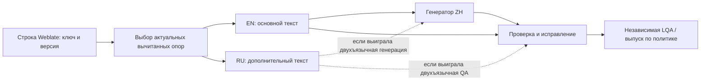

# Два опорных языка в локализации: практики и возможности HCGameLoc

Дата: 2026-09-16. Предмет: RU и вычитанный EN при локализации игр на zh-Hans.
Статус: исследование, без экспериментального подтверждения на HCGameLoc.

Сбор внешних источников выполнен тремя субагентами Luna: Weblate/community,
TMS/frameworks, научные работы и LQA. Основной агент проверил локальный код,
ключевые первичные источники и собрал протокол. Отдельный Terra исследует
актуальные проекты прода для согласования датасета (отчёт завершён).

Связанные документы:

- `docs/product/designs/2026-09-16-dual-reference-zh-experiment.md` — условия,
  контроль смещений, LQA, статистика и критерии решения.
- `docs/operations/reports/2026-09-16-dual-reference-dataset-candidates.md` —
  кандидаты из продакшена; выбор остаётся за владельцем.

## Рекомендация

Проверять политику «актуальный вычитанный EN — предпочтительный основной вход
для zh-Hans; актуальный вычитанный RU — дополнительная опора» разумно.
Объявлять её доказанной мировой практикой пока нельзя. Есть действующие
продуктовые механизмы и научные положительные результаты, но не найдено
публичного контролируемого исследования именно RU+EN→ZH в игровой локализации.

Качество EN и его актуальность важнее самого кода языка. Дополнительный текст
может снять многозначность или вернуть потерянный смысл, а может принести
ошибку, устаревшее условие или несовместимую адаптацию. Совпадение RU и EN
также не гарантирует истину: EN часто получен из RU и повторяет его ошибки.

Архитектурно не нужно сначала менять исходный язык всех компонентов Weblate.
Один source на компонент не запрещает выбирать другой основной вход для MT
и передавать дополнительный перевод в LLM. В HCGameLoc часть этого уже есть;
не хватает полного контракта вычитки, свежести и двухъязычной QA.

## Какие практики нельзя смешивать

| Практика | Что происходит | Какой эффект проверяется |
| --- | --- | --- |
| Pivot/relay | RU переводится в EN, затем EN в ZH | Полезность и потери промежуточного текста |
| Выбор готового EN | Для ZH используется уже вычитанный EN | EN против RU как вход в конкретную модель |
| Multilingual context | Модель одновременно видит основной текст и его версию на другом языке | Добавочная информация при генерации |
| Reference language в редакторе | Человек видит другой язык рядом | Помощь переводчику; передачи в модель может не быть |
| Cross-language QA | Готовый ZH сверяется с RU и EN | Обнаружение и исправление дефектов |
| RAG/TM examples | Извлекаются похожие ранее переведённые сегменты | Терминология/стиль, а не обязательно вторая версия той же строки |
| Multi-reference evaluation | Несколько допустимых ZH-эталонов или корпус эталонных сегментов | Оценивание результата, а не источник для генерации |
| Runtime fallback | Игра показывает другой язык, если целевой отсутствует | Доступность текста во время исполнения |

Для HeroCraft исходный EN уже предполагается подготовленным человеком.
Это другой вопрос, чем «пусть модель сначала сама переведёт RU в EN».
Смешивать эти сценарии в одном экспериментальном условии нельзя.

## Что подтверждают TMS и localization frameworks

Таблица отражает найденные официальные документы, а не аудит всех функций
каждого продукта. «Не подтверждено» означает границу этих источников.

| Система | Подтверждённый механизм | Что переносится в HCGameLoc | Ограничение |
| --- | --- | --- | --- |
| [Crowdin AI](https://support.crowdin.com/crowdin-ai/) | `Other languages translations` позволяет выбрать конкретные языки или передать переводы на всех языках в AI context | Прямой аналог RU/EN как дополнительного контекста той же строки | Документ не даёт измеренного RU+EN→ZH uplift и не доказывает вычитку выбранных переводов |
| [Gridly + memoQ](https://blog.memoq.com/gridly-and-memoq-integration-enhanced-localization-processes-in-app-and-game-development) | Pivot через English и отслеживание зависимостей/устаревания строк; интеграция описана для приложений и игр | Английский как редакторский промежуточный язык; необходимость revision tracking | Последовательный workflow, а не доказательство качества двухъязычного LLM prompt |
| [Phrase Next GenMT](https://support.phrase.com/hc/en-us/articles/14299433827996-Phrase-Next-GenMT) | Multi-segment context и RAG с fuzzy TM examples | Проверенные linguistic assets и контекст | Рекомендованные English–Russian и English–Chinese пары не доказывают превосходство EN→ZH над RU→ZH |
| [Smartling Prompt Tooling with RAG](https://help.smartling.com/hc/en-us/articles/42142862499227-Prompt-Tooling-with-RAG-for-LLM-Translation) | TM examples, glossary и locale-specific style rules передаются LLM | Управляемый контекст и качество его происхождения | TM examples не равны параллельному RU+EN source; такой режим этим документом не подтверждён |
| [Lokalise AI profiles](https://docs.lokalise.com/en/articles/11894216-ai-profiles) | Existing translations/TM как RAG для определённых языковых направлений | Выбор качественных примеров и профилей по языку | Не найдено обещания использования другого source language как второй опоры той же строки |
| [Trados / RWS community](https://community.rws.com/product-groups/trados-portfolio/trados-studio/f/machine-translation/20071/deepl-plugin-i-want-to-put-english-mt-into-projects-with-a-target-language-different-than-english) | Исторический ответ сотрудника: подготовить EN отдельным target, затем добавить как reference file для других языков | Практика справочного английского существует и вне LLM | Это ответ поддержки о конкретном workflow, не актуальная полная спецификация Trados и не эксперимент качества |
| [Tolgee AI Translator](https://docs.tolgee.io/platform/translation_process/ai_translator) | Screenshots, key/project context, language notes, TM | Второй язык должен дополнять игровой контекст | В просмотренной странице не подтверждён отдельный parallel-reference режим |

Полезный образец eval-процесса даёт
[Lokalise evaluation](https://docs.lokalise.com/en/articles/14018423-ai-profile-evaluation-and-proof-of-value):
контекст для генерации отделяется от approved reference set для оценки,
сравниваются несколько методов на одном наборе. Сама документация уточняет,
что BLEU/TER/chrF и совпадение с reference измеряют сходство, а не абсолютное
качество. Это поддерживает раздельные train/context/test данные; рекомендуемые
вендором объёмы не являются power analysis для нашего эксперимента.

У runtime frameworks другая ответственность.
[i18next fallback](https://www.i18next.com/principles/fallback) выбирает
доступный язык для отсутствующего ключа, а не сверяет RU/EN при создании ZH.
[Mozilla Fluent](https://projectfluent.org/) допускает различную грамматическую
сложность локализаций независимо от структуры source. Для нас это аргумент
оценивать китайскую выразительность по требованиям китайского языка, но не
эмпирическое доказательство пользы английской опоры.

## Есть ли опубликованные success practices

Есть три разных уровня свидетельств.

**Поддержанный промышленный workflow:** Crowdin передаёт переводы других
языков как AI context; Gridly/memoQ поддерживает English pivot с зависимостями.
Это показывает применимость архитектуры, но не величину эффекта.

**Измеренный научный результат:** исследователи LILT в
[Shahnazaryan et al., RANLP 2025](https://aclanthology.org/2025.ranlp-1.127/)
сравнили GPT-4o с дополнительными человеческими переводами и без них.
На proprietary EN→PT добавление трёх языков контекста дало в среднем
+2.31 BLEU и +1.01 COMET по шкалам статьи. На FLORES+/TICO-19 для EN→PT
прямой перевод часто оказался лучше. Это три контекстных языка, PT target
и технические тексты, не наш RU+EN→ZH. Самогенерируемый контекст не воспроизвёл
выигрыш. Все исходные корпуса были English-origin; эффект языкового
происхождения нельзя игнорировать. См. разделы 3.1, 4.1–4.2 и limitations
в [полной статье](https://aclanthology.org/2025.ranlp-1.127.pdf).

Более ранняя работа
[Zoph & Knight, 2016](https://aclanthology.org/N16-1004/) получила до
+4.8 BLEU для multi-source NMT относительно сильного baseline. Это
подтверждает возможность добавочного сигнала, но не переносится численно
на современные LLM и игровую локализацию.

**Кейс успешной AI-локализации без изоляции второго языка:**
[Crowdin / Polhus](https://crowdin.com/blog/ai-translation-polhus-using-crowdin)
сообщает о больших объёмах и доле AI-переводов без правок, однако объединяет
AI, глоссарий и человеческую проверку. Такой кейс не отвечает на наш
причинный вопрос. В найденных vendor case studies нет контролируемого
сравнения «тот же source и модель, единственное изменение — второй
вычитанный язык» для RU/EN/ZH игр.

Следовательно, ответ на вопрос worldwide: **подобные практики существуют,
положительные результаты в других условиях опубликованы; наша конкретная
политика требует собственной проверки**. Отсутствие найденной публикации
не означает отсутствия закрытых внедрений.

## Что говорит Weblate и его сообщество

В Weblate один source language у **компонента**, а не один обязательный язык
на всю инстанцию. Есть несколько независимых механизмов:

| Механизм | Локальное основание | Значение |
| --- | --- | --- |
| Secondary language проекта/компонента | `docs/admin/projects.rst:471`, `:1297` | Постоянный дополнительный язык для редактора; настройка может наследоваться |
| Пользовательские secondary languages | `docs/user/profile.rst:94` | Языки-подсказки конкретного переводчика; не произвольный набор опор LLM |
| Выбор MT source | `docs/admin/machine.rst:47`, `weblate/machinery/base.py:833` | Component source или configured secondary можно выбрать отдельно |
| Secondary в LLM payload | `docs/admin/machine.rst:70`, `weblate/machinery/llm.py:955` | Дополнительный перевод передаётся как контекст |
| Intermediate language / source quality gateway | `docs/admin/projects.rst:779`, `docs/workflows.rst:291` | Monolingual workflow от текста разработчика к подготовленному source, затем к остальным языкам |

Подтверждения community:

- [#13398: LLM context](https://github.com/WeblateOrg/weblate/issues/13398)
  описывает практически тот же мотив: French source и качественно
  подготовленный English для перевода на третий язык. Закрыт как выполненный
  с milestone 2026.5. При этом maintainer
  [в декабре 2024](https://github.com/WeblateOrg/weblate/issues/13398#issuecomment-2563921920)
  сообщал, что в собственных опытах заметного улучшения от existing translations
  не увидел. Это полезное отрицательное наблюдение без опубликованного
  протокола; закрытие issue не опровергает и не подтверждает quality uplift.
- [#7388: admin alternative source](https://github.com/WeblateOrg/weblate/issues/7388)
  закрыт, milestone 5.11: дополнительный язык задаётся администратором для
  проекта/компонента, а не только личными настройками переводчика.
- [#2136: MT from other languages](https://github.com/WeblateOrg/weblate/issues/2136)
  остаётся открытым. Maintainer
  [27 мая 2026](https://github.com/WeblateOrg/weblate/issues/2136#issuecomment-4552847986)
  уточнил, что явный alternative source уже доступен; отсутствует automatic
  fallback при неподдерживаемой языковой паре. Следующее уточнение ограничивает
  этот выбор внешними сервисами. Это не автоматический выбор наиболее
  качественного языка для каждой строки.
- [Discussion #15410](https://github.com/orgs/WeblateOrg/discussions/15410)
  касается developer English → polished English → другие языки. Обсуждение
  без accepted answer; ответ maintainer ссылается на уточнение документации
  в [#15473](https://github.com/WeblateOrg/weblate/pull/15473). Его проверяли
  через discussions репозитория `WeblateOrg/weblate`.

Upstream index [llms.txt](https://docs.weblate.org/en/latest/llms.txt) при
проверке обозначал 2026.10; локальный fork — `2026.8.1.dev0`. Это разные
ветки версий. Поведение HCGameLoc ниже установлено по локальному HEAD
`f103a26232b9abcd6ccce1a45543f5a28ae80d0f`, а не выведено из latest upstream.
Онлайн-документация не подтверждает ревизию работающего production image.

## Что реально умеет текущий HCGameLoc

Проверка кода дала следующие факты.

1. `BaseLLMTranslation._get_secondary_unit`
   (`weblate/machinery/llm.py:936`) принимает непустой перевод при
   `STATE_TRANSLATED <= state < STATE_READONLY`. Это включает state 20;
   обязательной human approval и проверки версии вычитки здесь нет.
2. `_get_secondary_context` (`weblate/machinery/llm.py:955`) берёт одну
   configured secondary translation, связанную с source unit. Исключает язык
   target и **исходник компонента**, но не сравнивает secondary с фактическим
   языком MT-запроса.
3. `get_source_language` (`weblate/machinery/base.py:833`) умеет выбрать
   secondary как основной вход. В базовом AUTO используется source компонента;
   это не LQA-оптимизатор. `PluralMapper.get_other_units`
   (`weblate/lang/models.py:1592`) также использует порог translated.
   Отсутствующий альтернативный перевод даёт пустую `plural_map`, а не
   доказанный автоматический fallback к RU для этой строки.
4. При stored source=RU, secondary=EN и MT source=secondary код способен
   отправить **EN как source и EN как secondary**, не добавив RU как отдельную
   опору. Это вывод по веткам кода, не результат live payload capture.
   Простое включение настройки не проверяет требуемое условие EN+RU.
5. `JudgeRequest` (`weblate/trans/judge.py:192`), `build_request`
   (`weblate/trans/judge_loop.py:111`) и `_segment`
   (`weblate/trans/judge.py:901`) сейчас передают один `unit.source` и target.
   Второй опорный перевод в запрос judge не включён. Выбор MT source не
   переключает автоматически основание оценки judge.
6. MT cache включает сериализованный контекст
   (`weblate/machinery/llm.py:1133`); judge context hash
   (`weblate/trans/models/judge.py:219`) включает source, note, explanation,
   glossary. При добавлении второй опоры её текст, ревизия и статус должны
   учитываться во всех связанных snapshot/cache identities, не только в prompt.
7. Смена `Component.source_language` у существующего компонента запрещена
   в `Component.clean` (`weblate/trans/models/component.py:5618`).
   Глоссарии также выбираются по source language
   (`weblate/glossary/models.py:311`). Поэтому миграция source — отдельная
   продуктовая работа с файлами, состояниями и связями, не шаг пилота.

Существующие measurements тоже предостерегают от предположения «больше
контекста обязательно лучше»:
`docs/product/measurements/2026-09-04-judge-dialog-context-paired.md`
и `docs/product/reviews/2026-09-04-judge-dialog-context-review.md`.
Это другой эксперимент, с соседними репликами, а не с двумя языками;
его результат нельзя переносить напрямую, но его контрольные меры полезны.

## Архитектурные варианты после эксперимента

**Вариант 1: компонент уже имеет EN source.** RU можно использовать как
secondary для перевода; дополнительно нужны проверка вычитки/свежести и
явная политика конфликтов. Двухъязычный judge потребует отдельной доработки.
Это минимальный путь, если такое устройство уже соответствует ресурсам игры.

**Вариант 2: сохранить RU source, отделить выбор опор для LLM.** Рекомендуемый
путь исследования и вероятный путь внедрения: resolver собирает версионированные
RU/EN; translator получает EN primary и RU reference; QA получает те же
основания. Структурные проверки и связь с игровым ресурсом продолжают
опираться на канонический технический контракт. Перед использованием пары
проверяется совместимость плейсхолдеров, ICU/plural и engine DSL.
Это предложение архитектуры, ещё не существующая готовая настройка.

**Вариант 3: formal source quality gateway.** Для подходящих monolingual
форматов intermediate file может отражать авторский RU, а подготовленный
EN стать source для других переводов. Это управляет порядком редакторской
подготовки, но не создаёт автоматически второй язык в judge. Intermediate
имеет особые правила отображения и блокировки переводов. Сам gateway не
является доказательством human approval: готовность source и его вычитка —
разные требования. Его следует сначала
проверять на отдельном примере формата. Для bilingual форматов такую схему
нельзя обещать без проверки поддержки.

Во всех вариантах должны существовать одно правило актуальности, понятный
владелец игрового смысла и различение `source_conflict` от `translation_error`.
Модель не должна молча решать, какая из противоречащих версий «победила».
Сначала проверяется гипотеза на snapshot; затем составляется и согласуется
план внедрения работающего варианта.

## Основания для LQA и eval-дизайна

Для качества важнее независимое профессиональное оценивание, чем рост
score того же LLM, который исправлял текст. Эти работы определяют прибор
измерения, но не доказывают пользу двух опор:

| Источник | Что поддерживает | Граница |
| --- | --- | --- |
| [Freitag et al., Experts, Errors, and Context, 2021](https://aclanthology.org/2021.tacl-1.87/) | Профессиональная MQM-разметка с контекстом меняет выводы относительно непрофессиональной оценки | Не готовая рубрика для игровой zh-Hans LQA |
| [WMT21 Metrics](https://aclanthology.org/2021.wmt-1.73/) | Зависимость ранжирования от качества references, домена и способа human evaluation | Китайское направление в обсуждаемой части — ZH→EN |
| [COMET, Rei et al., 2020](https://aclanthology.org/2020.emnlp-main.213/) | Обучаемая оценка с source/target/reference | Нужны конкретная версия и локальная калибровка; изменение source меняет прибор |
| [Chinese MWE metric benchmark, 2024](https://aclanthology.org/2024.lrec-main.198/) | Идиомы и многословные выражения создают слепые зоны метрик | Также ZH→EN; предупреждение, а не оценка нашего target |
| [Zheng et al., LLM-as-a-Judge, 2023](https://arxiv.org/abs/2306.05685) | Position, verbosity и self-enhancement bias | Исследование chat evaluation, поэтому переносим меры контроля, не его accuracy |
| [Fu & Liu, Multilingual LLM-as-a-Judge, 2025](https://aclanthology.org/2025.findings-emnlp.587/) | Непостоянство оценок многоязычных LLM | Другой benchmark; не замена китайским редакторам |
| [Ni et al., Translationese, 2022](https://aclanthology.org/2022.naacl-main.389/) | Происхождение текста и направление перевода влияют на измерение | EN, переведённый с RU, не эквивалентен независимо написанному EN |
| [Ki & Carpuat, Post-editing with Error Annotations, 2024](https://aclanthology.org/2024.findings-naacl.265/) | QA/post-editing нужно проверять как самостоятельное вмешательство | Не каждое более подробное замечание даёт полезное исправление |

Отсюда протокол отдельно сравнивает EN/RU, второй язык при генерации и второй
язык при QA с равноценной одноязычной QA. Основание качества — человеческие
major/critical дефекты; операционные отказы учитываются в общем риске
непригодного результата. Автоматические оценки остаются вспомогательными.
Датасет, локальная величина выигрыша, бюджет и допустимые регрессии этим
исследованием ещё не определены.
